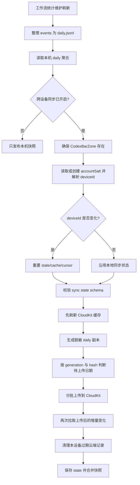

# 跨设备同步

本文档记录设置页「跨设备同步」的完整链路。当前实现只同步 Codex Hook 产生的工作流统计每日聚合，不是整个 App 的通用云同步。

## 同步范围

会同步:

- `daily.jsonl` 中每一天的工作流统计聚合副本
- 会话总数、对话轮次、子智能体、调用工具、权限请求、上下文压缩等计数字段
- `eventCount`、`projectCounts` 和 `modelCounts`
- 用于区分同设备、同日期独立贡献的随机 `sourceGeneration`

不会同步:

- Codex 账号、额度、token 用量
- app-server 请求日志
- Codex auth 文件、refresh token、stderr 或原始 RPC 响应
- 原始 Hook 事件 `events/YYYY-MM-DD.jsonl`
- `sessionIds` 和 `turnIds`
- CodexBar 设置项、快捷键、日志窗口内容

同步目标是当前 macOS 登录的 iCloud 账号的 CloudKit private database。数据不会跨 iCloud 账号迁移或合并；切换 iCloud 账号后会进入另一个 private database。

## 代码入口

| 文件                                                     | 职责                                                                              |
| -------------------------------------------------------- | --------------------------------------------------------------------------------- |
| `CodexBar/Services/Settings/WorkflowSyncSettings.swift`  | 设置页状态、同步账号可用性检查、UserDefaults 开关、最近同步时间、同步中和失败通知 |
| `CodexBar/Services/Workflow/WorkflowSyncScheduler.swift` | 维护、同步和显式重建的唯一调度者, 合并待执行请求、冷却窗口和最终状态校验          |
| `CodexBar/Services/Workflow/WorkflowSyncService.swift`   | CloudKit 设备标识、上传、拉取、缓存、游标、清理过期记录                           |
| `CodexBar/Services/Workflow/WorkflowService.swift`       | 维护本机 daily，并在调度器允许时调用同步服务，把本机 daily 与同步缓存合并成快照   |
| `CodexBar/Models/CodexWorkflowModels.swift`              | 本机聚合、云端脱敏聚合、云端缓存记录、最终 UI 快照的模型和合并规则                |
| `CodexBar/Views/Menu/CodexStatusMenuSections.swift`      | 主面板更新时间行的同步状态图标、最近同步时间和失败 tooltip                        |
| `CodexBar/Views/Settings/AppSettingsView.swift`          | 设置页同步状态和日期范围批量重建界面                                              |
| `CodexBar/Controllers/SettingsWindowController.swift`    | 打开设置窗口前刷新 Hook 和同步状态                                                |
| `CodexBar/Controllers/StatusItemController.swift`        | 自动刷新时触发本机维护，并把同步开关、Hook 和同步可用性变化交给调度器             |

## 本地状态

跨设备同步相关本地状态都在工作流统计目录下:

```text
~/Library/Application Support/CodexBar/HookEvents/
```

同步子目录:

```text
Sync/state.json
Sync/cache.jsonl
Sync/cursor.data
```

各文件职责:

| 文件          | 内容                                                                                                   |
| ------------- | ------------------------------------------------------------------------------------------------------ |
| `state.json`  | 本机同步状态，包括 `deviceId`、每天已处理的本机 hash、待权威替换日期、`lastUploadAt`、`lastPrunedDate` |
| `cache.jsonl` | 从 iCloud 拉取到的所有设备脱敏 daily 记录，一行一条；同一天可包含多个 generation                       |
| `cursor.data` | CloudKit custom zone `CodexBarZone` 的 `CKServerChangeToken`，用于下次增量拉取                         |

`state.json` 的逻辑结构:

```json
{
    "schema": 4,
    "deviceId": "<当前设备在当前 iCloud 账号下的匿名设备 ID>",
    "hashByDate": {
        "2026-06-25": "<脱敏 daily 聚合的 SHA256>"
    },
    "replacementDates": ["2026-06-25"],
    "lastUploadAt": "2026-06-25T10:20:30Z",
    "lastPrunedDate": "2026-06-25"
}
```

设置开关存在 `UserDefaults`:

| Key                          | 含义                                    |
| ---------------------------- | --------------------------------------- |
| `WorkflowSync.isEnabled`     | 用户是否开启过跨设备同步                |
| `WorkflowSync.needsBackfill` | 是否需要对本机现有 daily 数据做一次补传 |

关闭跨设备同步只会把 `WorkflowSync.isEnabled` 写成 `false`，不会删除本地 `state.json`、`cache.jsonl`、`cursor.data`，也不会删除 CloudKit 中已有记录。

## CloudKit 数据结构

CloudKit 使用默认 container 的 private database。CodexBar 自己创建和维护的记录都保存在 custom zone `CodexBarZone`；不会向 CloudKit `_defaultZone` 写入同步数据。

账号级 metadata 记录保存在 custom zone `CodexBarZone`:

```text
zoneName = CodexBarZone
recordType = CodexBarSyncMetadata
recordName = accountSalt
fields:
  schemaVersion: 4
  salt: Data(32 bytes)
```

每天的工作流统计贡献记录保存在 custom zone `CodexBarZone`。正常情况下每台设备每天只有一个 generation；确认原始事件文件从空文件重新开始后，同一天会增加一条 generation 记录:

```text
recordType = CodexBarDailyAggregate
recordName = <deviceId>_<yyyy-MM-dd>[_<sourceGeneration>]
fields:
  schemaVersion: 4
  deviceId: String
  date: String
  sourceGeneration: String?
  eventCount: Int
  sessionStartCount: Int
  stopCount: Int
  preToolUseCount: Int
  postToolUseCount: Int
  permissionRequestCount: Int
  preCompactCount: Int
  postCompactCount: Int
  subagentStartCount: Int
  subagentStopCount: Int
  sessionCount: Int?
  turnCount: Int?
  projectCounts: Data(JSON object)
  modelCounts: Data(JSON object)
  updatedAt: Date
```

`projectCounts` 会保留本机聚合中的项目显示名。项目显示名通常是 `cwd` 的最后一层目录名；如果路径最后一层为空，代码会回退到完整路径字符串。

`modelCounts` 会保留 Hook 事件中的模型名及其当天事件计数，用于跨设备合并后计算热力图详情的「最热模型」；不会包含 prompt、response 或原始事件内容。

CloudKit Production schema 必须包含当前 schema `4` 使用的字段，包括 `CodexBarDailyAggregate.sourceGeneration`；`deviceId` 和 `date` 需要保持可查询，以便按设备清理过期记录。schema 变化需要通过 CloudKit Dashboard 从 Development 部署到 Production；App 只负责读写记录，不会自动部署 Production schema。开发签名通常访问 Development，发布签名访问 Production。

## 设备标识

设备标识不直接上传 `IOPlatformUUID`。同步服务会先在当前 iCloud private database 中读取或创建 32 字节账号级 salt，然后计算:

```text
deviceId = HMAC_SHA256(accountSalt, IOPlatformUUID)
```

这个设计的效果:

- 同一台 Mac 在同一个 iCloud 账号下通常得到同一个 `deviceId`
- 同一台 Mac 切换 iCloud 账号后会得到不同的 `deviceId`
- CloudKit 中不会保存原始 `IOPlatformUUID`

当前 iCloud sync state schema 为 `4`。服务会在实际同步前校验 `state.json`；状态无法按当前 schema 使用时，会重建同步状态并重新拉取 CloudKit 缓存。只读本地缓存用于展示时不会改写同步 state。

如果本地 `state.json` 中的 `deviceId` 和当前解析出的 `deviceId` 不一致，说明 iCloud 账号或账号级 salt 已变化。此时同步服务会重置本地同步状态，清空 `cache.jsonl`，并删除 `cursor.data`，然后按新账号重新同步。

## 设置页行为

设置页打开时会刷新:

- Codex Hook 本地配置状态
- `hooks/list` 验证结果
- CloudKit account status
- 最近同步时间

`AppSettingsView.onAppear` 和 App 再次变为 active 时也会刷新同步可用性。

「跨设备同步」开关可操作的条件:

```text
Codex Hook 已开启
Codex Hook 当前没有正在更新
CKContainer.default().accountStatus == .available
```

UI 状态:

| 状态                     | UI 表现                                     |
| ------------------------ | ------------------------------------------- |
| 同步账号状态还在检查     | 开关不可操作，暂不显示错误                  |
| 同步账号可用但 Hook 关闭 | 开关不可操作                                |
| 同步账号不可用           | 开关不可操作，下方显示 `同步不可用`         |
| Hook 开启且同步账号可用  | 开关可操作                                  |
| 同步中                   | 开关下方显示 `最近同步` 和小型进度指示      |
| 有成功上传记录           | 开关下方显示 `最近同步 yyyy-MM-dd HH:mm:ss` |

跨设备同步开启时，设置页始终为「最近同步」状态子行保留固定 16 pt 高的单行布局；右侧状态区域固定宽度，同步时间与进度指示通过交叉淡入淡出平滑切换，不触发设置窗口高度或行内位置变化。关闭跨设备同步后移除整行及其占位，让设置窗口随内容缩回。

主面板「数据更新时间」行最右侧始终显示同步状态图标:

| 状态                      | SF Symbol                             | tooltip                                                                                                           |
| ------------------------- | ------------------------------------- | ----------------------------------------------------------------------------------------------------------------- |
| 非 active 同步            | `icloud.slash`                        | `同步未开启`; 包括 Hook 关闭、同步偏好关闭、同步账号不可用或仍在检查                                              |
| active 且空闲             | `icloud`                              | 有成功上传记录时为 `最近同步: yyyy-MM-dd HH:mm:ss`, 没有记录时为 `暂无同步记录`; 时间来源和设置页「最近同步」一致 |
| active 且正在同步         | `arrow.trianglehead.clockwise.icloud` | `正在同步`                                                                                                        |
| active 且最近一次同步失败 | `exclamationmark.icloud`              | 归类后的短错误, 例如 `网络不可用`                                                                                 |

开启时:

1. `WorkflowSyncSettings.setEnabled(true)` 先确认同步账号可用。
2. 写入 `WorkflowSync.isEnabled = true`。
3. 写入 `WorkflowSync.needsBackfill = true`，要求后续同步补传本机已有 daily 数据。
4. `StatusItemController` 请求一次 CloudKit 同步；如果当前空闲且不在冷却窗口内会立即执行，否则由调度器合并为待补跑同步。

关闭时:

1. 写入 `WorkflowSync.isEnabled = false`。
2. 清理调度器中的待同步请求，不新开 CloudKit 同步；已经开始的同步不取消，结束后按最终状态决定是否补跑。
3. 本地同步状态、缓存和云端记录保留。

关闭 Codex Hook 不会清空跨设备同步偏好；但因为工作流统计同步只在 Hook 开启时触发，所以 Hook 关闭期间不会继续同步。之后重新开启 Hook 时，如果跨设备同步偏好仍为 true 且同步账号可用，会通过调度器请求一次同步。

## 刷新时机

跨设备同步只在工作流统计的维护刷新中执行，但本机维护和 CloudKit 同步可以分开执行。核心入口是:

```text
WorkflowService.loadSnapshot(performMaintenance: true, synchronize: true)
```

两类刷新行为不同:

| 刷新类型                                       | 是否维护 local daily | 是否访问 CloudKit        | 用途                           |
| ---------------------------------------------- | -------------------- | ------------------------ | ------------------------------ |
| `performMaintenance: false`                    | 否                   | 否，只读取 `cache.jsonl` | 打开菜单面板时快速展示现有数据 |
| `performMaintenance: true, synchronize: false` | 是                   | 否，只读取 `cache.jsonl` | 每分钟自动刷新中的本机统计维护 |
| `performMaintenance: true, synchronize: true`  | 是                   | 是                       | 调度器允许后的 CloudKit 同步   |

触发 CloudKit 同步请求:

- 用户开启「跨设备同步」
- Codex Hook 重新开启，且跨设备同步偏好仍为 true
- 同步账号从不可用变为可用，且 Hook 与跨设备同步都已开启
- app-server 自动刷新倒计时重置时，如果 Hook、跨设备同步和同步账号都可用
- 用户从设置页批量重建日期范围内的本机数据，且 Hook、跨设备同步和同步账号都可用

Hook 子进程不访问网络。它只检查事件文件是否从空文件重新开始、维护本地 generation 状态、把原始事件写入 `events/YYYY-MM-DD.jsonl` 并标记 `maintenance.json` 的 pending 日期。真正的 daily 重建和 CloudKit 同步都由主 App 的维护刷新完成。

调度器规则:

- 关闭同步、关闭 Hook 或同步账号不可用时，只清理待同步请求，不新开 CloudKit 同步
- 同步正在执行时，新请求只标记为待补跑，不取消当前同步
- 冷却窗口内的多次请求合并为一次待补跑同步
- 补跑前重新校验 Hook 开启、`WorkflowSync.isEnabled == true` 且同步账号可用；最终状态不满足时丢弃待补跑请求
- `WorkflowViewModel.refreshMaintenance(synchronize:)` 只执行一次明确的维护刷新；维护、同步和显式重建的运行、排队与同步冷却均由 `WorkflowSyncScheduler` 管理。
- 用户发起的日期范围批量重建同样由 `WorkflowSyncScheduler` 串行执行；已有维护或同步完成后再开始，重建期间新增的自动维护或同步请求分别合并，并在整批重建完成后继续处理。

## 同步主流程



「确保 CodexBarZone 存在」和「读取或创建 accountSalt」首次成功后会在 `WorkflowSyncService` actor 内跨轮缓存，后续每轮同步直接复用，不再重复往返 CloudKit。任何一轮同步失败都会作废这两项缓存：iCloud 账号切换必然伴随请求报错，因此下一轮会重新确认 zone、按新账号取 salt，并经 deviceId 变化检测重置本地同步状态。

同步服务会在开始和结束时发出通知:

```text
CodexBar.workflowSyncDidStart
CodexBar.workflowSyncDidFinish
```

设置页通过这两个通知更新 `isSyncing` 和 `lastUploadAt`。

## 上传数据如何脱敏

本机 `daily.jsonl` 每行是 `WorkflowDailyAggregate`。上传前会转换成 `WorkflowSyncedDailyAggregate`:

- 保留各类计数字段
- 保留 `projectCounts`
- 保留 `modelCounts`
- 保留随机 UUID `sourceGeneration`
- 不包含只用于本机判断来源是否从空文件开始的 `sourceIsFresh`
- 不包含 `sessionIds`
- 不包含 `turnIds`
- 优先把本机已有的正数 `sessionCount` / `turnCount` 写入同步副本
- 如果没有正数压缩 count，但本机还有非空 `sessionIds` / `turnIds`，会把去重数量写入对应 count
- 如果两者都没有，对应同步 count 为 `null`，不会上传空数组得到的 `0`

明确的 `sessionCount == 0` / `turnCount == 0` 如果分别与正数 `sessionStartCount` / `stopCount` 冲突，会被视为不一致值并在本地归一化时修复。接收端不恢复 ID，生成 `WorkflowDailyMetrics` 时使用「正数 `sessionCount`，否则 `sessionStartCount`」和「正数 `turnCount`，否则 `stopCount`」。真正没有会话或轮次的日期因为起止事件计数同样为 `0`，最终仍显示为 `0`。

本机 `daily.jsonl` 不会因为上传而被改写。也就是说，最近 3 个本地自然日实际收集到的非空 `sessionIds` / `turnIds` 仍然只保存在本机，用于本机精确去重。

## 待上传日期选择

每次同步会检查保留窗口内的全部本机日期:

```text
候选日期 = 本机 daily.jsonl 中的全部保留日期
```

最多只有 210 个日期；逐日稳定 hash 相同的记录会立即跳过。这样维护和 CloudKit 同步即使分两轮发生，也不会因为变化日期已经被维护流程消费而漏传。

对每个候选日期:

1. 找到本机 daily 聚合。
2. 转换成脱敏 cloud aggregate。
3. 用固定字段顺序序列化为 JSON line。
4. 计算 SHA256。
5. 如果 hash 和 `state.hashByDate[date]` 相同，表示这份本机数据已经上传或已按保护规则处理，直接跳过。
6. 否则加入待上传列表。

待上传列表按日期升序排列，保证每次补传顺序稳定。

## 上传节奏和时间预算

为避免每分钟自动刷新被长时间上传拖住，上传有两个限制:

```text
每批最多 25 天
每轮最多 20 秒
```

上传流程:

1. 以 25 天为一批切分待上传列表。
2. 每批开始前检查 Task 是否取消，以及是否仍在 20 秒预算内。
3. 先按当前设备、当前待上传日期的不带 generation record ID 和当前 generation record ID 批量读取已有 CloudKit 记录；只有单条结果明确为 `unknownItem` 才视为不存在，其他读取错误会终止本批。
4. 同 generation 记录存在时复用更新；云端记录没有 generation 时，只有全部同步业务字段与本机完全一致才认作同一来源。即使本机 generation 也为空，仍必须比较完整内容。
5. 当前 generation 不存在时，只有云端没有该日期记录，或本机明确标记为从空文件开始，才创建新的 generation 记录；来源不明确的非空替换不会自动加入云端已有贡献。
6. 使用 `database.modifyRecords(saving:deleting:savePolicy:.changedKeys, atomically:false)` 保存。
7. 只有本批所有待写记录都成功，或该日期已经明确按防倒退/来源保护规则保留云端，才更新对应的 `state.hashByDate[date]`。
8. 如果读取、请求或任一单条保存失败，会删除本批日期在 `hashByDate` 中的确认值并立即保存，使整批日期稳定进入下轮候选。
9. 本批全部确认后，如果至少有成功写入的日期，更新 `state.lastUploadAt`，并立刻写回 `state.json`。

如果某批 CloudKit 请求整体抛错或返回单条失败，本轮上传停止。已经成功确认的前序批次不会回滚；失败批次即使已有部分记录实际写入，也会整批重试，重复 upsert 不改变聚合内容。

`needsBackfill` 只有在本机所有 daily 日期的 hash 都已经和 `state.hashByDate` 匹配后才会清除。这样首次开启时即使 20 秒内没有补完，后续每分钟刷新也会继续补传。

## 显式重建替换

用户在设置页通过两次点击选择日期范围并确认重建后，`WorkflowService` 只处理范围内有非空本机原始事件文件的日期，为它们分别生成新的本地 generation，并批量加入 `state.replacementDates`，同时清除对应的 `hashByDate[date]`；两次点击同一天时只处理该日期。日期选择器允许选择最近 210 天保留窗口内的任意日期，非空本机原始事件日期以圆点标记，没有数据的日期只参与范围选择，不进入重建或云端替换。这个状态表示用户已经明确授权以当前本机原始事件替换「当前设备、实际重建日期」的云端贡献，不代表新的独立贡献。

存在待替换日期时，同步流程会先全量查询 `CodexBarDailyAggregate`，再按批次删除当前 `deviceId` 对应日期的 legacy 记录和全部 generation 记录。只有删除结果全部成功或返回 `unknownItem` 后，才从本地 cache 移除这些旧记录并按正常上传流程创建本地新 generation 的记录。新记录确认后才从 `replacementDates` 移除日期；删除或上传中途失败时请求保留，下一轮会重新全量确认并幂等重试。

待替换期间，`WorkflowSnapshot` 不使用当前设备对应日期的旧缓存，直接展示重建后的本机聚合；其他设备同日贡献仍照常合并。跨设备同步关闭、Hook 关闭或账号暂不可用时只完成本地重建，待替换状态保留到后续实际同步。超过 210 天保留窗口的待替换日期会随同步清理移除。

## 拉取缓存和游标

上传之后会更新本地同步缓存。`CodexBarDailyAggregate` 保存在 custom zone `CodexBarZone`, 因为 CloudKit 默认 zone 不支持 `getChanges`/zone change token。没有 `cursor.data` 时, App 会先 query 全量 `CodexBarDailyAggregate` 记录（包含当前设备自己的记录）回填 `cache.jsonl`, 然后从 `nil` 调用 CloudKit zone changes 补齐这段变化并保存新的 `cursor.data`; 有游标时优先拉取 custom zone 的增量变化:

```text
database.recordZoneChanges(
    inZoneWith: CodexBarZone,
    since: cursor,
    desiredKeys: nil,
    resultsLimit: 200
)
```

处理规则:

- 修改记录: 只接受 `CodexBarDailyAggregate`，转换成 `WorkflowSyncedDailyRecord` 后按 CloudKit record name 写入内存 cache，因此同设备、同日期可以保留多个 generation
- 删除记录: 如果删除的是 `CodexBarDailyAggregate`，按原 record name 从 cache 中移除对应 generation
- `moreComing == true`: 继续用新的 change token 拉下一页
- `changeTokenExpired` 或增量拉取失败: 不写入日志窗口，直接 query 全量 `CodexBarDailyAggregate` 重建 `cache.jsonl`
- 全量重建后的游标基线建立失败: 保留已写入的 `cache.jsonl`, 不保存 `cursor.data`, 下轮刷新继续全量重建并再次尝试建立游标

删除变化只会从 `cache.jsonl` 移除对应 record，不会同时清除 `state.hashByDate`。因此，如果用户在 CloudKit Dashboard 或其他客户端删除某天的云端记录，而本机 daily 内容和上次确认的 hash 没有变化，下一轮同步不会立即把它重新上传；只有本机该日聚合之后发生变化，或同步 state 被重置、对应 hash 被清除时，它才会再次成为上传候选。

本地落盘顺序很重要:

1. 先写 `cache.jsonl`
2. 再写 `cursor.data`

如果 `cache.jsonl` 写入失败，`cursor.data` 不会提前推进。下一轮会重新拉取同一批 CloudKit 变化，避免游标已经前进但缓存没有落盘导致记录丢失。

## 展示合并规则

UI 展示使用 `WorkflowSnapshot`。合并规则是:

```text
最终展示 = 各设备、各安全 generation 的 daily 贡献之和
```

`cache.jsonl` 会保留当前设备自己的全部 generation。当前本机 generation 与其云端副本不会重复相加：本机 `eventCount` 大于等于同 generation 云端副本时使用本机，否则回退云端。其他 generation 只有在 CodexBar 确认它们分别从空文件开始时才作为独立贡献相加。来源不明确的非空替换不会自动加入已有云端贡献，界面继续使用已有云端记录，避免重复统计。

同一天多设备数据相加时，会先把每台设备的 daily aggregate 转成 `WorkflowDailyMetrics`，再按日期求和:

- 本机 daily 的会话/轮次按「正数压缩 count → 非空 ID 去重数量 → 起止事件计数」解析
- 同步 daily 不含 ID，按「正数压缩 count → 起止事件计数」解析

```text
sessionCount += other.sessionCount
turnCount += other.turnCount
toolCallCount += other.toolCallCount
permissionRequestCount += other.permissionRequestCount
contextCompactionCount += other.contextCompactionCount
subagentCount += other.subagentCount
```

上传同样按 generation 防倒退：同 generation 云端 `eventCount` 更大时保留云端副本；本机追平后才继续写回。不同 generation 不再互相覆盖；确认从空文件开始的新 generation 使用独立 record，展示时与已有 contribution 相加。云端记录没有 generation 时，只有全部同步业务字段与本机一致才会认作同一来源；不一致则保留云端记录。

CloudKit 拉取不会单独向 UI 推送新快照；只有当前这次 `WorkflowService` 刷新最终提交结果时，菜单面板和热力图才会看到更新。非维护刷新只读取已有 `cache.jsonl`，不会主动联网。

## 保留和清理

本机工作流统计最多保留最近 210 天。跨设备同步遵循同样窗口:

- 读取缓存时会过滤掉 210 天窗口外的记录
- 保存 `cache.jsonl` 前也会过滤 210 天窗口外的记录
- 当前设备每天最多执行一次云端清理

云端清理只删除当前设备自己的过期记录，包括同一天的全部 generation:

```text
deviceId == 当前 deviceId
date < retentionCutoffDate
```

其他设备的记录不会由本机删除。每台设备只负责清理自己上传的过期记录。

清理候选先通过 CloudKit 按 `deviceId == 当前设备` 分页查询，并通过 `desiredKeys` 只读取 `date` 字段，再在本地校验日期格式并按 `date < retentionCutoffDate` 过滤。CloudKit 的 `date` 是字符串字段，不在服务端使用范围比较；缺失 `date` 或不是合法 `yyyy-MM-dd` 的当前设备记录视为异常记录并一并删除。清理使用查询结果中的完整 `CKRecord.ID` 分批执行，不依赖已经过滤过期行的 `cache.jsonl`，legacy 名称和 `<device>_<date>_<generation>` 名称都会进入删除请求。只有全部删除成功或返回 `unknownItem` 后才更新 `lastPrunedDate`；中途失败会在下一轮继续查询和幂等重试。

当前实现不会因为本机 `daily.jsonl` 删除了某个仍在 210 天窗口内的日期，就主动删除该日期对应的 CloudKit 记录。它会等到该记录超过 210 天保留窗口后再清理。

单独删除某天的本机 events 文件也不会删除已有 daily 行：历史日期不再产生事件时，界面仍使用保留下来的本机 daily，并与同 generation 云端副本择优。如果 daily 行也被删除，开启同步时界面会回退到 `cache.jsonl` 中的云端贡献；关闭同步或云端没有副本时，该日期才会从界面消失。相比之下，把仍存在的 events 文件清空或截断会被识别为文件连续性变化，并按维护规则重建或切换 generation。

## 失败和重试

失败处理以不中断工作流统计展示为目标。

| 场景                            | 当前行为                                                                                                                                                                                                  |
| ------------------------------- | --------------------------------------------------------------------------------------------------------------------------------------------------------------------------------------------------------- |
| iCloud 未登录或不可用           | 设置页禁用「跨设备同步」，显示 `同步不可用`; 主面板同步图标走非 active 同步态, 显示 `icloud.slash` 和「同步未开启」                                                                                       |
| 用户尝试在同步账号不可用时开启  | `setEnabled(true)` 直接返回，不写入开启状态                                                                                                                                                               |
| `CodexBarZone` 不存在           | 同步开始时创建 custom zone                                                                                                                                                                                |
| CloudKit 上传读取失败           | 只有 `unknownItem` 视为记录不存在；其他单条读取错误终止本轮，整批日期持久化为待重试                                                                                                                       |
| CloudKit 上传保存失败           | 请求抛错、结果缺失或任一单条失败都会终止本轮；已确认的前序批次保留，失败批次清除 hash 后在下次刷新整批重试                                                                                                |
| 确认从空文件开始的新 generation | 为同设备、同日期创建独立记录，与旧 generation 一起展示和清理                                                                                                                                              |
| 来源不明确的非空替换            | 不上传为新的独立贡献，继续使用已有云端记录，避免和可能重叠的事件重复相加                                                                                                                                  |
| 用户确认从原始事件批量重建      | 对实际有本机数据的日期隐藏当前设备同日旧缓存，删除对应日期的全部旧 generation，再上传本地新 generation；失败时保留待替换日期并重试                                                                        |
| CloudKit 增量拉取失败           | 不写入日志窗口，尝试全量重建缓存                                                                                                                                                                          |
| 云端记录被外部删除              | 从本地 cache 移除；如果本机 daily hash 未变化则不会立即重新上传，等待本机内容变化，或 state 重置、对应 hash 被清除后重新进入候选                                                                          |
| CloudKit 全量重建失败           | 本轮同步失败，保存已有 state，保留已有 cache，后续刷新重试                                                                                                                                                |
| 账号 salt 创建冲突              | 重新读取 CloudKit 中已有 salt                                                                                                                                                                             |
| 本地 state schema 不兼容        | 丢弃旧 state，按当前 schema 重新同步                                                                                                                                                                      |
| `deviceId` 变化                 | 重置本地同步 state/cache/cursor，按当前 iCloud 账号重新同步                                                                                                                                               |
| `changeTokenExpired`            | 不写入日志窗口，尝试全量重建缓存并建立新的 cursor                                                                                                                                                         |
| `cache.jsonl` 写入失败          | 不保存新 cursor，下一轮重新拉取同一批变化                                                                                                                                                                 |
| 同步失败                        | `WorkflowSyncService` 捕获错误并归类为 `网络不可用`、`账号不可用`、`服务暂时不可用` 或 `同步失败，请稍后重试`; 主面板显示 `exclamationmark.icloud` 和短 tooltip, 设置页停止同步中状态且 `最近同步` 不更新 |

同步异常不会清空用户的开启偏好。只要 `WorkflowSync.isEnabled` 仍为 true、Codex Hook 开启且同步账号可用，后续调度器允许的同步会继续重试。
