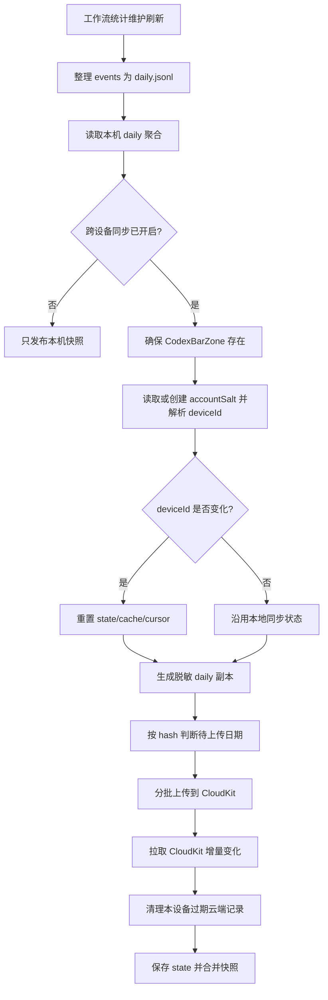

# 跨设备同步

本文档记录设置页「跨设备同步」的完整链路。当前实现只同步 Codex Hook 产生的工作流统计每日聚合，不是整个 App 的通用 iCloud 同步。

## 同步范围

会同步:

- `daily.jsonl` 中每一天的工作流统计聚合副本
- 会话总数、对话轮次、子智能体、工具调用、权限请求、上下文压缩等计数字段
- `eventCount` 和 `projectCounts`

不会同步:

- Codex 账号、额度、token 用量
- app-server 请求日志
- Codex auth 文件、refresh token、stderr 或原始 RPC 响应
- 原始 Hook 事件 `events/YYYY-MM-DD.jsonl`
- `sessionIds` 和 `turnIds`
- CodexBar 设置项、快捷键、日志窗口内容

同步目标是当前 macOS 登录的 iCloud 账号的 CloudKit private database。数据不会跨 iCloud 账号迁移或合并；切换 iCloud 账号后会进入另一个 private database。

## 代码入口

| 文件 | 职责 |
| --- | --- |
| `CodexBar/Services/Settings/WorkflowSyncSettings.swift` | 设置页状态、iCloud 可用性检查、UserDefaults 开关、最近上传时间、同步中通知 |
| `CodexBar/Services/WorkflowStats/WorkflowSyncService.swift` | CloudKit 设备标识、上传、拉取、缓存、游标、清理过期记录 |
| `CodexBar/Services/WorkflowStats/WorkflowStatsService.swift` | 在工作流统计维护刷新中调用同步服务，并把本机 daily 与 iCloud 缓存合并成快照 |
| `CodexBar/Models/CodexWorkflowStatsModels.swift` | 本机聚合、云端脱敏聚合、云端缓存记录、最终 UI 快照的模型和合并规则 |
| `CodexBar/Views/Settings/AppSettingsView.swift` | 设置页「跨设备同步」开关、`iCloud 不可用`、同步中和最近上传时间展示 |
| `CodexBar/Controllers/SettingsWindowController.swift` | 打开设置窗口前刷新 Hook 和 iCloud 同步状态 |
| `CodexBar/Controllers/StatusItemController.swift` | 自动刷新时触发维护同步；开关变化后立即触发一次维护刷新 |

## 本地状态

跨设备同步相关本地状态都在工作流统计目录下:

```text
~/Library/Application Support/CodexBar/HookEvents/
```

同步子目录:

```text
iCloudSync/state.json
iCloudSync/cache.jsonl
iCloudSync/cursor.data
```

各文件职责:

| 文件 | 内容 |
| --- | --- |
| `state.json` | 本机同步状态，包括 `deviceId`、每天上传过的 hash、`lastUploadAt`、`lastPrunedDate` |
| `cache.jsonl` | 从 iCloud 拉取到的其他设备脱敏 daily 记录，一行一条；不保存当前设备自己的云端副本 |
| `cursor.data` | CloudKit custom zone `CodexBarZone` 的 `CKServerChangeToken`，用于下次增量拉取 |

`state.json` 的逻辑结构:

```json
{
    "schema": 1,
    "deviceId": "<当前设备在当前 iCloud 账号下的匿名设备 ID>",
    "hashByDate": {
        "2026-06-25": "<脱敏 daily 聚合的 SHA256>"
    },
    "lastUploadAt": "2026-06-25T10:20:30Z",
    "lastPrunedDate": "2026-06-25"
}
```

设置开关存在 `UserDefaults`:

| Key | 含义 |
| --- | --- |
| `WorkflowiCloudSync.isEnabled` | 用户是否开启过跨设备同步 |
| `WorkflowiCloudSync.needsBackfill` | 是否需要对本机现有 daily 数据做一次补传 |

关闭跨设备同步只会把 `WorkflowiCloudSync.isEnabled` 写成 `false`，不会删除本地 `state.json`、`cache.jsonl`、`cursor.data`，也不会删除 CloudKit 中已有记录。

## CloudKit 数据结构

CloudKit 使用默认 container 的 private database。CodexBar 自己创建和维护的记录都保存在 custom zone `CodexBarZone`；不会向 CloudKit `_defaultZone` 写入同步数据。

账号级 metadata 记录保存在 custom zone `CodexBarZone`:

```text
zoneName = CodexBarZone
recordType = CodexBarSyncMetadata
recordName = accountSalt
fields:
  schemaVersion: Int
  salt: Data(32 bytes)
```

每天的工作流统计记录保存在 custom zone `CodexBarZone`:

```text
recordType = CodexBarDailyAggregate
recordName = <deviceId>_<yyyy-MM-dd>
fields:
  schemaVersion: Int
  deviceId: String
  date: String
  eventCount: Int
  sessionStartCount: Int
  stopCount: Int
  preToolUseCount: Int
  postToolUseCount: Int
  permissionRequestCount: Int
  preCompactCount: Int
  postCompactCount: Int
  subagentStartCount: Int
  subagentStopCount: Int
  sessionCount: Int?
  turnCount: Int?
  projectCounts: Data(JSON object)
  updatedAt: Date
```

`projectCounts` 会保留本机聚合中的项目显示名。项目显示名通常是 `cwd` 的最后一层目录名；如果路径最后一层为空，代码会回退到完整路径字符串。

## 设备标识

设备标识不直接上传 `IOPlatformUUID`。同步服务会先在当前 iCloud private database 中读取或创建 32 字节账号级 salt，然后计算:

```text
deviceId = HMAC_SHA256(accountSalt, IOPlatformUUID)
```

这个设计的效果:

- 同一台 Mac 在同一个 iCloud 账号下通常得到同一个 `deviceId`
- 同一台 Mac 切换 iCloud 账号后会得到不同的 `deviceId`
- CloudKit 中不会保存原始 `IOPlatformUUID`

如果本地 `state.json` 的 `schema` 和当前代码不一致，服务会丢弃旧同步状态。下一轮同步会按当前设备重新写入 `state.json`，清空旧 `cache.jsonl` / `cursor.data`，再从 `CodexBarZone` 重建缓存。当前调试阶段 iCloud sync state schema 保持为 `1`。

如果本地 `state.json` 中的 `deviceId` 和当前解析出的 `deviceId` 不一致，说明 iCloud 账号或账号级 salt 已变化。此时同步服务会重置本地同步状态，清空 `cache.jsonl`，并删除 `cursor.data`，然后按新账号重新同步。

## 设置页行为

设置页打开时会刷新:

- Codex Hook 本地配置状态
- `hooks/list` 验证结果
- iCloud account status
- 最近上传时间

`AppSettingsView.onAppear` 和 App 再次变为 active 时也会刷新 iCloud 可用性。

「跨设备同步」开关可操作的条件:

```text
Codex Hook 已开启
Codex Hook 当前没有正在更新
CKContainer.default().accountStatus == .available
```

UI 状态:

| 状态 | UI 表现 |
| --- | --- |
| iCloud 状态还在检查 | 开关不可操作，暂不显示错误 |
| iCloud 可用但 Hook 关闭 | 开关不可操作 |
| iCloud 不可用 | 开关不可操作，下方显示 `iCloud 不可用` |
| Hook 开启且 iCloud 可用 | 开关可操作 |
| 同步中 | 开关下方显示 `最近上传` 和小型进度指示 |
| 有成功上传记录 | 开关下方显示 `最近上传 yyyy-MM-dd HH:mm:ss` |

开启时:

1. `WorkflowSyncSettings.setEnabled(true)` 先确认 iCloud 可用。
2. 写入 `WorkflowiCloudSync.isEnabled = true`。
3. 写入 `WorkflowiCloudSync.needsBackfill = true`，要求后续同步补传本机已有 daily 数据。
4. `StatusItemController` 立即触发 `workflowStatsViewModel.refresh(performMaintenance: true)`。

关闭时:

1. 写入 `WorkflowiCloudSync.isEnabled = false`。
2. 后续 `WorkflowSyncService` 直接返回 `.disabled`，不再访问 CloudKit。
3. 本地同步状态、缓存和云端记录保留。

关闭 Codex Hook 不会清空跨设备同步偏好；但因为工作流统计同步只在 Hook 开启时触发，所以 Hook 关闭期间不会继续同步。之后重新开启 Hook 时，如果跨设备同步偏好仍为 true 且 iCloud 可用，同步会恢复。

## 刷新时机

跨设备同步只在工作流统计的维护刷新中执行。核心入口是:

```text
WorkflowStatsService.loadSnapshot(performMaintenance: true)
```

两类刷新行为不同:

| 刷新类型 | 是否维护 local daily | 是否访问 CloudKit | 用途 |
| --- | --- | --- | --- |
| `performMaintenance: false` | 否 | 否，只读取 `cache.jsonl` | 打开菜单面板时快速展示现有数据 |
| `performMaintenance: true` | 是 | 是 | 每分钟自动刷新、开关变化后的立即刷新 |

触发维护刷新:

- app-server 自动刷新倒计时重置时，如果 Codex Hook 已开启
- 用户开启或关闭「跨设备同步」后立即触发一次

Hook 子进程不访问网络。它只把原始事件写入本机 `events/YYYY-MM-DD.jsonl` 并标记 `maintenance.json` 的 pending 日期。真正的 daily 重建和 CloudKit 同步都由主 App 的维护刷新完成。

## 同步主流程



同步服务会在开始和结束时发出通知:

```text
CodexBar.workflowStatsICloudSyncDidStart
CodexBar.workflowStatsICloudSyncDidFinish
```

设置页通过这两个通知更新 `isSyncing` 和 `lastUploadAt`。

## 上传数据如何脱敏

本机 `daily.jsonl` 每行是 `WorkflowDailyAggregate`。上传前会转换成 `WorkflowCloudDailyAggregate`:

- 保留各类计数字段
- 保留 `projectCounts`
- 不包含 `sessionIds`
- 不包含 `turnIds`
- 如果本机还有 `sessionIds`，会把去重数量写入 `sessionCount`
- 如果本机还有 `turnIds`，会把去重数量写入 `turnCount`

本机 `daily.jsonl` 不会因为上传而被改写。也就是说，最近 3 个本地自然日的 `sessionIds` / `turnIds` 仍然只保存在本机，用于本机精确去重。

## 待上传日期选择

每次同步先构造候选日期:

```text
候选日期 =
  本轮维护后内容发生变化的日期
  + state.hashByDate 中还没有记录的本机日期
  + needsBackfill 为 true 时的全部本机日期
```

对每个候选日期:

1. 找到本机 daily 聚合。
2. 转换成脱敏 cloud aggregate。
3. 用固定字段顺序序列化为 JSON line。
4. 计算 SHA256。
5. 如果 hash 和 `state.hashByDate[date]` 相同，则跳过。
6. 否则加入待上传列表。

待上传列表按日期升序排列，保证每次补传顺序稳定。

## 上传节奏和时间预算

为避免每分钟自动刷新被长时间上传拖住，上传有两个限制:

```text
每批最多 25 天
每轮最多 20 秒
```

上传流程:

1. 以 25 天为一批切分待上传列表。
2. 每批开始前检查 Task 是否取消，以及是否仍在 20 秒预算内。
3. 先按 record ID 批量读取已有 CloudKit 记录。
4. 已存在的记录复用后改字段；不存在的记录创建新 `CKRecord`。
5. 使用 `database.modifyRecords(saving:deleting:savePolicy:.changedKeys, atomically:false)` 保存。
6. 对保存成功的日期，立即更新 `state.hashByDate[date]`。
7. 如果本批至少有成功日期，更新 `state.lastUploadAt`，并立刻写回 `state.json`。

如果某批 CloudKit 请求整体抛错，本轮上传停止。已经成功的批次不会回滚，剩余日期留给下一次刷新继续处理。

`needsBackfill` 只有在本机所有 daily 日期的 hash 都已经和 `state.hashByDate` 匹配后才会清除。这样首次开启时即使 20 秒内没有补完，后续每分钟刷新也会继续补传。

## 拉取缓存和游标

上传之后会更新本地 iCloud 缓存。`CodexBarDailyAggregate` 保存在 custom zone `CodexBarZone`, 因为 CloudKit 默认 zone 不支持 `getChanges`/zone change token。没有 `cursor.data` 时, App 会先 query 全量 `CodexBarDailyAggregate` 记录, 过滤掉当前设备自己的记录后回填 `cache.jsonl`, 然后从 `nil` 调用 CloudKit zone changes 补齐这段变化并保存新的 `cursor.data`; 有游标时优先拉取 custom zone 的增量变化:

```text
database.recordZoneChanges(
    inZoneWith: CodexBarZone,
    since: cursor,
    desiredKeys: nil,
    resultsLimit: 200
)
```

处理规则:

- 修改记录: 只接受 `CodexBarDailyAggregate`，转换成 `WorkflowCloudDailyRecord` 后写入内存 cache；如果 `deviceId == 当前设备`, 从 cache 中移除并跳过
- 删除记录: 如果删除的是 `CodexBarDailyAggregate`，按 record name 解析出 `deviceId` 和 `date`，从 cache 中移除
- `moreComing == true`: 继续用新的 change token 拉下一页
- `changeTokenExpired` 或增量拉取失败: 不写入日志窗口，直接 query 全量 `CodexBarDailyAggregate` 重建 `cache.jsonl`
- 全量重建后的游标基线建立失败: 保留已写入的 `cache.jsonl`, 不保存 `cursor.data`, 下轮刷新继续全量重建并再次尝试建立游标

本地落盘顺序很重要:

1. 先写 `cache.jsonl`
2. 再写 `cursor.data`

如果 `cache.jsonl` 写入失败，`cursor.data` 不会提前推进。下一轮会重新拉取同一批 CloudKit 变化，避免游标已经前进但缓存没有落盘导致记录丢失。

## 展示合并规则

UI 展示使用 `WorkflowStatsSnapshot`。合并规则是:

```text
最终展示 = 本机 daily.jsonl + iCloud 缓存中的其他设备记录
```

`cache.jsonl` 写入前会过滤当前设备自己的 CloudKit 记录，否则本机 daily 和自己上传到云端的副本会重复相加。

同一天多设备数据相加时，会先把每台设备的 daily aggregate 转成 `WorkflowDailyStats`，再按日期求和:

```text
sessionCount += other.sessionCount
turnCount += other.turnCount
toolCallCount += other.toolCallCount
permissionRequestCount += other.permissionRequestCount
contextCompactionCount += other.contextCompactionCount
subagentCount += other.subagentCount
```

本机数据永远以本机 `daily.jsonl` 为准。iCloud 缓存只补其他设备的数据。

CloudKit 拉取不会单独向 UI 推送新快照；只有当前这次 `WorkflowStatsService` 刷新最终提交结果时，菜单面板和热力图才会看到更新。非维护刷新只读取已有 `cache.jsonl`，不会主动联网。

## 保留和清理

本机工作流统计最多保留最近 210 天。跨设备同步遵循同样窗口:

- 读取缓存时会过滤掉 210 天窗口外的记录
- 保存 `cache.jsonl` 前也会过滤 210 天窗口外的记录
- 当前设备每天最多执行一次云端清理

云端清理只删除当前设备自己的过期记录:

```text
deviceId == 当前 deviceId
date < retentionCutoffDate
```

其他设备的记录不会由本机删除。每台设备只负责清理自己上传的过期记录。

当前实现不会因为本机 `daily.jsonl` 删除了某个仍在 210 天窗口内的日期，就主动删除该日期对应的 CloudKit 记录。它会等到该记录超过 210 天保留窗口后再清理。

## 失败和重试

失败处理以不中断工作流统计展示为目标。

| 场景 | 当前行为 |
| --- | --- |
| iCloud 未登录或不可用 | 设置页禁用「跨设备同步」，显示 `iCloud 不可用` |
| 用户尝试在 iCloud 不可用时开启 | `setEnabled(true)` 直接返回，不写入开启状态 |
| `CodexBarZone` 不存在 | 同步开始时创建 custom zone |
| CloudKit 上传失败 | 本轮上传停止，已成功批次保留，失败日期下次刷新继续 |
| CloudKit 增量拉取失败 | 不写入日志窗口，尝试全量重建缓存 |
| CloudKit 全量重建失败 | 本轮同步失败，保存已有 state，保留已有 cache，后续刷新重试 |
| 账号 salt 创建冲突 | 重新读取 CloudKit 中已有 salt |
| 本地 state schema 不匹配 | 丢弃旧 state，按当前 schema 重新同步 |
| `deviceId` 变化 | 重置本地同步 state/cache/cursor，按当前 iCloud 账号重新同步 |
| `changeTokenExpired` | 不写入日志窗口，尝试全量重建缓存并建立新的 cursor |
| `cache.jsonl` 写入失败 | 不保存新 cursor，下一轮重新拉取同一批变化 |
| 同步失败 | 设置页没有单独错误文案，`最近上传` 不更新 |

同步异常不会清空用户的开启偏好。只要 `WorkflowiCloudSync.isEnabled` 仍为 true、Codex Hook 开启且 iCloud 可用，后续维护刷新会继续重试。
