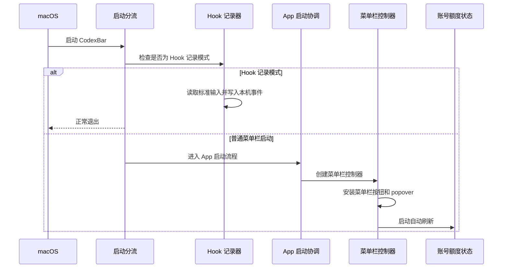
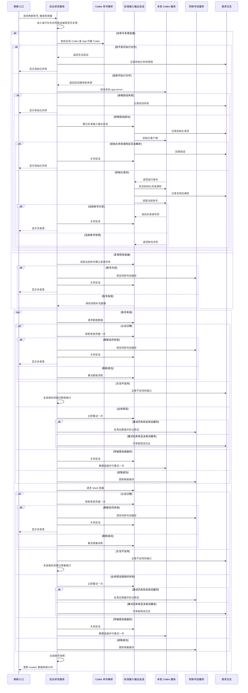
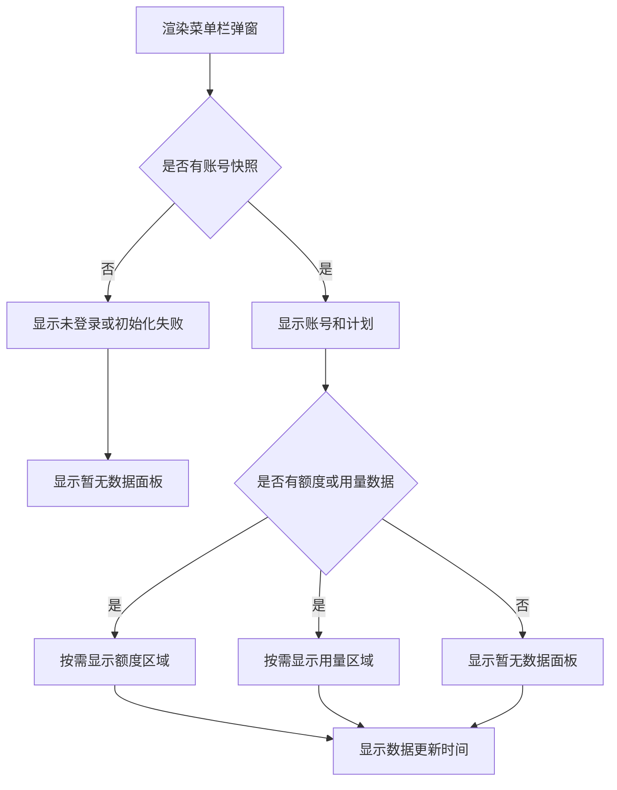
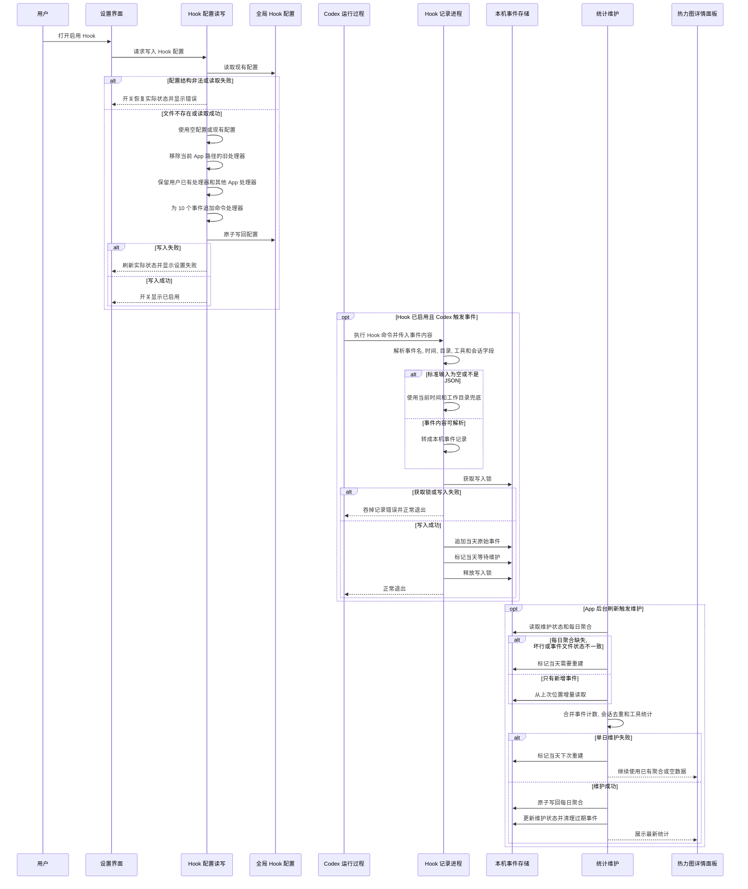
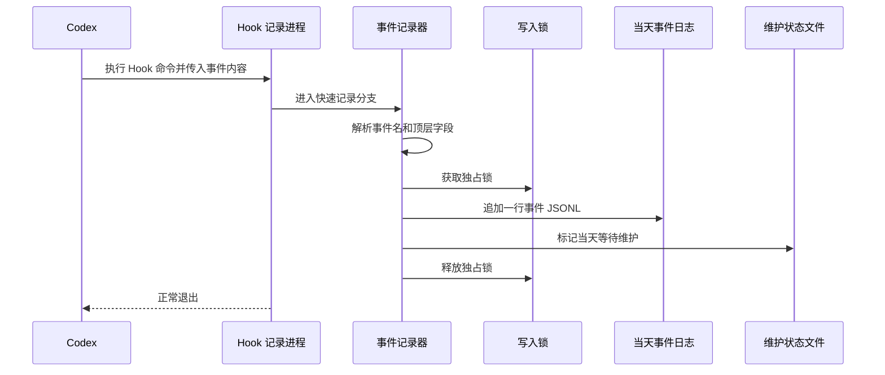
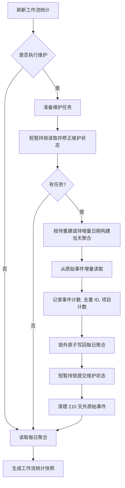

# CodexBar 开发文档

本文面向继续开发 CodexBar 的维护者, 记录当前 App 的主要流程, 数据边界和模块协作方式

更细的 app-server 协议见 [AppServer.md](AppServer.md), Codex Hook 统计口径见 [CodexHook.md](CodexHook.md)

## 1. 应用定位与工程边界

CodexBar 是一个 macOS 菜单栏应用, 使用 SwiftUI + AppKit + MVVM

App 通过本机 Codex app-server 读取账号, 额度和 token 用量, 通过 Codex Hook 记录本机工作流事件, 并把这些数据展示在菜单栏 popover, 设置窗口和日志窗口中

关键边界:

- 应用形态是 `LSUIElement`, 不显示 Dock 图标, 不依赖主窗口
- 最低系统版本是 macOS 15.0
- App Sandbox 保持关闭, 因为需要启动本机 `codex`, 读取真实用户 Codex 登录状态, 并写入用户级 Hook 配置
- 除 Sparkle 检查和下载更新外, App 自身不发起网络请求
- 账号, 额度, token 用量和 Hook 工作流统计都只在本机处理, 不发送给第三方
- Swift 工程开启 `SWIFT_DEFAULT_ACTOR_ISOLATION = MainActor`, 服务和模型中需要被后台队列同步访问的类型显式使用 `nonisolated`

源码目录职责:

| 目录                    | 职责                                                                    |
| ----------------------- | ----------------------------------------------------------------------- |
| `CodexBar/App/`         | SwiftUI 入口和 AppDelegate 启动分支                                     |
| `CodexBar/Controllers/` | 菜单栏, popover, 设置窗口, 日志窗口和窗口行为                           |
| `CodexBar/Models/`      | account, quota, usage, workflow stats, 日期网格和错误模型               |
| `CodexBar/Services/`    | app-server, Codex CLI 解析, 版本探测, Hook 设置, 统计维护, 更新, 登录项 |
| `CodexBar/Views/`       | popover, 设置窗口, 日志窗口和共享 Liquid Glass 样式                     |
| `Docs/`                 | app-server, Hook 和开发文档                                             |
| `Scripts/`              | DMG 和 appcast 发布脚本                                                 |

## 2. 总体架构

两条主数据链路:

- Codex app-server 链路: `CodexStatusService` 启动或复用本机 app-server, 生成 `CodexQuotaSnapshot`, 由 `CodexStatusViewModel` 发布给菜单栏 UI
- Codex Hook 链路: Codex 进程触发 Hook 命令, CodexBar 以 `--hook-event` 模式快速写入 JSONL; 主 App 后续维护聚合并生成 `WorkflowStatsSnapshot`

## 3. 启动流程

入口在 `CodexBar/App/CodexBarApp.swift`

`CodexBarApp.init()` 最先调用 `WorkflowHookEventRecorder.handleIfRequested()`, 用于区分普通 App 启动和 Hook 子进程启动



普通启动时, `CodexBarAppDelegate` 创建五个长期对象:

- `CodexStatusViewModel`: app-server 刷新状态
- `WorkflowStatsViewModel`: Hook 工作流统计快照
- `CodexHookSettings`: Hook 配置状态和写入操作
- `GlobalHotKeySettings`: 全局快捷键配置和错误状态
- `AppUpdater`: Sparkle 更新状态

`StatusItemController.install()` 负责:

- 配置菜单栏按钮图标, tooltip 和点击事件
- 配置 popover 的 SwiftUI 根视图
- 订阅状态变化并切换菜单栏图标
- 订阅全局快捷键配置并安装或移除 Carbon hot key
- 开始每 60 秒自动刷新

App 退出时, `applicationWillTerminate` 调用 `StatusItemController.uninstall()`, 关闭 popover, 注销全局快捷键, 移除订阅并从系统状态栏移除 status item

## 4. 菜单栏, Popover 与窗口流程

菜单栏按钮由 `NSStatusBar.system.statusItem(withLength:)` 创建

正常图标是 `person.fill.checkmark`, 错误图标是 `person.fill.xmark`

错误图标触发条件:

- `loadState` 是 `.notLoggedIn` 或 `.initializationFailed`
- 当前 snapshot 没有可信额度和用量数据, 即 `snapshot?.hasTrustedData == false`

点击行为:

| 操作             | 行为             |
| ---------------- | ---------------- |
| 左键点击         | 切换 popover     |
| 右键点击         | 打开上下文菜单   |
| Control + 点击   | 打开上下文菜单   |
| 全局快捷键       | 切换 popover     |
| 上下文菜单"设置" | 打开独立设置窗口 |
| 上下文菜单"日志" | 打开独立日志窗口 |
| 上下文菜单"退出" | 终止 App         |

全局快捷键由 `GlobalHotKeySettings` 和 `GlobalHotKeyController` 管理。没有用户设置时默认注册 `⌘⇧W`; 用户清除后不注册快捷键。注册冲突时恢复到上一个已注册快捷键, 并把错误显示在设置窗口的快捷键行内。

打开 popover 的顺序:

- 取消正在等待的延迟刷新和淡入淡出任务
- 设置状态为 `opening`, 准备透明度淡入
- 显示 `NSPopover`, 把 `PopoverVisibilityState.isVisible` 设为 `true`
- 调用 `refreshWorkflowStatsIfHookEnabled(performMaintenance: false)`, 只读取已有 `daily.jsonl`, 不做重维护
- 安装 `PopoverDismissMonitor`, 监听 popover window 并只将 popover window 置前和设为 key window
- 执行 0.24 秒淡入
- 延迟 160 ms 后调用 `viewModel.refreshIfNeeded()`

关闭 popover 的顺序:

- 移除本地和全局事件监听
- 将 `isVisible` 设为 `false`, 让倒计时停止 `TimelineView` 每秒 tick
- 临时禁止设置窗口和日志窗口成为 key window, 避免关闭 popover 时 AppKit 把这些辅助窗口提到前面
- 默认执行 0.18 秒淡出, 无法淡出时直接关闭
- popover 关闭后延迟 120 ms 恢复设置窗口和日志窗口的 key window 能力

`PopoverDismissMonitor` 监听这些 dismiss 条件:

- popover 外部鼠标点击
- Escape
- Command-Tab
- App 失去 active
- 其他应用被激活
- popover window 失去 key

Command-Space 不直接关闭 popover, 只短暂抑制 600 ms 内的 active 变化关闭逻辑, 避免 Spotlight 或系统搜索抢焦点时误关弹窗。

设置窗口和日志窗口都继承 `HostingWindowController` 的行为: 懒创建, 关闭后不释放, 重新打开复用, 按当前屏幕居中, 重新打开对应入口时只移动和置前对应窗口。

设置窗口和日志窗口使用 `AuxiliaryHostingWindow`; 窗口可以成为 key window, 但不能成为 main window。通过快捷键打开或关闭 popover 时, 只激活并置前 popover, 不主动置前已有的设置窗口或日志窗口。

## 5. Codex 状态刷新流程

刷新入口在 `CodexStatusViewModel`:

- `startAutoRefresh()` 先尝试一次 `refreshIfNeeded()`, 之后按 `autoRefreshDelay` 循环
- 刷新间隔是 60 秒
- `refreshIfNeeded()` 会比较 `autoRefreshCountdownStartedAt`, 避免 popover 打开和自动刷新同时触发重复请求
- `refresh()` 通过 `isRefreshing` 防重入

下面的时序图展示刷新, app-server 握手, 额度与用量读取, 以及常见错误后的重试或降级



`CodexStatusService` 的连接策略:

- 所有连接状态只在 `CodexBar.app-server` 串行队列上访问
- 请求超时是 20 秒
- 连接最大复用时间是 1 小时, 超过后重建, 便于后台升级后的 `codex` 二进制生效
- 忽略 `SIGPIPE`, 断管由 `write` 抛错后走连接重建
- 复用连接发生传输故障时只重建并重试一次, 避免故障状态下反复拉起进程
- 新连接初始化失败直接返回 `.initializationFailed`

`CodexFetchOutcome` 只向 UI 暴露三种结果:

| outcome                 | UI 状态                                |
| ----------------------- | -------------------------------------- |
| `.data(snapshot)`       | `.loaded` 并展示数据                   |
| `.notLoggedIn`          | `.notLoggedIn`, snapshot 清空          |
| `.initializationFailed` | `.initializationFailed`, snapshot 清空 |

更细的启动失败, 请求失败, 超时, 断连, 解析失败, 业务错误都只进入请求日志

## 6. app-server 会话与日志

app-server 启动命令必须通过 `CodexCLIResolver.resolveAppServerCommand()` 解析, 最终参数是:

```bash
codex app-server --listen stdio://
```

解析优先级:

- PATH 中的全局 `codex`
- 如果 PATH 中的 `codex` 等价于 `/Applications/Codex.app/Contents/Resources/codex`, 它被视为 Codex APP 内置 CLI, 不算全局 CLI
- 全局 CLI 不存在时回退 Codex APP 内置 CLI
- 两者都不存在时抛出 `CodexStatusError.executableNotFound`

环境变量由 `CodexCLIResolver.environment` 构造:

- 保留当前环境
- `HOME` 使用 `getpwuid(getuid())` 获取真实用户 home
- 同步设置 `USER` 和 `LOGNAME`
- 合并 Homebrew, npm global, `.local`, Volta 和系统路径
- 确保 `TERM` 有值

`AppServerSession` 负责 JSON-RPC 读写:

- 每个带 id 的请求先写入 `RequestLogStore.beginRequest`
- 请求 JSON 使用 sorted keys 和不转义斜杠序列化
- 写入 stdin 时追加换行
- `JSONLineReader` 从 stdout 读取按行 JSON, 只处理 id 匹配的响应, 其他行忽略
- 收到 JSON-RPC error 时转成 `CodexStatusError.serverError(message)`
- 响应不能解析成期望类型时归为 `.invalidServerResponse`
- `initialized` 是无 id 通知, 不等待响应, 但记录为"请求"
- `PipeDrain` 只 drain stderr, 不把子进程 stderr 展示给用户

请求错误分类:

| 错误                         | 处理                                                              |
| ---------------------------- | ----------------------------------------------------------------- |
| 认证失败                     | 同一轮最多 `account/read(refreshToken:true)` 一次, 然后重试原读取 |
| unsupported method           | 当前连接记住该 method, 后续跳过                                   |
| 非认证业务错误               | `AppServerSession` 先重试同请求一次, 仍失败后不阻断整轮刷新       |
| 连接断开, 超时, 响应解析失败 | 视为传输故障, 外层重建连接                                        |

`RequestLogStore` 是常驻全局日志:

- 容量上限 500 条
- 单条详情上限 4000 字符
- 合法 JSON 会稳定化显示, 非 JSON 错误消息保持原样
- storage 用 `NSLock` 保护, SwiftUI 通知切回主线程发送
- 日志窗口关闭不会清空日志

日志状态标签:

| Kind             | UI 标签 |
| ---------------- | ------- |
| `.pending`       | 进行    |
| `.response`      | 完成    |
| `.failure`       | 错误    |
| `.emptyResponse` | 请求    |

## 7. 错误处理总览

错误处理的基本原则:

- Popover 只展示"未登录"和"初始化失败"两类特殊状态
- 具体启动失败, 请求失败, 超时, 断连, 解析失败和业务错误进入日志窗口
- 账户有效时, rate limits 和 usage 可以单独失败, 失败区域按缓存或无数据处理
- 登录项和 Hook 写入错误显示在设置窗口中部的独立错误组
- 全局快捷键录制, 校验和注册错误显示在快捷键行内
- Hook 子进程尽量快速退出, 事件记录失败不会阻断 Codex 自身流程

app-server 与状态刷新错误:

| 错误来源                                     | 检测位置                                     | 用户可见状态                             | 日志或存储                                   | 重试或降级                                                        |
| -------------------------------------------- | -------------------------------------------- | ---------------------------------------- | -------------------------------------------- | ----------------------------------------------------------------- |
| 找不到全局 Codex CLI 和 Codex APP 内置 CLI   | `CodexCLIResolver.resolveAppServerCommand()` | `初始化失败`                             | `RequestLogStore.recordFailure` 记录可读错误 | 不启动 app-server, 下轮刷新重新解析                               |
| app-server 进程启动失败                      | `Process.run()`                              | `初始化失败`                             | 记录"app-server 启动失败"                    | 不复用本次进程, 下轮刷新重试                                      |
| `initialize` 或首次 `account/read` 失败      | `CodexStatusService.openConnection`          | `初始化失败`                             | 对应 JSON-RPC 请求进入日志                   | 关闭本次 session, 不重复完整握手                                  |
| 首次 `account/read` 返回 `account == nil`    | `CodexStatusService.openConnection`          | `未登录`                                 | 请求响应进入日志                             | 关闭本次 session, 不生成 snapshot                                 |
| 复用连接刷新 account 后返回 `account == nil` | `CodexStatusService.fetchData`               | `未登录`                                 | 请求响应进入日志                             | 清空 supplemental cache, teardown connection                      |
| JSON-RPC 认证失败                            | `CodexStatusError.isAuthenticationRequired`  | 取决于刷新后结果                         | 失败响应进入日志                             | 同一轮最多 `account/read(refreshToken:true)` 一次, 然后重试原读取 |
| refresh token 后仍认证失败                   | `ReadResult.resultAfterAuthAttempt`          | `未登录`                                 | 失败响应进入日志                             | 清空 cache, teardown connection                                   |
| unsupported method                           | `CodexStatusError.isUnsupportedMethod`       | 对应区域可能显示无数据                   | 失败响应进入日志                             | 当前 session 记住 method, 后续跳过, 不复用旧缓存                  |
| 非认证业务错误                               | `CodexStatusError.isRetriableServerError`    | 通常不改变整体状态                       | 失败响应进入日志                             | 同请求立即重试一次, 仍失败则 supplemental 读取按失败处理          |
| rate limits 读取失败                         | `CodexStatusService.cachedRead`              | 有旧缓存时区域半透明, 无旧缓存时无额度区 | 失败进入日志                                 | 同账号旧缓存复用并标记 `isRateLimitsStale`                        |
| usage 读取失败                               | `CodexStatusService.cachedRead`              | 有旧缓存时区域半透明, 无旧缓存时无用量区 | 失败进入日志                                 | 同账号旧缓存复用并标记 `isUsageStale`                             |
| 连接断开, 请求超时, 响应解析失败             | `CodexStatusError.isTransportFailure`        | 复用连接重建失败后为 `初始化失败`        | 请求标记为错误                               | 复用连接只重建重试一次, 新连接失败不再重试                        |
| app-server 关闭超时                          | `AppServerSession.close()`                   | 不直接改变 UI                            | 记录强制结束或仍在后台运行                   | 先 terminate 等 1 秒, 再 SIGKILL 等 0.5 秒                        |
| snapshot 无可信 quota 和 usage               | `CodexQuotaSnapshot.hasTrustedData`          | 菜单栏切换错误图标                       | 不新增日志                                   | 仍可展示 stale 数据或无数据面板                                   |

日志错误处理:

| 场景                     | 行为                                 |
| ------------------------ | ------------------------------------ |
| 请求发送后等待响应       | 日志先显示"进行"                     |
| 收到正常响应             | 回填同一条日志为"完成"               |
| 请求失败或响应解析失败   | 回填同一条日志为"错误"               |
| `initialized` 无 id 通知 | 记录为"请求", 不等待响应             |
| 进程级错误没有 method    | 日志行直接预览错误文本               |
| 合法 JSON 内容           | 重新序列化为稳定顺序并保留未转义斜杠 |
| 超长详情                 | 截断到 4000 字符                     |

设置, Hook 和更新错误:

| 错误来源                         | 检测位置                                                 | 用户可见状态                              | 重试或降级                                       |
| -------------------------------- | -------------------------------------------------------- | ----------------------------------------- | ------------------------------------------------ |
| 登录项注册或取消失败             | `LoginItemSettings.setEnabled`                           | 设置窗口中部错误组显示"设置开机启动失败"  | 调用 `refresh()` 恢复实际状态                    |
| `hooks.json` 读取失败或结构非法  | `CodexHookSettings.refresh`                              | Hook 开关视为关闭, 中部错误组显示读取失败 | 不写配置                                         |
| Hook 开关写入失败                | `CodexHookSettings.setEnabled`                           | 中部错误组显示"设置 Codex Hook 失败"      | 调用 `refresh()` 恢复实际状态                    |
| 快捷键无法识别或不符合规则       | `HotKeyRecorderRow` / `GlobalHotKeySettings.setShortcut` | 快捷键行内显示红色错误                    | 用户清除后重新录制                               |
| 快捷键注册冲突                   | `StatusItemController.applyGlobalHotKey`                 | 快捷键行内显示占用提示                    | 恢复上一个已注册快捷键                           |
| Hook 子进程 payload 不是 JSON    | `WorkflowHookEventRecorder.stdinPayload`                 | 无 UI 提示                                | 使用空 payload 和 fallback 字段继续记录          |
| Hook 子进程写入失败              | `WorkflowHookEventRecorder.handleIfRequested`            | 无 UI 提示                                | `try? record` 吞掉错误并正常退出, 避免阻断 Codex |
| `daily.jsonl` 缺失, 空文件或坏行 | `WorkflowStatsService.prepareMaintenanceTasksOnQueue`    | 热力图详情面板可能暂时显示 0              | 标记 dirty, 后续从 events 文件重建               |
| events 文件变小或 offset 不一致  | `WorkflowStatsService.reconcileEventFiles`               | 热力图详情面板可能暂时显示旧聚合          | 标记 dirty, 从头重建当天聚合                     |
| 单个维护任务失败                 | `WorkflowStatsService.performMaintenanceIfNeededOnQueue` | 使用已有 daily 或空 snapshot              | 对应日期标记 dirty                               |
| Sparkle 配置缺失                 | `AppUpdater.init`                                        | 更新开关禁用, 操作显示"未配置更新资源"    | 不创建 updater controller                        |
| 手动检查没有更新                 | `updaterDidNotFindUpdate`                                | 显示"没有可用更新"                        | 1 秒后自动清理状态                               |
| 手动检查失败                     | `didAbortWithError`                                      | 显示"检查更新失败"                        | 不展示底层错误细节                               |

Codex 版本探测错误:

| 错误来源                        | 显示文本                                 | 处理                                      |
| ------------------------------- | ---------------------------------------- | ----------------------------------------- |
| 对应安装源不存在                | `未找到 Codex CLI` 或 `未找到 Codex APP` | 不启动探测进程                            |
| `codex --version` 启动失败      | `启动失败`                               | 该来源显示错误, 另一个来源继续            |
| 版本探测超时                    | `读取超时`                               | terminate 后 SIGKILL, 停止 pipe collector |
| 进程退出码非 0                  | `读取失败`                               | 不展示 stderr 细节                        |
| stdout 和 stderr 都没有可用版本 | `版本未知`                               | 保留路径, 版本列显示错误                  |

发布脚本错误:

| 脚本                 | 失败条件                                                        | 行为                                   |
| -------------------- | --------------------------------------------------------------- | -------------------------------------- |
| `Scripts/dmg.sh`     | 找不到唯一 App, 版本号缺失, DMG 挂载失败, 缺少必要命令          | `set -euo pipefail` 直接退出并打印错误 |
| `Scripts/appcast.sh` | 找不到 DMG, appcast, Xcode 工程, build setting 或 `sign_update` | 直接退出并打印错误                     |
| `Scripts/appcast.sh` | 无法解析 `sparkle:edSignature`                                  | 打印 sign_update 原始输出并退出        |
| `Scripts/appcast.sh` | appcast 缺少插入点或 XML 校验失败                               | 退出, 不继续发布                       |

## 8. Snapshot 合成流程

`CodexQuotaSnapshot` 是 popover 展示 app-server 数据的唯一入口

它由 `AccountReadResponse`, 可选的 `AccountRateLimitsResponse` 和可选的 `AccountUsageResponse` 合成

账户规则:

- `AccountReadResponse.account` 必须存在, 否则视为未登录
- 账户存在时, 即使 rate limits 和 usage 都没有数据, 也生成 snapshot, 让 UI 展示"暂无数据"
- `CodexAccount.displayName` 优先使用 email, 没有 email 时按 account type 映射为 `API Key`, `ChatGPT`, `Amazon Bedrock` 或原始 type

额度规则:

- 优先读取 `rateLimitsByLimitId`, 为空时回退顶层 `rateLimits`
- 顶层 `rateLimits.limitId` 指向的主 limit 置顶, 缺省为 `codex`
- 其他 limit 按 `limitName ?? limitId` localized standard 排序, 再按 `limitId` 稳定排序
- 每个 limit 的 `primary` 和 `secondary` 合成 `[QuotaWindow]`
- 没有窗口的 limit 被过滤
- `remainingPercent = clamp(100 - usedPercent, 0...100)`
- `windowDurationMins` 标签按 `ND`, `NH`, `NM` 格式化, 缺失或非正数显示"额度"
- 本轮 rate limits 请求失败但同账号有旧缓存时复用旧值, 并把 `isRateLimitsStale` 设为 `true`

用量规则:

- `AccountUsageResponse.summary` 提供全时累计, 单日峰值, 当前连胜, 最长连胜, 最长任务
- `dailyUsageBuckets` 按 `startDate` 汇总 token
- `CodexUsageSnapshot.recentWeekGrid` 使用 `CodexWeekGrid` 生成周日到周六排列的日期网格
- 本轮 usage 请求失败但同账号有旧缓存时复用旧值, 并把 `isUsageStale` 设为 `true`

热力图日期规则由 `UsageHeatmapDay.grid` 合并 token 和 workflow stats:

- 固定 30 列 x 7 行
- Hook 开启时包含今天
- Hook 关闭但 app-server 已返回当天 token bucket 时包含今天
- Hook 关闭且没有当天 token bucket 时结束于昨天
- `nil` 表示未来日期或无法生成日期, UI 不绘制方块, 也不参与峰值计算
- 今天没有 token bucket 但 Hook 开启时, 今天 token 显示 `--`

## 9. Popover UI 展示流程

`CodexStatusMenuView.menuWidth` 由热力图宽度和 padding 推导:

```swift
Metrics.padding * 2 + MenuMetrics.panelPadding * 2 + UsageHeatmap.Metrics.totalWidth
```

UI 状态分支:



账号区:

- 正常状态显示账号, 计划和刷新进度
- 账号图标双击触发刷新
- 邮箱文本双击切换模糊显示
- 计划名是右侧加粗纯文字, 颜色由 `planBadgeTint(for:)` 按 enterprise, team/business, pro, plus, edu, free, 默认 cyan 匹配
- 没有 snapshot 时只展示"未登录"或"初始化失败"两种特殊状态

额度区:

- 多个 limit 间用 `LiquidGlassDivider` 分隔
- 每个 quota window 展示标签, 50 个固定胶囊组成的电量条, 剩余百分比和重置时间
- 胶囊宽度为 `3.5`, 间距为 `2`, 高度为 `12`
- 额度行标签列宽 `34`, 居中显示, 标签允许最小缩放到 `0.75`, 标签到电量条间距 `12`, 电量条到百分比间距 `8`, 百分比列宽 `37`, 百分比到重置时间最小间距 `6`, 重置时间列宽 `75`
- 重置时间格式为 `MM-dd HH:mm`, 使用等宽数字, 在额度行最右侧对齐
- 无数据时百分比和重置时间显示 `--`, 电量条用占位色
- stale 数据通过 `.markStale(true)` 降低透明度到 0.55

用量区:

- 指标行展示"全时累计", "单日峰值", "当前连胜", "最长连胜", "最长任务"
- token 文本由 `TokenCountText` 格式化, 1K 以下完整显示, 1K 起显示 K/M/B
- 热力图方块强度按当天 token 相对当前 30 周峰值计算, 并用 `pow(percent, 0.62)` 调整视觉强度
- hover 时通过 `UsageHeatmapHoverContext` 通知 `HeatmapDetailPanelController` 展示侧边详情面板
- 指针会吸附到最近方块, 吸附动画 0.12 秒; 离开热力图后延迟 160 ms 清除选中状态

热力图详情面板是 popover 的 borderless nonactivating child panel, 不接收鼠标事件, 按悬停列优先显示在 popover 左侧或右侧; 左右空间不足时尝试另一侧, 最终在当前屏幕可见区域内保留 8 px 边距。侧边切换时先以 0.12 秒抽屉动画收起, 再以 0.18 秒展开。

详情面板分两种:

| Hook 状态 | 内容                                                                                           | 尺寸        |
| --------- | ---------------------------------------------------------------------------------------------- | ----------- |
| 关闭      | 日期, token 数和"用量强度"分段条                                                               | `212 x 84`  |
| 开启      | 日期, token 数, "用量强度"分段条, 会话总数, 对话轮次, 子智能体, 工具调用, 权限请求, 上下文压缩 | `212 x 189` |

Hook 开启且当天没有 token bucket 时, 今天的 token 数显示 `--`。日期使用 `AnimatedDateText` 做数字滚动, token 数使用 `TokenCountText` 并保留数字和单位宽度。
「用量强度」前置圆点固定为蓝色, 不随用量强度变化。

更新时间行:

- 显示倒计时圆环, "数据更新时间"和 `HH:mm:ss`
- popover 可见时使用 `TimelineView(.periodic(..., by: 1))` 每秒 tick
- popover 不可见时只渲染一次静态圆环
- 普通 tick 不做连续动画, 只有刷新起点变化时播放 0.5 秒恢复动画
- 如果 Sparkle 自动发现新版, 右侧显示 `panelUpdateMessage`, 双击该文本调用 `startUpdate()`

## 10. Codex Hook 开启后完整流程

设置页"启用 Codex Hook"由 `CodexHookSettings` 管理, 配置文件是:

```text
~/.codex/hooks.json
```

下面的时序图展示开启 Hook, Codex 触发事件, 本机写入, 后台维护, 以及常见错误后的处理



当前安装事件:

- `SessionStart`
- `UserPromptSubmit`
- `PreToolUse`
- `PostToolUse`
- `PermissionRequest`
- `PreCompact`
- `PostCompact`
- `Stop`
- `SubagentStart`
- `SubagentStop`

每个处理器形如:

```bash
'<当前 CodexBar 可执行文件路径>' --hook-event SessionStart
```

识别和移除 CodexBar 自己的 Hook 时必须同时满足:

- handler 是 JSON 对象
- `type == "command"`
- `command` 等于当前 App 可执行路径生成的命令

这意味着:

- 用户已有 Hook 会被保留
- 其他 App Hook 会被保留
- 其他路径的 CodexBar Hook 不会被当作当前 App Hook 删除
- 同一事件下其他处理器会被保留

检测是否已开启时, 要求全部 CodexBar 事件都存在当前 App 路径对应的 handler

## 11. Hook 事件写入流程

Hook 子进程写入路径追求轻量, 避免超过 Codex Hook timeout



读取字段:

| Hook payload 字段       | 写入字段                                        |
| ----------------------- | ----------------------------------------------- |
| `timestamp`             | `timestamp`, 本机时间 `yyyy-MM-dd HH:mm:ss.SSS` |
| `cwd`                   | `cwd`                                           |
| `tool_name`             | `tool`                                          |
| `model`                 | `model`                                         |
| `permission_mode`       | `permission`                                    |
| `session_id`            | `session`                                       |
| `turn_id`               | `turn`                                          |
| 命令参数 `--hook-event` | `event`                                         |

缺失字段不阻断写入:

- `timestamp` 缺失或无法解析时使用当前时间
- `cwd` 缺失时使用当前工作目录
- 其他字段缺失写为 `null`

Hook 数据目录:

```text
~/Library/Application Support/CodexBar/HookEvents/
```

文件职责:

| 文件                      | 职责                                             |
| ------------------------- | ------------------------------------------------ |
| `events/YYYY-MM-DD.jsonl` | 按本机日期拆分的原始 Hook 事件                   |
| `daily.jsonl`             | 每日聚合结果, UI 优先读取                        |
| `stats.lock`              | `flock` 锁文件                                   |
| `maintenance.json`        | pending, dirty, offset, size, corrupt 等维护状态 |

## 12. Workflow Stats 维护与聚合流程

`WorkflowStatsViewModel` 刷新规则:

- `refreshIfNeeded(performMaintenance: false)` 至少间隔 5 秒
- `performMaintenance: true` 时跳过 5 秒节流, 直接刷新
- 打开 popover 时如果 Hook 开启, 只读取现有 `daily.jsonl`, 不维护
- app-server 自动刷新倒计时重置时, 如果 Hook 开启, 触发一次带维护的 workflow stats 刷新

维护流程在 `WorkflowStatsService` 的 `CodexBar.workflow-stats` 串行队列执行



任务类型:

| 类型    | 触发条件                                                   | 读取方式                        |
| ------- | ---------------------------------------------------------- | ------------------------------- |
| dirty   | schema 变化, daily 缺失或坏行, events 状态不一致, 文件缩小 | 从当天 events 文件开头重建      |
| pending | Hook 新增事件或 events 文件变大                            | 从 `days[date].offset` 增量读取 |

聚合规则:

- 事件名先去掉 `_` 和 `-`, 再转小写
- `sessionStartCount`, `stopCount`, `preToolUseCount` 等按归一化事件名增加
- 最近 7 天保留 `sessionIds` 和 `turnIds`, 用于继续去重
- 7 天前把 ID 集合压缩为 `sessionCount` 和 `turnCount`, 随后移除 ID 列表
- 最多保留最近 210 天数据
- 210 天外的 `events/YYYY-MM-DD.jsonl` 在主 App 维护流程中删除
- 坏 JSONL 行跳过并计入 `corrupt`, 不阻断整天聚合

UI 展示指标来自 `WorkflowDailyAggregate.stats`:

| UI 字段    | 生成规则                                                |
| ---------- | ------------------------------------------------------- |
| 会话总数   | `sessionCount ?? sessionIds.count ?? sessionStartCount` |
| 对话轮次   | `turnCount ?? turnIds.count ?? stopCount`               |
| 子智能体   | `max(subagentStartCount, subagentStopCount)`            |
| 工具调用   | `max(preToolUseCount, postToolUseCount)`                |
| 权限请求   | `permissionRequestCount`                                |
| 上下文压缩 | `max(preCompactCount, postCompactCount)`                |

## 13. 设置窗口流程

设置窗口由 `SettingsWindowController` 打开, 内容是 `AppSettingsView`

`onAppear` 时刷新:

- `LoginItemSettings.refresh()`
- `CodexHookSettings.refresh()`
- `AppUpdater.refreshAutomaticCheckSetting()`
- `CodexCLIVersionViewModel.refresh()`
- `CodexStatusViewModel.refreshCodexConnectionInfo()`

App 再次成为 active 时, 也会刷新 Codex 版本区

版本探测内部有 60 秒节流, 避免 `onAppear` 和 `didBecomeActive` 连续触发时重复启动子进程

设置项:

| 设置项          | 状态源                                               | 写入行为                             |
| --------------- | ---------------------------------------------------- | ------------------------------------ |
| 开机自动启动    | `SMAppService.mainApp.status`                        | `register()` / `unregister()`        |
| 自动检查更新    | Sparkle updater                                      | 设置 `automaticallyChecksForUpdates` |
| 使用快捷键      | `GlobalHotKeySettings.shortcut`                      | 写入 `UserDefaults` 并注册 hot key   |
| 启用 Codex Hook | `~/.codex/hooks.json`                                | 追加或移除当前 CodexBar command hook |
| CodexBar 版本   | Bundle + AppUpdater 状态                             | 有更新状态时优先显示动态消息         |
| Codex 版本      | `CodexCLIVersionSnapshot` + 当前 app-server 握手信息 | 路径点击复制到剪贴板                 |

错误显示:

- 开机启动失败和 Hook 设置失败显示在设置组与底部按钮组之间的独立错误组
- 没有登录项或 Hook 错误时不渲染错误组
- 快捷键无法识别, 规则不合法或注册冲突显示在快捷键行内
- 更新检查状态显示在 CodexBar 版本行
- Hook 开关说明只展示辅助说明, 不展示启用或关闭状态文案

## 14. Codex CLI 解析与版本探测

`CodexCLIResolver` 同时服务于 app-server 启动和版本探测

安装源模型:

- `.global`: PATH 中真实全局 `codex`
- `.bundled`: `/Applications/Codex.app/Contents/Resources/codex` 或等价路径

`CodexCLIInstallations.activeSource` 与启动优先级一致: 全局优先, 内置回退

`CodexCLIVersionService` 的版本探测:

- 在 `CodexBar.codex-version` 串行队列执行
- 先解析安装源
- 全局和内置版本探测先并发启动, 再收集结果, 避免两个 5 秒超时串行叠加
- 每个探测运行 `codex --version`
- stdout 和 stderr 都收集, 最多各 64 KiB
- 进程超时时先 terminate, 再 SIGKILL
- 第一行中第一个以数字开头的 token 作为显示版本

`CodexCLIVersionDisplay` 合并磁盘探测结果和当前 app-server 连接信息:

- 当前运行来源优先显示 app-server `initialize` 握手里的版本
- 非当前来源显示磁盘探测版本
- 当前运行版本低于磁盘安装版本时, 显示"已更新至 <version>"
- 路径点击复制到剪贴板, 1.5 秒后恢复路径显示

## 15. Sparkle 更新流程

`AppUpdater` 是 `@MainActor ObservableObject`

初始化时先检查 Bundle 中的 Sparkle 配置:

- `SUFeedURL` 必须是 http 或 https
- `SUPublicEDKey` 必须非空

配置不可用时:

- 不创建 `SPUStandardUpdaterController`
- `canConfigureAutomaticChecks == false`
- 手动检查或启动更新显示"未配置更新资源"

配置可用时:

- 创建 `SPUStandardUpdaterController(startingUpdater: true, updaterDelegate: self, userDriverDelegate: nil)`
- 从 updater 读取自动检查设置

手动检查:

- `checkForUpdates()` 设置 `isManualCheckInProgress = true`
- 设置页显示"正在检查更新"
- 调用 `checkForUpdateInformation()`
- delegate 回调发现新版时设置 `availableUpdateMessage`, 手动检查时同时保持设置页消息
- 没有新版时显示"没有可用更新"1 秒
- 失败时显示"检查更新失败"

被动发现新版:

- 自动检查发现新版时设置 `panelUpdateMessage`
- popover 底部更新时间行显示该消息
- 双击消息调用 `startUpdate()`, 激活 App 并打开 Sparkle 更新流程

## 16. 日志窗口流程

日志窗口由右键菜单"日志"打开, 内容是 `LogView(store: RequestLogStore.shared)`

展示规则:

- 顶部显示标题和当前日志条数
- "清空"按钮调用 `RequestLogStore.clear()`
- 空状态显示"暂无日志"
- 有日志时使用 `ScrollView + LazyVStack`, 最新日志在前
- 每行默认显示时间, 状态标签, method 或无 method 记录的详情预览
- 点击行展开请求和响应或错误详情
- 详情文本开启 `.textSelection(.enabled)`

日志只记录经过 `RequestLogStore` 的请求和错误

为了保护隐私, 不直接展示 app-server stderr, Codex auth 文件内容或未截断的长响应

## 17. 发布脚本流程

发布脚本位于 `Scripts/`, 修改后至少运行 shell 语法检查

`Scripts/dmg.sh [App.app] [Output.dmg]`:

- 解析 App 路径, 未指定时从项目根查找唯一 `.app`
- 读取 `MARKETING_VERSION`, 优先从 Xcode build settings 读取, 失败后回退 `project.pbxproj` 和 App `Info.plist`
- 准备临时 staging 目录, 复制 `.app` 并创建 `/Applications` 符号链接
- 创建可写 DMG
- 挂载 DMG 并用 AppleScript 写 Finder icon view 布局
- 压缩为最终 UDZO DMG

`Scripts/appcast.sh [CodexBar-vX.Y.Z.dmg]`:

- 解析 DMG, appcast, 下载地址, release notes 地址和 Xcode 工程
- 读取 Release 配置中的 `MARKETING_VERSION`, `CURRENT_PROJECT_VERSION` 和 `PRODUCT_NAME`
- 查找 Sparkle `sign_update`
- 对 DMG 签名并解析 `sparkle:edSignature` 和长度
- 生成新的 appcast `<item>`
- 移除同 build version 旧 item, 再插入新 item
- 如果存在 `xmllint`, 校验 appcast XML

## 18. 并发, 隔离与文件安全

主要并发边界:

| 模块                              | 并发策略                                          |
| --------------------------------- | ------------------------------------------------- |
| UI, 控制器, ViewModel, 设置, 更新 | `@MainActor`                                      |
| `CodexStatusService`              | `DispatchQueue(label: "CodexBar.app-server")`     |
| `CodexCLIVersionService`          | `DispatchQueue(label: "CodexBar.codex-version")`  |
| `WorkflowStatsService`            | `DispatchQueue(label: "CodexBar.workflow-stats")` |
| `RequestLogStore`                 | `NSLock` 保护 storage, 主线程发送 SwiftUI 通知    |
| Hook 写入                         | `stats.lock` + `flock(LOCK_EX)`                   |
| app-server stdout                 | `JSONLineReader` 使用锁和 semaphore               |
| 版本探测输出                      | `PipeCollector` 使用锁和 semaphore                |

文件写入安全:

- Hook 子进程只在锁内追加当天 `events/YYYY-MM-DD.jsonl` 并更新 `maintenance.json`
- 主 App 维护 `daily.jsonl` 时, 先锁外原子写 daily, 再短暂持锁提交维护状态, 减少阻塞 Hook 写入
- `maintenance.json` 和 `daily.jsonl` 使用 atomic write
- 设置 Hook 时 pretty printed 写回 `~/.codex/hooks.json`, 但只移除当前 App 可执行路径对应的 handler

隐私和敏感信息边界:

- 不展示 app-server stderr
- 不读取或展示 Codex auth 文件内容
- 不把原始敏感 RPC 响应写入文档或测试夹具
- 日志详情截断到 4000 字符
- Hook 统计只保存在用户 Application Support 的 CodexBar 目录
