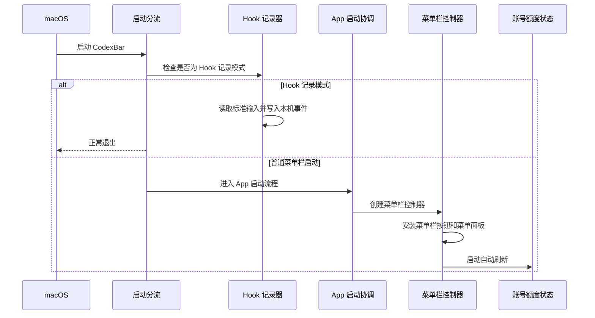
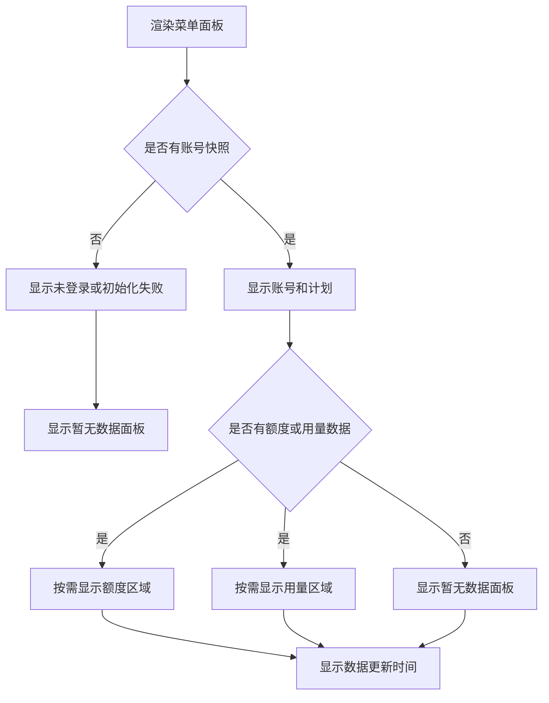
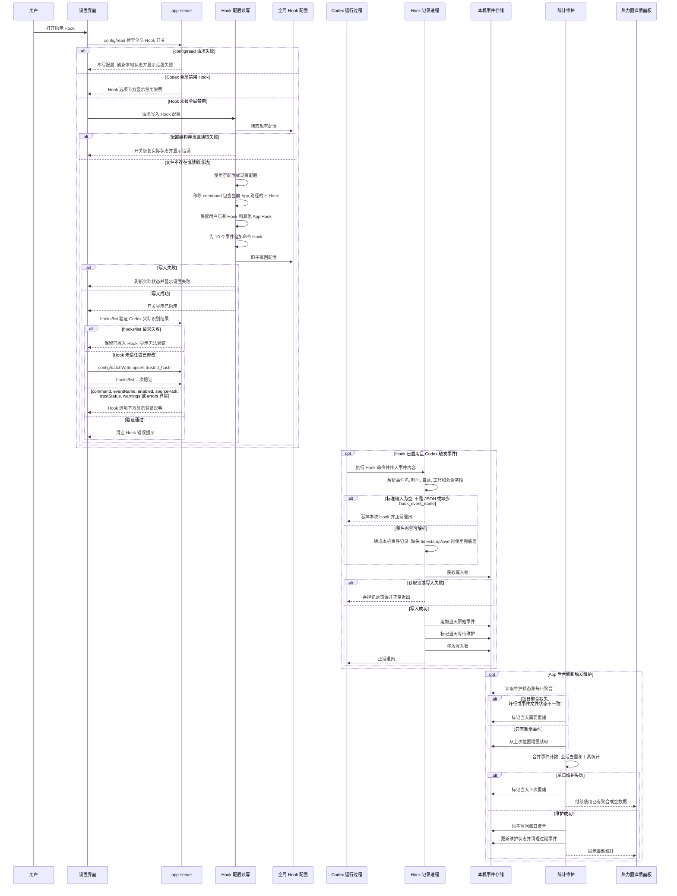
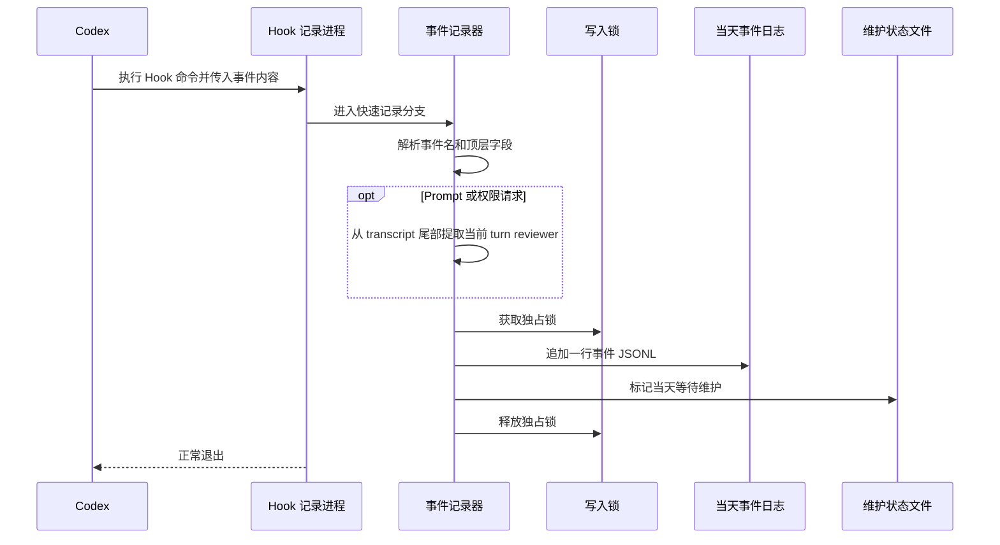
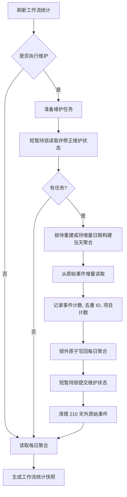

# CodexBar 开发文档

本文面向继续开发 CodexBar 的维护者, 记录当前 App 的主要流程, 数据边界和模块协作方式

更细的 app-server 协议见 [AppServer.md](AppServer.md), Codex Hook 统计口径见 [CodexHook.md](CodexHook.md), 跨设备同步链路见 [CrossDeviceSync.md](CrossDeviceSync.md)

## 1. 应用定位与工程边界

CodexBar 是一个 macOS 菜单栏应用, 使用 SwiftUI + AppKit + MVVM

App 通过本机 Codex app-server 读取账号, 额度和 token 用量, 通过 Codex Hook 记录本机工作流事件, 并把这些数据展示在菜单面板, 设置窗口和日志窗口中

关键边界:

- 应用形态是 `LSUIElement`, 不显示 Dock 图标, 不依赖主窗口
- 最低系统版本是 macOS 15.0
- App Sandbox 保持关闭, 因为需要启动本机 `codex`, 读取真实用户 Codex 登录状态, 并写入用户级 Hook 配置
- 除手动重置机会过期时间查询、Sparkle 检查/下载更新, 以及用户显式开启「跨设备同步」后的 CloudKit private database 同步外, App 自身不发起网络请求
- 账号, 额度和 token 用量只在本机处理, 不发送给第三方；Hook 工作流统计默认只在本机处理, 仅在用户开启「跨设备同步」后把脱敏 daily 聚合行同步到当前 iCloud 账号
- Swift 工程使用 Swift 6 并开启 `SWIFT_DEFAULT_ACTOR_ISOLATION = MainActor`, UI 默认 MainActor 隔离；服务共享状态优先用 actor 管理, DTO、模型、同步辅助类型和静态工具需要显式使用 `nonisolated`

源码目录职责:

| 目录                    | 职责                                                                    |
| ----------------------- | ----------------------------------------------------------------------- |
| `CodexBar/App/`         | SwiftUI 入口和 AppDelegate 启动分支                                     |
| `CodexBar/Controllers/` | 菜单栏, 菜单面板, 侧边 child panel, 设置窗口, 日志窗口和窗口行为        |
| `CodexBar/Models/`      | account, quota, usage, workflow, activity, 日期网格、快捷键和错误模型   |
| `CodexBar/Services/`    | app-server, Codex CLI 解析, 版本探测, Hook 设置, 统计维护, 更新, 登录项 |
| `CodexBar/Views/`       | 菜单面板, 设置窗口, 日志窗口和共享 Liquid Glass 样式                    |
| `Docs/`                 | app-server, Hook 和开发文档                                             |
| `Scripts/`              | Release 构建、公证、DMG 和 appcast 发布脚本                             |

## 2. 总体架构

两条主数据链路:

- Codex app-server 链路: `CodexStatusService` 启动或复用本机 app-server, 生成 `CodexQuotaSnapshot`, 由 `CodexStatusViewModel` 发布给菜单栏 UI
- Codex Hook 链路: Codex 进程触发带 `--hook-event` 参数的 Hook 命令, CodexBar 从 stdin payload 读取 `hook_event_name` 并快速写入 JSONL; 主 App 一路维护聚合并生成 `WorkflowSnapshot`, 另一路通过 `CodexActivityMonitor` 只读 tail 原始事件并发布实时活动快照；活跃 turn 再由 `CodexSessionLifecycleReader` 从本机 rollout 补充起点、终态、审批路由和推理强度

## 3. 启动流程

入口在 `CodexBar/App/CodexBarApp.swift`

`CodexBarApp.init()` 最先调用 `WorkflowHookEventRecorder.handleIfRequested()`, 用 `--hook-event` 参数区分普通 App 启动和 Hook 子进程启动



普通启动时, `CodexBarAppDelegate` 创建并持有这些长期对象:

- `CodexStatusViewModel`: app-server 刷新状态
- `WorkflowViewModel`: Hook 工作流统计快照
- `CodexHookSettings`: Hook 配置状态和写入操作
- `CodexActivityMonitor`: Hook 实时任务状态、UI 快照和 live transition
- `WorkflowSyncSettings`: 跨设备同步偏好、账号可用性、同步中和失败状态
- `GlobalHotKeySettings`: 全局快捷键配置和错误状态
- `MenuBarQuotaSettings`: 菜单栏额度指示偏好和窗口选择
- `NotificationSettings`: 本地通知偏好和系统授权状态
- `AppUpdater`: Sparkle 更新状态

`StatusItemController.install()` 负责:

- 配置菜单栏按钮图标、可选额度进度条和点击事件
- 配置菜单面板的 SwiftUI 根视图
- 订阅状态变化并切换菜单栏图标
- 把统一活动快照注入菜单栏图标、tooltip 和菜单活动卡片
- 订阅 Hook、同步开关和同步可用性变化, 把维护/同步请求交给 `WorkflowSyncScheduler`
- 订阅全局快捷键配置并安装或移除 Carbon hot key
- 开始每 60 秒自动刷新

启动时还会把系统 tooltip 首次出现延迟 `NSInitialToolTipDelay` 设置为 200 ms, 让主面板同步图标等短提示更快出现。

App 退出时, `applicationWillTerminate` 调用 `StatusItemController.uninstall()` 和 `CodexActivityMonitor.stop()`, 关闭菜单面板与实时 tail, 注销全局快捷键, 移除订阅并从系统状态栏移除 status item

## 4. 菜单栏, 菜单面板与窗口流程

菜单栏按钮由 `NSStatusBar.system.statusItem(withLength:)` 创建

正常图标是 `person.fill.checkmark`, 错误图标是 `person.fill.xmark`

小人右下角的状态点只表达 Hook 任务状态，并以 `CodexQuotaSnapshot` 可用作为展示条件。快照可用时按 `等待批准 > 运行中 > 刚完成 > 暂无活动` 取最高优先级：等待批准使用系统橙色，运行中使用系统蓝色，确认 turn 完成后 30 秒内使用系统绿色，空闲时不显示；快照为 `nil` 时不绘制状态点。小人本体始终使用系统前景色，账号异常由 `person.fill.xmark` 表达；状态点与额度竖条分别绘制，颜色互不影响。空闲且没有额度竖条时使用 template 图像，存在状态点或额度竖条时使用非 template 合成图。

设置页「菜单栏额度指示」默认开启, 使用独立开关控制启用状态; 缺失持久化选择时默认使用 `.primary`, 关闭时显式持久化 `.off`。开启后在同一行显示额度窗口菜单, 可选择当前账号 Codex limit 返回的额度窗口, 当前保留选择不在返回窗口中时用 fallback 标题追加到菜单。最后一次非关闭的窗口选择由 `MenuBarQuotaSettings` 以 `MenuBarQuota.lastWindowSelection` 键随偏好持久化: 关闭开关时它继续参与菜单淡出避免过渡期间回退, 重新开启时（含重开设置窗口或重启应用后）恢复该选择, 无记录时回退 `.primary`。开启后 `StatusItemController` 会把所选 Codex 窗口的剩余额度进度条绘制在图标左侧, 以竖条形式与 `person.fill.checkmark` / `person.fill.xmark` 合成为单个 `NSImage`, 并随 `CodexStatusViewModel` 自动刷新。合成图尺寸为 `27 x 17`, 图标本体保持原始 `24 x 17`, 左侧竖条轨道为 `2 x 15`, 状态点位于小人右下角。额度显隐或状态点变化时, `StatusItemController` 合并为同一个逐帧重绘任务，在 0.18 秒内同时插值竖条与状态点的透明度以及状态点颜色，避免两个动画任务竞争；过渡期间合成图宽度和绘制坐标保持固定。活动期间 tooltip 每分钟更新一次耗时并合并并发数量与额度，活动结束后取消刷新任务。

Hook 开启且 `MainPanelSettings.showsTaskCenter` 为 `true` 时，账号卡片下方显示固定高度 `CodexActivityCard`；该偏好缺失时默认开启。`CodexQuotaSnapshot` 为 `nil` 时，卡片显示「暂无数据」且不开放任务中心；Monitor 继续维护实时状态。快照可用时，卡片按等待、运行、最近完成、最近终止、空闲的顺序展示项目最后一级名称、模型或工具、耗时及其他活动任务数量；只有终止历史时显示最近一项灰色终止状态。存在任务中心内容时，卡片可点击，其他活动任务数量使用右侧 `+N` 徽标，hover 和选中反馈作用于卡片描边。关闭展示偏好只移除活动卡片和任务中心入口，不影响 Monitor、菜单栏状态点、通知或触觉反馈。

`ActivityCenterPanelController` 展示 `CodexActivitySnapshot` 的完整等待、运行、最近完成和最近终止列表。等待和运行按最后活动时间倒序，完成和终止按各自结束时间倒序；列表身份使用进程内 opaque UUID，不向 UI 暴露 session/turn ID。最近完成和最近终止保留 10 分钟。活动 Monitor 和 `CodexActivityCenterPresentationState` 作为普通引用传入菜单根视图，再由活动卡片自身观察；这样共享逐秒时间只让卡片失效，不会带动整个菜单树每秒重算。卡片与任务中心观察同一个 Monitor，并在菜单可见、额度快照可用、`MainPanelSettings` 允许展示且存在任务中心内容时使用 presentation state 的共享逐秒时间。任务中心打开期间额度快照变为 `nil`、Hook 关闭或展示偏好关闭时立即关闭。

错误图标触发条件:

- `loadState` 是 `.notLoggedIn` 或 `.initializationFailed`
- 当前 snapshot 没有可信额度和用量数据, 即 `snapshot?.hasTrustedData == false`

点击行为:

| 操作             | 行为             |
| ---------------- | ---------------- |
| 左键点击         | 切换菜单面板     |
| 右键点击         | 打开上下文菜单   |
| Control + 点击   | 打开上下文菜单   |
| 全局快捷键       | 切换菜单面板     |
| 系统 `⌘,`        | 打开独立设置窗口 |
| 菜单面板内 `⌘L`  | 打开独立日志窗口 |
| 点击可见活动卡片 | 切换并发任务中心 |
| 上下文菜单"设置" | 打开独立设置窗口 |
| 上下文菜单"日志" | 打开独立日志窗口 |
| 上下文菜单"退出" | 终止 App         |

上下文菜单由 `NSStatusBarButton.performClick(nil)` 触发。设置和日志菜单项的 action 可能在 `NSMenu` 仍处于 tracking 时被键盘等效键触发, 因此 `StatusItemController` 会先缓存打开请求, 等 `NSMenuDelegate.menuDidClose(_:)` 确认菜单结束、清空 `statusItem.menu` 后再真正打开辅助窗口, 确保鼠标点击和键盘等效键路径都能把目标窗口激活到最前面。

系统应用设置命令由 `CodexBarApp` 的 `CommandGroup(replacing: .appSettings)` 接管, `⌘,` 不打开空 Settings scene, 而是调用 `StatusItemController.openSettingsFromCommand()` 关闭菜单面板并打开自定义设置窗口。菜单面板打开时, `MenuSurfaceDismissMonitor` 只对精确 `⌘L` 调用日志快捷入口; 带 Shift、Option 或 Control 的组合键不触发该路径。

全局快捷键由 `GlobalHotKeySettings` 和 `GlobalHotKeyController` 管理。没有用户设置时默认注册 `⌘⇧W`; 用户清除后不注册快捷键。注册冲突时恢复到上一个已注册快捷键, 并把错误显示在设置窗口的快捷键行内。

通过全局快捷键打开菜单面板前, `StatusItemController` 会先用鼠标所在屏幕作为目标屏幕, 找不到时回退主屏幕, 再校验当前 `NSStatusBarButton` 锚点是否可信: 按钮必须有 window 和有效 screen、未隐藏且 bounds 非空, 换算后的屏幕矩形必须是有限尺寸, 宽高至少 1 px, 并且与目标屏幕范围相交。锚点可信时使用 `NSPopover` 挂在 status item 下方; 锚点不可信时使用无箭头 fallback `NSPanel`, 放在目标屏幕顶部居中位置。快捷键打开主面板时会短暂禁止设置窗口和日志窗口成为 key window, 避免 App 激活时把已有的设置/日志窗口一起带到前台。已打开时仍允许快捷键关闭当前面板。鼠标点击路径不做这层 fallback, 因为点击 sender 本身就是当前锚点。

打开菜单面板的顺序:

- 取消正在等待的延迟刷新和淡入淡出任务
- 如果来自全局快捷键且当前状态需要打开菜单面板, 先临时禁止设置窗口和日志窗口成为 key window, 再用目标屏幕确认 status item 锚点可信; 不可信时改用同一屏幕顶部居中的 fallback `NSPanel`
- 设置状态为 `opening`, 准备透明度淡入
- 显示 `NSPopover` 或 fallback `NSPanel`, 把 `MenuSurfaceVisibilityState.isVisible` 设为 `true`
- 调用 `refreshWorkflowIfHookEnabled(performMaintenance: false)`, 只读取已有 `daily.jsonl`, 不做重维护
- 安装 `MenuSurfaceDismissMonitor`, 监听当前菜单面板 window、面板内日志快捷键和已打开的侧边详情面板区域, 并只将当前菜单面板 window 置前和设为 key window
- 执行 0.24 秒淡入
- 延迟 160 ms 后调用 `viewModel.refreshIfNeeded()`

关闭菜单面板的顺序:

- 立即隐藏热力图详情面板、重置次数详情面板和并发任务中心
- 移除本地和全局事件监听
- 将 `isVisible` 设为 `false`, 停止活动卡片与任务中心共享的逐秒时间任务
- 临时禁止设置窗口和日志窗口成为 key window, 避免关闭菜单面板时 AppKit 把这些辅助窗口提到前面
- 默认执行 0.18 秒淡出, 无法淡出时直接关闭
- 菜单面板关闭后延迟 120 ms 恢复设置窗口和日志窗口的 key window 能力

`MenuSurfaceDismissMonitor` 监听这些 dismiss 条件:

- 菜单面板、状态栏按钮和已打开侧边详情面板外部的鼠标点击
- Escape
- Command-Tab
- App 失去 active
- 其他应用被激活
- 菜单面板 window 失去 key

Command-Space 不直接关闭菜单面板, 只短暂抑制 600 ms 内的 active 变化关闭逻辑, 避免 Spotlight 或系统搜索抢焦点时误关弹窗。

热力图详情面板、重置次数详情面板和并发任务中心都会通过 `containsScreenPoint(_:)` 告诉关闭监听器自己的屏幕区域, 因此点击这些 child panel 内部不会触发主菜单面板关闭。重置次数详情面板和并发任务中心可接收鼠标事件用于滚动; 热力图详情面板不接收鼠标事件。并发任务中心是点击后保持打开的面板；出现有效的热力图方块 hover context 时会自动收回任务中心并展示当天详情，点击重置次数也会显式切换并关闭任务中心。

侧边面板的共同行为集中在 `CodexBar/Controllers/SidePanelSupport.swift`。`NonactivatingSidePanel` 不能成为 key/main window；`KeyableBorderlessPanel` 用于需要键盘焦点的通知子选项面板和 fallback 面板；`SidePanelDrawerAnimator` 管理横向抽屉 transform；`SidePanelDrawerPresenter` 管理重置次数、并发任务中心和通知子选项面板的显隐状态、generation、入退场动画及 child window 挂载；`SidePanelContentHost` 统一三个侧边详情面板的内容宿主行为——懒建 panel + hostingController、每次更新替换 rootView、圆角 layer 重配、内容尺寸同步与屏幕点命中检测。`SidePanelSupport` 统一提供 panel 创建、左右侧选择、屏幕边界夹紧、锚点行校验与对齐、菜单面板 key window 恢复、圆角 layer 配置和屏幕坐标换算。侧边面板视图的玻璃底、背板、描边和圆角裁剪共用 `LiquidGlassStyle.swift` 的 `sidePanelChrome(cornerRadius:)`。

`HeatmapDetailPanelController` 管理 hover 请求、Y 轴策略、侧边切换队列和 token/workflow 内容更新；`ResetCreditsPanelController` 管理重置次数内容、最大高度和点击切换；`ActivityCenterPanelController` 观察常驻 Monitor 快照并更新列表与窗口布局。任务中心宽度固定，高度由标题、分区、固定行高、间距和底部留白计算，并受屏幕可见高度及活动卡片顶边到主面板底边的范围限制。活动卡片把 `ScreenFrameProvider` 作为锚点交给控制器，控制器每次布局都只读取属于当前菜单窗口的实时 frame；首次读取失败时等待一个 MainActor 调度点重试，仍无有效锚点才回退主面板垂直居中。锚点有效时，面板顶边与卡片顶边对齐，底边最低与主面板底边齐平；达到高度上限后列表内部滚动。

任务中心列表使用普通 `VStack` 和单层条目 transition。快照变化后，SwiftUI 提交列表布局，AppKit 在下一个 MainActor 调度点用 0.20 秒 ease-in-ease-out 曲线更新 panel frame；新的快照会取消尚未执行的布局更新。任务中心内容变空时等待 0.20 秒再执行抽屉收起，期间出现新内容会取消收起。

设置窗口和日志窗口都继承 `HostingWindowController` 的行为: 懒创建, 关闭后不释放, 重新打开复用, 按当前屏幕居中, 重新打开对应入口时只移动和置前对应窗口。窗口 level 保持 `.normal`; 置前时先恢复 `AuxiliaryHostingWindow.allowsKeyFocus`, 再执行 `NSWindow.bringToFrontActivatingApp()` (`ScreenGeometry.swift`, 即 `orderFrontRegardless()` → `NSRunningApplication.current.activate(options: [])` → `makeKeyAndOrderFront(nil)` 的固定序列, fallback 面板和菜单面板聚焦共用), 只做一次性置前, 不持续置顶。CodexBar 是 `LSUIElement` 菜单栏 App, 首次懒创建辅助窗口时需要通过当前运行中应用激活, 避免设置或日志窗口第一次打开时没有稳定拉到最前。

设置窗口和日志窗口使用 `AuxiliaryHostingWindow`; 窗口可以成为 key window, 但不能成为 main window。关闭菜单面板期间会临时禁止成为 key window, 避免菜单面板收起时抢焦点。通过快捷键打开或关闭菜单面板时, 只激活并置前当前面板, 不主动置前已有的设置窗口或日志窗口。

## 5. Codex 状态刷新流程

刷新入口在 `CodexStatusViewModel`:

- `startAutoRefresh()` 先尝试一次 `refreshIfNeeded()`, 之后按 `autoRefreshDelay` 循环
- 刷新间隔是 60 秒
- `refreshIfNeeded()` 会比较 `autoRefreshCountdownStartedAt`, 避免菜单面板打开和自动刷新同时触发重复请求
- `refresh()` 通过 `isRefreshing` 防重入
- 刷新任务通过 `RefreshTaskCoordinator` 管理, 保证只有最后一次有效刷新能回写 UI 状态

下面的时序图展示刷新, app-server 握手, 额度与用量读取, 以及常见错误后的重试或降级


`CodexStatusService` 的连接策略:

- `CodexStatusService` 是 actor, app-server 连接、缓存和重建状态都在 actor 隔离内访问
- 请求超时是 20 秒
- 连接最大复用时间是 1 小时, 超过后重建, 便于后台升级后的 `codex` 二进制生效
- 忽略 `SIGPIPE`, 断管由 `write` 抛错后走连接重建
- 复用连接发生传输故障时只重建并重试一次, 避免故障状态下反复拉起进程
- 新连接初始化失败直接返回 `.initializationFailed`

`CodexFetchOutcome` 只向 UI 暴露三种结果:

| outcome                 | UI 状态                                |
| ----------------------- | -------------------------------------- |
| `.data(snapshot)`       | `.loaded` 并展示数据                   |
| `.notLoggedIn`          | `.notLoggedIn`, snapshot 清空          |
| `.initializationFailed` | `.initializationFailed`, snapshot 清空 |

更细的启动失败, 请求失败, 超时, 断连, 解析失败, 业务错误都只进入请求日志

## 6. app-server 会话与日志

app-server 启动命令必须通过 `CodexCLIResolver.resolveAppServerCommand()` 解析, 最终参数是:

```bash
codex app-server --listen stdio://
```

解析优先级:

- PATH 中的全局 `codex`
- 如果 PATH 中的 `codex` 等价于 APP 内置路径, 它被视为内置 CLI, 不算全局 CLI
- 全局 CLI 不存在时依次检查 `/Applications/ChatGPT.app/Contents/Resources/codex` 和 `/Applications/Codex.app/Contents/Resources/codex`
- 两者都不存在时抛出 `CodexStatusError.executableNotFound`

环境变量由 `CodexCLIResolver.environment` 构造:

- 保留当前环境
- `HOME` 使用 `getpwuid(getuid())` 获取真实用户 home
- 同步设置 `USER` 和 `LOGNAME`
- 合并 Homebrew, npm global, `.local`, Volta 和系统路径
- 确保 `TERM` 有值

`AppServerSession` 负责 JSON-RPC 读写:

- 每个带 id 的请求先写入 `RequestLogStorage.beginRequest`
- 请求 JSON 使用 sorted keys 和不转义斜杠序列化，同一份稳定文本直接写入请求日志
- 写入 stdin 时追加换行
- `JSONLineReader` 从 stdout 读取按行 JSON, 只处理 id 匹配的响应, 其他行忽略
- id 匹配后用同时包含 `error` 和 `result` 的统一响应信封完成一次完整解码，避免大响应行重复解析
- 收到 JSON-RPC error 时转成 `CodexStatusError.serverError(message)`
- 响应不能解析成期望类型时归为 `.invalidServerResponse`
- `initialized` 是无 id 通知, 不等待响应, 但记录为"请求"
- `PipeDrain` 只 drain stderr, 不把子进程 stderr 展示给用户
- `JSONLineReader` 和 `PipeDrain` 底层都使用 `PipeReadBuffer`, 把 `FileHandle`、`DispatchSourceRead` 和 semaphore 的非 Sendable IO 边界集中管理

请求错误分类:

| 错误                         | 处理                                                              |
| ---------------------------- | ----------------------------------------------------------------- |
| 认证失败                     | 同一轮最多 `account/read(refreshToken:true)` 一次, 然后重试原读取 |
| unsupported method           | 当前连接记住该 method, 后续跳过                                   |
| 非认证业务错误               | `AppServerSession` 先重试同请求一次, 仍失败后不阻断整轮刷新       |
| 连接断开, 超时, 响应解析失败 | 视为传输故障, 外层重建连接                                        |

`RequestLogStorage` 是常驻全局日志存储:

- 容量上限 500 条
- `RequestLogEntry` 完整保存 request/detail
- 列表摘要和行内展开只使用 `RequestLogEntry` 生成的单行短预览
- 非空请求和响应标题行提供完整预览和复制; 预览视图对 JSON 做格式化和高亮
- request 直接保存 `AppServerSession` 已稳定序列化的文本；响应和 JSON 错误详情由 storage 使用相同选项稳定化，非 JSON 错误消息保持原样
- storage 用 `OSAllocatedUnfairLock` 保护, 后台请求路径可以同步写入并立即拿到请求 token
- 写入后通过 `Task { @MainActor ... }` 刷新 `RequestLogStore.shared`
- 日志窗口关闭不会清空日志

`RequestLogStore` 是 `@MainActor ObservableObject` 外壳, 只负责把 storage 快照发布给 SwiftUI, 清空操作也委托给 `RequestLogStorage`

日志状态标签:

| Kind             | UI 标签 |
| ---------------- | ------- |
| `.pending`       | 进行    |
| `.response`      | 完成    |
| `.failure`       | 错误    |
| `.emptyResponse` | 请求    |

## 7. 错误处理总览

错误处理的基本原则:

- 菜单面板只展示"未登录"和"初始化失败"两类特殊状态
- 具体启动失败, 请求失败, 超时, 断连, 解析失败和业务错误进入日志窗口
- 账户有效时, rate limits 和 usage 可以单独失败, 失败区域按缓存或无数据处理
- 登录项错误显示在设置组与底部按钮组之间的独立错误组; Hook 写入/验证错误显示在 Hook 开关下方; 同步账号不可用显示在「跨设备同步」开关下方; 同步运行失败显示在主面板更新时间行同步图标 tooltip 中
- 全局快捷键录制, 校验和注册错误显示在快捷键行内
- Hook 子进程尽量快速退出, 事件记录失败不会阻断 Codex 自身流程
- 通知发送与 Hook 事件 tail 的失败全部静默降级, 不进入请求日志窗口, 详见第 19 节

app-server 与状态刷新错误:

| 错误来源                                     | 检测位置                                                                          | 用户可见状态                                     | 日志或存储                                     | 重试或降级                                                        |
| -------------------------------------------- | --------------------------------------------------------------------------------- | ------------------------------------------------ | ---------------------------------------------- | ----------------------------------------------------------------- |
| 找不到全局 Codex CLI 和 Codex APP 内置 CLI   | `CodexCLIResolver.resolveAppServerCommand()`                                      | `初始化失败`                                     | `RequestLogStorage.recordFailure` 记录可读错误 | 不启动 app-server, 下轮刷新重新解析                               |
| app-server 进程启动失败                      | `Process.run()`                                                                   | `初始化失败`                                     | 记录"app-server 启动失败"                      | 不复用本次进程, 下轮刷新重试                                      |
| `initialize` 或首次 `account/read` 失败      | `CodexStatusService.openConnection`                                               | `初始化失败`                                     | 对应 JSON-RPC 请求进入日志                     | 关闭本次 session, 不重复完整握手                                  |
| 首次 `account/read` 返回 `account == nil`    | `CodexStatusService.openConnection`                                               | `未登录`                                         | 请求响应进入日志                               | 关闭本次 session, 不生成 snapshot                                 |
| 复用连接刷新 account 后返回 `account == nil` | `CodexStatusService.fetchData`                                                    | `未登录`                                         | 请求响应进入日志                               | 清空 supplemental cache, teardown connection                      |
| JSON-RPC 认证失败                            | `CodexStatusError.isAuthenticationRequired`                                       | 取决于刷新后结果                                 | 失败响应进入日志                               | 同一轮最多 `account/read(refreshToken:true)` 一次, 然后重试原读取 |
| refresh token 后仍认证失败                   | `ReadResult.resultAfterAuthAttempt`                                               | `未登录`                                         | 失败响应进入日志                               | 清空 cache, teardown connection                                   |
| unsupported method                           | `CodexStatusError.isUnsupportedMethod`                                            | 对应区域可能显示无数据                           | 失败响应进入日志                               | 当前 session 记住 method, 后续跳过, 不复用旧缓存                  |
| 非认证业务错误                               | `CodexStatusError.isRetriableServerError`                                         | 通常不改变整体状态                               | 失败响应进入日志                               | 同请求立即重试一次, 仍失败则 supplemental 读取按失败处理          |
| rate limits 读取失败                         | `CodexStatusService.cachedRead`                                                   | 有旧缓存时区域半透明, 无旧缓存时无额度区         | 失败进入日志                                   | 同账号旧缓存复用并标记 `isRateLimitsStale`                        |
| usage 读取失败                               | `CodexStatusService.cachedRead`                                                   | 有旧缓存时区域半透明, 无旧缓存时无用量区         | 失败进入日志                                   | 同账号旧缓存复用并标记 `isUsageStale`                             |
| 重置机会过期时间请求失败                     | `CodexStatusService.fetchResetCreditExpirationDates` / `CodexResetCreditsService` | `重置次数: N` 保留, 侧边详情面板显示未知过期时间 | 不展示错误, 不保存原始响应                     | 401/403 时复用本轮认证刷新预算重试, 其他失败静默降级为 `nil`      |
| 连接断开, 请求超时, 响应解析失败             | `CodexStatusError.isTransportFailure`                                             | 复用连接重建失败后为 `初始化失败`                | 请求标记为错误                                 | 复用连接只重建重试一次, 新连接失败不再重试                        |
| app-server 关闭超时                          | `AppServerSession.close()`                                                        | 不直接改变 UI                                    | 记录强制结束或仍在后台运行                     | 先 terminate 等 1 秒, 再 SIGKILL 等 0.5 秒                        |
| snapshot 无可信 quota 和 usage               | `CodexQuotaSnapshot.hasTrustedData`                                               | 菜单栏切换错误图标                               | 不新增日志                                     | 仍可展示 stale 数据或无数据面板                                   |

日志错误处理:

| 场景                     | 行为                                                    |
| ------------------------ | ------------------------------------------------------- |
| 请求发送后等待响应       | 日志先显示"进行"                                        |
| 收到正常响应             | 回填同一条日志为"完成"                                  |
| 请求失败或响应解析失败   | 回填同一条日志为"错误"                                  |
| `initialized` 无 id 通知 | 记录为"请求", 不等待响应                                |
| 进程级错误没有 method    | 日志行直接预览错误文本                                  |
| 响应或 JSON 错误详情     | 重新序列化为稳定顺序并保留未转义斜杠                    |
| 请求 payload             | 直接保存已稳定序列化的完整内容, UI 行内只渲染单行短预览 |
| 响应或错误详情           | 存完整内容, 通过预览视图查看或复制                      |

设置, Hook 和更新错误:

| 错误来源                         | 检测位置                                                                 | 用户可见状态                                                                               | 重试或降级                                       |
| -------------------------------- | ------------------------------------------------------------------------ | ------------------------------------------------------------------------------------------ | ------------------------------------------------ |
| 登录项注册或取消失败             | `LoginItemSettings.setEnabled`                                           | 设置窗口中部错误组显示"设置开机启动失败"                                                   | 调用 `refresh()` 恢复实际状态                    |
| `config/read` 请求失败           | `CodexHookSettings.setEnabled` / app-server `config/read`                | Hook 选项下方显示"设置 Codex Hook 失败"                                                    | 不写 `hooks.json`, 调用 `refresh()` 恢复实际状态 |
| Codex 全局配置禁用 Hook          | `CodexHookSettings.setEnabled` / app-server `config/read`                | Hook 开关保持关闭, Hook 选项下方显示禁用说明                                               | 不写 `hooks.json`                                |
| `hooks.json` 读取失败或结构非法  | `CodexHookSettings.refresh`                                              | Hook 开关视为关闭, Hook 选项下方显示错误                                                   | 不写配置                                         |
| Hook 开关写入失败                | `CodexHookSettings.setEnabled`                                           | Hook 选项下方显示"设置 Codex Hook 失败"                                                    | 调用 `refresh()` 恢复实际状态                    |
| `hooks/list` 请求失败            | `CodexHookSettings.verifyInstalledHooks` / app-server `hooks/list`       | Hook 选项下方显示"无法验证 Codex Hook"                                                     | 保留已写入 Hook, 详细错误进入日志                |
| Hook 自动信任写入失败            | `CodexHookSettings.trustCodexBarHooks` / app-server `config/batchWrite`  | Hook 选项下方显示"无法验证 Codex Hook"                                                     | 保留已写入 Hook, 详细错误进入日志                |
| Hook 写入后验证发现问题          | `CodexHookSettings.verifyInstalledHooks` / app-server `hooks/list`       | Hook 选项下方显示最高优先级验证摘要                                                        | 保留已写入 Hook, 详细响应进入日志                |
| 同步账号不可用                   | `WorkflowSyncSettings.refreshSyncAvailability` / CloudKit account status | 跨设备同步开关禁用, 下方显示"同步不可用"; 主面板同步图标显示 `icloud.slash` 和"同步未开启" | 不开启同步偏好写入                               |
| CloudKit 同步上传或拉取失败      | `WorkflowSyncService.synchronizeIfEnabled`                               | 主面板更新时间行显示 `exclamationmark.icloud`, tooltip 显示归类错误, 最近同步时间不更新    | 保存已有 state, 下次刷新继续重试                 |
| 快捷键无法识别或不符合规则       | `HotKeyRecorderRow` / `GlobalHotKeySettings.setShortcut`                 | 快捷键行内显示红色错误                                                                     | 用户清除后重新录制                               |
| 快捷键注册冲突                   | `StatusItemController.applyGlobalHotKey`                                 | 快捷键行内显示占用提示                                                                     | 恢复上一个已注册快捷键                           |
| Hook 子进程 payload 不是 JSON    | `WorkflowHookEventRecorder.stdinPayload`                                 | 无 UI 提示                                                                                 | 吞掉本次 Hook, 避免启动完整菜单栏 App            |
| Hook 子进程写入失败              | `WorkflowHookEventRecorder.handleIfRequested`                            | 无 UI 提示                                                                                 | `try? record` 吞掉错误并正常退出, 避免阻断 Codex |
| `daily.jsonl` 缺失, 空文件或坏行 | `WorkflowService.prepareMaintenanceTasks`                                | 热力图详情面板可能暂时显示 0                                                               | 标记 dirty, 后续从 events 文件重建               |
| events 文件变小或 offset 不一致  | `WorkflowService.reconcileEventFiles`                                    | 热力图详情面板可能暂时显示旧聚合                                                           | 标记 dirty, 从头重建当天聚合                     |
| 单个维护任务失败                 | `WorkflowService.performMaintenanceIfNeeded`                             | 使用已有 daily 或空 snapshot                                                               | 对应日期标记 dirty                               |
| Sparkle 配置缺失                 | `AppUpdater.init`                                                        | 更新开关禁用, 操作显示"未配置更新资源"                                                     | 不创建 updater controller                        |
| 手动检查没有更新                 | `updaterDidNotFindUpdate`                                                | 显示"没有可用更新"                                                                         | 1 秒后自动清理状态                               |
| 手动检查失败                     | `didAbortWithError`                                                      | 显示"检查更新失败"                                                                         | 不展示底层错误细节                               |

Codex 版本探测错误:

| 错误来源                        | 显示文本                                 | 处理                                      |
| ------------------------------- | ---------------------------------------- | ----------------------------------------- |
| 对应安装源不存在                | `未找到 Codex CLI` 或 `未找到 Codex APP` | 不启动探测进程                            |
| `codex --version` 启动失败      | `启动失败`                               | 该来源显示错误, 另一个来源继续            |
| 版本探测超时                    | `读取超时`                               | terminate 后 SIGKILL, 停止 pipe collector |
| 进程退出码非 0                  | `读取失败`                               | 不展示 stderr 细节                        |
| stdout 和 stderr 都没有可用版本 | `版本未知`                               | 保留路径, 版本列显示错误                  |

发布脚本错误:

| 脚本                 | 失败条件                                                        | 行为                                   |
| -------------------- | --------------------------------------------------------------- | -------------------------------------- |
| `Scripts/build.sh`   | 找不到 Xcode 工程、签名命令、notary 凭据或导出 App              | `set -euo pipefail` 直接退出并打印错误 |
| `Scripts/build.sh`   | archive、Developer ID 导出、notary、staple 或签名校验失败       | 退出；默认不产出最终 App，保留中间产物 |
| `Scripts/dmg.sh`     | 找不到唯一 App, 版本号缺失, DMG 挂载失败, 缺少必要命令          | `set -euo pipefail` 直接退出并打印错误 |
| `Scripts/appcast.sh` | 找不到 DMG, appcast, Xcode 工程, build setting 或 `sign_update` | 直接退出并打印错误                     |
| `Scripts/appcast.sh` | 无法解析 `sparkle:edSignature`                                  | 打印 sign_update 原始输出并退出        |
| `Scripts/appcast.sh` | appcast 缺少插入点或 XML 校验失败                               | 退出, 不继续发布                       |

## 8. Snapshot 合成流程

`CodexQuotaSnapshot` 是菜单面板展示 app-server 数据的唯一入口

它由 `AccountReadResponse`, 可选的 `AccountRateLimitsResponse` 和可选的 `AccountUsageResponse` 合成

账户规则:

- `AccountReadResponse.account` 必须存在, 否则视为未登录
- 账户存在时, 即使 rate limits 和 usage 都没有数据, 也生成 snapshot, 让 UI 展示"暂无数据"
- `CodexAccount.displayName` 优先使用 email, 没有 email 时按 account type 映射为 `API Key`, `ChatGPT`, `Amazon Bedrock` 或原始 type

额度规则:

- 优先读取 `rateLimitsByLimitId`, 为空时回退顶层 `rateLimits`
- 顶层 `rateLimits.limitId` 指向的主 limit 置顶, 缺省为 `codex`
- `codexLimit` 返回 `limitId` 大小写不敏感等于 `codex` 的第一个 limit, 供菜单栏额度指示读取可选窗口
- 其他 limit 按 `limitName ?? limitId` localized standard 排序, 再按 `limitId` 稳定排序
- `rateLimitResetCredits.availableCount` 写入 `resetCreditsAvailableCount`, 缺失时不展示重置次数
- 如果 `resetCreditsAvailableCount > 0`, `CodexResetCreditsService` 会用真实用户 `CODEX_HOME/auth.json` 或 `HOME/.codex/auth.json` 中的 access token, 只读请求 `https://chatgpt.com/backend-api/wham/rate-limit-reset-credits`; 401/403 时复用本轮认证刷新预算, 尚未刷新过时通过当前 app-server 会话刷新一次 token 后重试。成功时将可用且未过期的 `credits[].expires_at` 按升序写入 `resetCreditExpirationDates`; 请求失败时为 `nil`
- 每个 limit 的 `primary` 和 `secondary` 合成 `[QuotaWindow]`
- 没有窗口的 limit 被过滤
- `remainingPercent = clamp(100 - usedPercent, 0...100)`
- `windowDurationMins` 标签按 `ND`, `NH`, `NM` 格式化, 缺失或非正数显示"额度"
- 本轮 rate limits 请求失败但同账号有旧缓存时复用旧值, 并把 `isRateLimitsStale` 设为 `true`

用量规则:

- `AccountUsageResponse.summary` 提供全时累计, 单日峰值, 当前连胜, 最长连胜, 最长任务
- `dailyUsageBuckets` 按 `startDate` 汇总 token
- `CodexUsageSnapshot.recentWeekGrid` 使用 `CodexWeekGrid` 生成周日到周六排列的日期网格
- 本轮 usage 请求失败但同账号有旧缓存时复用旧值, 并把 `isUsageStale` 设为 `true`

热力图日期规则由 `UsageHeatmapDay.grid` 合并 token 和 workflow:

- 固定 30 列 x 7 行
- Hook 开启时包含今天
- Hook 关闭但 app-server 已返回当天 token bucket 时包含今天
- Hook 关闭且没有当天 token bucket 时结束于昨天
- `nil` 表示未来日期或无法生成日期, UI 不绘制方块, 也不参与峰值计算
- 今天没有 token bucket 但 Hook 开启时, 今天 token 显示 `--`

## 9. 菜单面板 UI 展示流程

`CodexStatusMenuView.menuWidth` 由热力图宽度和 padding 推导:

```swift
Metrics.padding * 2 + MenuMetrics.panelPadding * 2 + UsageHeatmap.Metrics.totalWidth
```

UI 状态分支:



账号区:

- 正常状态显示账号, 计划和刷新进度
- 账号图标双击触发刷新
- 邮箱文本双击切换模糊显示
- 计划名是右侧加粗纯文字, 颜色由 `planBadgeTint(for:)` 按 enterprise, team/business, pro, plus, edu, free, 默认 cyan 匹配
- 没有 snapshot 时只展示"未登录"或"初始化失败"两种特殊状态

额度区:

- 多个 limit 间用 `LiquidGlassDivider` 分隔
- 如果 `resetCreditsAvailableCount > 0`, 只在置顶主 limit 标题右侧显示 `重置次数: N`; 该控件是 plain button, 点击后通过重置次数侧边详情面板展示过期时间。`resetCreditExpirationDates` 非空时按 `yyyy-MM-dd HH:mm:ss` 升序逐行展示, 相同展示时间合并数量, 单个显示 `可用: 1`; 剩余时间不超过 7 天时徽标为橙色, 少于 24 小时时为红色, 两个阈值均按精确秒数计算; 多行之间显示渐变分隔线; 没有过期时间时显示「未知过期时间」
- 每个 quota window 展示标签, 50 个固定胶囊组成的电量条, 剩余百分比和重置时间
- 胶囊宽度为 `3.5`, 间距为 `2`, 高度为 `12`
- 额度行标签列宽 `34`, 居中显示, 标签允许最小缩放到 `0.75`, 标签到电量条间距 `12`, 电量条到百分比间距 `8`, 百分比列宽 `37`, 百分比到重置时间最小间距 `6`, 重置时间列宽 `75`
- 重置时间格式为 `MM-dd HH:mm`, 使用等宽数字, 在额度行最右侧对齐
- 无数据时百分比和重置时间显示 `--`, 电量条用占位色
- stale 数据通过 `.markStale(true)` 降低透明度到 0.55

`QuotaLimitsSection` 通过 `ScreenFrameProvider` 持有额度区桥接 `NSView`, 点击「重置次数」时同步读取额度区在屏幕坐标系中的最新 frame, 作为重置次数详情面板顶部对齐锚点。`ScreenFrameReader` 是通用 `NSViewRepresentable`, 同时服务额度区、活动卡片和热力图；它接受父布局提出的尺寸，在 SwiftUI 布局稳定后上报 frame 并去重，视图拆除时解除与 provider 的绑定。`ScreenFrameProvider` 弱持有当前桥接视图，并同时记录最后有效 frame 及其所属 window。任务中心首次展示只接受当前菜单窗口中的实时 frame，失败时等待一个 MainActor 调度点后重试；后续布局也只允许同一窗口的缓存 frame 兜底，避免复用旧菜单窗口坐标导致顶部错位。额度区和热力图继续按各自控制器的锚点校验与降级策略读取坐标。

重置次数详情面板由 `ResetCreditsPanelController` 管理:

- 面板是菜单面板的 borderless nonactivating child panel, 可接收鼠标事件但不能成为 key/main window
- 默认显示在菜单面板右侧, 空间不足时尝试左侧, 最终夹紧到当前屏幕可见区域内并保留 `8` px 边距
- 与菜单面板之间保留 `4` px gap; 纵向优先对齐额度区顶部, 锚点坐标异常或与当前菜单内容区域不相交时丢弃, 没有可用锚点时居中对齐菜单面板
- 内容宽 `147`, 最小高度 `62`, 高度按过期时间行数和额度区顶部到菜单面板底部的可用空间夹紧; 没有可用锚点时最大高度回退为 `260`, 圆角为 `12`
- 过期时间行高 `42`, 行间距 `7`; 有多行时行间使用 `1` px 渐变分隔线并通过上下 padding 保持 `7` px 总间距; 横向 padding `12`, 纵向 padding `10`
- 展开使用 `0.18` 秒抽屉动画, 收起使用 `0.12` 秒抽屉动画
- 与热力图详情面板互斥: 点击重置次数会隐藏热力图详情面板, hover 热力图会隐藏重置次数详情面板

用量区:

- 指标行展示"全时累计", "单日峰值", "当前连胜", "最长连胜", "最长任务"
- token 文本由 `TokenCountText` 格式化, 1K 以下完整显示, 1K 起显示 K/M/B
- 热力图方块强度按当天 token 相对当前 30 周峰值计算, 并用 `pow(percent, 0.62)` 调整视觉强度
- hover 时通过 `UsageHeatmapHoverContext` 通知 `HeatmapDetailPanelController` 展示侧边详情面板
- 指针会吸附到最近方块, 吸附动画 0.12 秒; 离开热力图后 `UsageHeatmap` 延迟 160 ms 清除选中状态, 控制器收到空 hover context 后默认再延迟 220 ms 执行侧边面板收起动画

热力图详情面板是菜单面板的 borderless nonactivating child panel, 不接收鼠标事件, 按悬停列优先显示在菜单面板左侧或右侧; 左右空间不足时尝试另一侧, 最终在当前屏幕可见区域内保留 8 px 边距。侧边切换时先以 0.12 秒抽屉动画收起, 再以 0.18 秒展开。热力图详情面板和重置次数详情面板互斥, hover 热力图会立即隐藏重置次数详情面板。nonactivating panel、抽屉 transform、child window 挂载和圆角 layer 配置复用 `SidePanelSupport.swift`。

`HeatmapDetailPanelController` 会复用同一个 `NSPanel` 和 `NSHostingController`, 但每次 hover 内容变化时必须替换 `hostingController.rootView` 并同步 `setContentSize` (该更新序列由 `SidePanelContentHost` 统一执行)。不要用常驻 `ObservableObject` model 持续推送 `UsageHeatmapHoverContext`; Hook 开关会让详情面板在 `212 x 84` 和 `212 x 208` 两种布局之间切换, 复用同一棵 SwiftUI 布局树容易触发 AppKit constraint/layout 递归。相关回归路径是: 先 hover 出详情面板, 打开设置切换 Hook, 再回到主面板 hover 热力图。

详情面板分两种:

| Hook 状态 | 内容                                                                                                     | 尺寸        |
| --------- | -------------------------------------------------------------------------------------------------------- | ----------- |
| 关闭      | 日期, token 数和"用量强度"分段条                                                                         | `212 x 84`  |
| 开启      | 日期, token 数, "用量强度"分段条, 最热模型, 会话总数, 对话轮次, 子智能体, 调用工具, 权限请求, 上下文压缩 | `212 x 208` |

Hook 开启且当天没有 token bucket 时, 今天的 token 数显示 `--`。日期使用 `AnimatedDateText` 做数字滚动, token 数使用 `TokenCountText` 并保留数字和单位宽度。
「用量强度」前置圆点固定为蓝色, 不随用量强度变化。

更新时间行:

- 显示倒计时圆环, "数据更新时间"和 `HH:mm:ss`
- 菜单面板可见时使用 `TimelineView(.periodic(..., by: 1))` 每秒 tick
- 菜单面板不可见时只渲染一次静态圆环
- 普通 tick 不做连续动画, 只有刷新起点变化时播放 0.5 秒恢复动画
- 如果 Sparkle 自动发现新版, 右侧显示 `panelUpdateMessage`, 双击该文本调用 `startUpdate()`
- 最右侧显示同步状态图标；只有 Codex Hook 开启、跨设备同步偏好开启且同步账号可用时, 主面板同步图标才进入 active 同步态
- 非 active 同步态显示 `icloud.slash`, tooltip 为「同步未开启」
- active 空闲态显示 `icloud`, tooltip 为 `最近同步: yyyy-MM-dd HH:mm:ss`, 使用 `WorkflowSyncSettings.lastUploadAtText`，和设置页「最近同步」时间口径一致；没有成功上传记录时显示「暂无同步记录」
- active 同步中显示 `arrow.trianglehead.clockwise.icloud`, tooltip 为「正在同步」
- active 同步失败显示 `exclamationmark.icloud`; tooltip 不展示原始 CloudKit error, 只展示「网络不可用」「账号不可用」「服务暂时不可用」「同步失败，请稍后重试」这类归类文案

## 10. Codex Hook 开启后完整流程

设置页"启用 Codex Hook"由 `CodexHookSettings` 管理, Hook 写入文件是:

```text
~/.codex/hooks.json
```

该路径由 `CodexCLIResolver.codexHomeDirectory()` 统一解析: 优先环境变量 `CODEX_HOME`, 否则回退真实用户 `HOME` 下的 `.codex`, 与 `CodexResetCreditsService` 读取 `auth.json` 的口径一致。

开启前会复用 App 当前的 `CodexStatusService` app-server 会话调用 `config/read`, 如果有效配置中 `[features] hooks = false` 或兼容旧名 `codex_hooks = false`, 则不写入 Hook, 并在 Hook 选项下方提示。`config/read` 请求失败时同样不写入 Hook, 并显示"设置 Codex Hook 失败"。开启写入后会继续调用 `hooks/list`, 检查 Codex 实际识别到的 `command`, `eventName`, `enabled`, `sourcePath`, `trustStatus`, `key`, `currentHash`, `warnings` 和 `errors`。如果 `trustStatus` 是 `untrusted` 或 `modified`, CodexBar 只对 `sourcePath` 指向全局 `~/.codex/hooks.json` 且 command 属于当前 CodexBar 的 Hook, 用 `config/batchWrite` 把对应 `trusted_hash` upsert 到 `hooks.state` 并重新 `hooks/list` 验证。`hooks/list`、自动信任写入或验证未通过不会回滚已写入 Hook, 只在 Hook 选项下方显示验证摘要。这些 app-server 请求和响应都会进入日志窗口。

下面的时序图展示开启 Hook, Codex 触发事件, 本机写入, 后台维护, 以及常见错误后的处理



当前安装事件:

- `SessionStart`
- `UserPromptSubmit`
- `PreToolUse`
- `PostToolUse`
- `PermissionRequest`
- `PreCompact`
- `PostCompact`
- `Stop`
- `SubagentStart`
- `SubagentStop`

每个 Hook 形如:

```bash
'<当前 CodexBar 可执行文件路径>' --hook-event
```

Hook 事件定义集中在 `CodexHookEvent`:

- `configName`: 写入 `hooks.json` 使用, 例如 `SessionStart`
- `appServerName`: 验证 `hooks/list` 使用, 例如 `sessionStart`
- `init(eventName:)`: 统计 events 使用, 会把 `PreToolUse`, `pre_tool_use`, `pre-tool-use` 归一化到同一事件

识别和移除当前 CodexBar Hook 时必须同时满足:

- handler 是 JSON 对象
- `type == "command"`
- `command` 同时包含当前 App 可执行路径生成的 shell 命令和 `--hook-event` 参数

这意味着:

- 用户已有 Hook 会被保留
- 其他 App Hook 会被保留
- 同一事件下其他 Hook 会被保留
- 如果用户自定义 Hook 命令中也同时包含当前 CodexBar 可执行路径和 `--hook-event` 参数, 会被当作当前 CodexBar Hook 删除

检测是否已开启时, 只要任意 CodexBar 事件存在当前 App 路径对应的 handler, 开关就保持开启。缺少部分事件时, `hooks/list` 验证会在 Hook 选项下方显示"CodexBar Hook 已不完整"。

## 11. Hook 事件写入流程

Hook 子进程写入路径追求轻量, 避免超过 Codex Hook timeout



读取字段:

| Hook payload 字段 | 写入字段                                        |
| ----------------- | ----------------------------------------------- |
| `timestamp`       | `timestamp`, 本机时间 `yyyy-MM-dd HH:mm:ss.SSS` |
| `hook_event_name` | `event`                                         |
| `cwd`             | `cwd`                                           |
| `tool_name`       | `tool`                                          |
| `model`           | `model`                                         |
| `permission_mode` | `permission`                                    |
| `transcript_path` | `approval`、`effort`；仅提取匹配 turn 的上下文  |
| `session_id`      | `session`                                       |
| `turn_id`         | `turn`                                          |
| `agent_id`        | `agent`                                         |

`hook_event_name` 是 Hook 事件来源。如果 stdin 有输入但缺失事件名, 记录器会吞掉本次 Hook, 避免 Hook 子进程启动完整菜单栏 App。

除 `hook_event_name` 外, 缺失字段不阻断写入:

- `timestamp` 缺失或无法解析时使用当前时间
- `cwd` 缺失时使用当前工作目录
- `transcript_path` 缺失、无法读取或 512 KB 内找不到匹配 `turn_context` 时，`approval` 和 `effort` 写为 `null`；reviewer 未知时 `approval` 写为 `null`。主 App 仍会通过 rollout reader 尝试补齐，未补齐 reviewer 前不判定为用户等待
- 其他字段缺失写为 `null`

Hook 数据目录:

```text
~/Library/Application Support/CodexBar/HookEvents/
```

文件职责:

| 文件                      | 职责                                             |
| ------------------------- | ------------------------------------------------ |
| `events/YYYY-MM-DD.jsonl` | 按本机日期拆分的原始 Hook 事件                   |
| `daily.jsonl`             | 每日聚合结果, UI 优先读取                        |
| `stats.lock`              | `flock` 锁文件                                   |
| `maintenance.json`        | pending, dirty, offset, size, corrupt 等维护状态 |

## 12. Workflow 维护与聚合流程

`WorkflowViewModel` 刷新规则:

- `refreshIfNeeded()` 只负责普通 UI 读取, 至少间隔 5 秒
- 打开菜单面板时如果 Hook 开启, 只读取现有 `daily.jsonl` 和同步缓存, 不维护, 不联网
- app-server 自动刷新倒计时重置时, 如果 Hook 开启, 通过 `WorkflowSyncScheduler.requestMaintenance(allowsSync: true)` 请求一次维护
- 同步开关开启、Hook 重新开启或同步账号恢复可用时, 通过 `WorkflowSyncScheduler.requestSync()` 请求一次同步维护
- `WorkflowSyncScheduler` 是维护/同步任务的唯一调度者, 负责运行中、待补跑、冷却窗口和最终状态校验
- `WorkflowViewModel.refreshMaintenance(synchronize:)` 不自行判断维护并发, 只取消普通读取并执行一次明确的 `WorkflowService.loadSnapshot(performMaintenance: true, synchronize: ...)`

维护流程在 `WorkflowService` actor 内串行执行



任务类型:

| 类型    | 触发条件                                                   | 读取方式                        |
| ------- | ---------------------------------------------------------- | ------------------------------- |
| dirty   | schema 变化, daily 缺失或坏行, events 状态不一致, 文件缩小 | 从当天 events 文件开头重建      |
| pending | Hook 新增事件或 events 文件变大                            | 从 `days[date].offset` 增量读取 |

同一维护批次只读取一次现有 `daily.jsonl`，随后让所有 dirty/pending 日期任务共享并逐步更新同一份内存聚合集合；每次落盘前仍对整份集合执行当前保留策略的归一化。批次没有写入时，服务用文件 size、identifier 和当天日期键组成的进程内 stamp 跳过未变化文件的重复全量解码；日期跨天或文件发生变化后会重新检查并在需要时原子改写。

聚合规则:

- 事件名先去掉 `_` 和 `-`, 再转小写
- `sessionStartCount`, `stopCount`, `preToolUseCount` 等按归一化事件名增加
- 任意有效事件中的非空 `model` 按模型名累加到 `modelCounts`
- 最近 3 个本地自然日只持久化非空 `sessionIds` 和 `turnIds`, 用于继续去重
- 新建聚合的 ID 数组从 `[]` 开始；聚合结束后仍为空时规范化为 `nil`，只有非空 ID 数组会持久化
- 3 天前把 ID 集合压缩为 `sessionCount` 和 `turnCount`, 随后移除 ID 列表
- 压缩和展示时只有正数 count 或非空 ID 集合可以优先于起止事件计数；空 ID 数组以及与正数起止事件冲突的零 count 按缺失处理
- 本机聚合和同步聚合共享 `WorkflowCountResolution`; 同步聚合不含 ID，因此直接按正数 count、起止事件计数的顺序解析
- 最多保留最近 210 天数据
- 210 天外的 `events/YYYY-MM-DD.jsonl` 在主 App 维护流程中删除
- 坏 JSONL 行跳过并计入 `corrupt`, 不阻断整天聚合

UI 展示指标来自 `WorkflowDailyAggregate.metrics`:

| UI 字段    | 生成规则                                                                        |
| ---------- | ------------------------------------------------------------------------------- |
| 会话总数   | 正数 `sessionCount`，否则非空 `sessionIds` 的去重数量，否则 `sessionStartCount` |
| 对话轮次   | 正数 `turnCount`，否则非空 `turnIds` 的去重数量，否则 `stopCount`               |
| 子智能体   | `max(subagentStartCount, subagentStopCount)`                                    |
| 调用工具   | `max(preToolUseCount, postToolUseCount)`                                        |
| 权限请求   | `permissionRequestCount`                                                        |
| 上下文压缩 | `max(preCompactCount, postCompactCount)`                                        |
| 最热模型   | 合并 `modelCounts` 后取计数最高的模型, 并列时按名称升序                         |

跨设备同步只在 `performMaintenance: true, synchronize: true` 的刷新中执行。`WorkflowSyncScheduler` 会合并同步开关、Hook 重新开启、同步账号恢复可用和自动刷新产生的同步请求；同步中不取消重启, 冷却窗口内只保留一次待补跑请求, 补跑前重新校验 Hook 开启、跨设备同步偏好为 true 且同步账号可用。`WorkflowSyncService` 先用本机 daily 聚合生成脱敏 `WorkflowSyncedDailyAggregate`, 保留 `projectCounts` 和 `modelCounts`, 再按日期稳定排序候选项, 每批最多上传 25 天, 每轮最多使用 20 秒。zone 存在性确认和 account salt 首次成功后在 actor 内跨轮缓存, 任一轮同步失败时作废, 下一轮重新确认（覆盖 iCloud 账号切换）。每批成功后立即保存 `state.hashByDate` 和 `lastUploadAt`, 未完成的 backfill 留给后续自动刷新继续。没有 `cursor.data` 时先 query 全量 `CodexBarDailyAggregate` 回填 `cache.jsonl`; 有游标时优先拉 CloudKit 增量, 游标失效或增量失败时不写入日志窗口, 直接全量重建缓存。写入 `cache.jsonl` 前会过滤当前设备自己的记录, 只保留其他设备记录。增量路径先写 `cache.jsonl`, 成功后再写 `cursor.data`, 避免游标提前推进导致未落盘记录被跳过。同步失败会通过 `CodexBar.workflowSyncDidFinish` 通知发送 `didSucceed=false` 和归类后的 `failureMessage`, 主面板同步图标进入失败态。

当前代码写入的 CloudKit `schemaVersion` 和本地同步 state schema 都是 `3`。本地 state 从 schema `2` 升级时会丢弃旧 hash 和游标基线，重新上传本机 daily，并从 custom zone 重建其他设备缓存，从而覆盖旧版空数组压缩产生的错误零 count。

## 13. 设置窗口流程

设置窗口由 `SettingsWindowController` 打开, 内容是 `AppSettingsView`

`SettingsWindowController.open()` 每次打开设置窗口时刷新:

- `CodexHookSettings.refresh()`
- `CodexHookSettings.verifyInstalledHooks()`
- `WorkflowSyncSettings.refresh()`
- `MenuBarQuotaSettings.refresh()`
- `MainPanelSettings.refresh()`

设置窗口按 SwiftUI 内容 `fittingSize` 自适应高度, 但必须校验尺寸有限且夹紧到当前屏幕可见区域内的安全上限, 避免 SwiftUI 初始化或状态刷新重入时给出异常尺寸导致空白大窗口。`MenuBarQuotaSettings.refresh()` 可能被设置页 `onAppear` 和 `didBecomeActive` 调用, 发布 `selection` 时需要延后到下一轮 MainActor, 避免在 SwiftUI view update 中同步发布造成未定义布局行为。

`AppSettingsView.onAppear` 时刷新:

- `LoginItemSettings.refresh()`
- `WorkflowSyncSettings.refresh()`
- `MenuBarQuotaSettings.refresh()`
- `MainPanelSettings.refresh()`
- `AppUpdater.refreshAutomaticCheckSetting()`
- `CodexCLIVersionViewModel.refresh()`
- `CodexStatusViewModel.refreshCodexConnectionInfo()`

App 再次成为 active 时, 也会刷新 Codex 版本区、同步可用性, 并在已安装 Hook 时重新运行 `hooks/list` 验证。

版本探测内部有 60 秒节流, 避免 `onAppear` 和 `didBecomeActive` 连续触发时重复启动子进程

设置项:

| 设置项          | 状态源                                                                               | 写入行为                                                                                                                                              |
| --------------- | ------------------------------------------------------------------------------------ | ----------------------------------------------------------------------------------------------------------------------------------------------------- |
| 开机自动启动    | `SMAppService.mainApp.status`                                                        | `register()` / `unregister()`                                                                                                                         |
| 自动检查更新    | Sparkle updater                                                                      | 设置 `automaticallyChecksForUpdates`                                                                                                                  |
| 菜单栏额度指示  | `MenuBarQuotaSettings.selection` / `MenuBarQuota.lastWindowSelection`                | 开关写入 `.off` 或恢复持久化的上次窗口选择, 窗口菜单写入所选窗口并同步记住; 标签优先来自当前账号 Codex limit 返回的额度窗口, 缺失时使用 fallback 标题 |
| 主面板任务中心  | `MainPanelSettings.showsTaskCenter` + Codex Hook 状态                                | 写入 `MainPanel.showsTaskCenter`; 缺失时默认开启。Hook 关闭时显示为关闭并置灰但保留偏好, 重新开启后恢复                                               |
| 系统通知        | `NotificationSettings` + `UNUserNotificationCenter`                                  | 总开关、五类通知子开关、任务触觉开关与阈值写入 `UserDefaults`; 首次开启时请求系统通知授权                                                             |
| 使用快捷键      | `GlobalHotKeySettings.shortcut`                                                      | 写入 `UserDefaults` 并注册 hot key                                                                                                                    |
| 启用 Codex Hook | app-server `config/read` / `hooks/list` / `config/batchWrite`, `~/.codex/hooks.json` | 检查全局 Hook 开关后追加或移除当前 CodexBar command hook, 并维护对应 `hooks.state` 信任状态                                                           |
| 跨设备同步      | `WorkflowSyncSettings` + CloudKit account status + `WorkflowSyncScheduler`           | Hook 开启且同步账号可用时写入 `UserDefaults`; 开启时标记 `needsBackfill` 并请求调度同步                                                               |
| Codex 版本      | `CodexCLIVersionSnapshot` + 当前 app-server 握手信息                                 | 路径点击复制到剪贴板                                                                                                                                  |
| CodexBar 版本   | Bundle + AppUpdater 状态                                                             | 有更新状态时优先显示动态消息                                                                                                                          |

错误显示:

- 开机启动失败显示在设置组与底部按钮组之间的独立错误组
- Hook 设置失败, 全局禁用, 自动信任写入失败或验证异常显示在 Hook 选项下方
- 同步账号不可用时显示在跨设备同步开关下方
- 同步运行失败不在设置页展示原始错误; 主面板同步图标 tooltip 显示归类后的短错误
- 没有登录项错误时不渲染错误组
- 快捷键无法识别, 规则不合法或注册冲突显示在快捷键行内
- 更新检查状态显示在 CodexBar 版本行
- Hook 开关下方只在必要时展示错误, 不展示辅助说明、启用或关闭状态文案

## 14. Codex CLI 解析与版本探测

`CodexCLIResolver` 同时服务于 app-server 启动和版本探测

安装源模型:

- `.global`: PATH 中真实全局 `codex`
- `.bundled`: `/Applications/ChatGPT.app/Contents/Resources/codex`、`/Applications/Codex.app/Contents/Resources/codex` 或等价路径, ChatGPT.app 优先

`CodexCLIInstallations.activeSource` 与启动优先级一致: 全局优先, 内置回退

`CodexCLIVersionService` 的版本探测:

- `CodexCLIVersionService` 是 actor, 对外提供 async 快照 API
- 先解析安装源
- 全局和内置版本探测用 `async let` 并发启动, 再收集结果, 避免两个 5 秒超时串行叠加
- 每个探测运行 `codex --version`
- stdout 和 stderr 都通过 `PipeReadBuffer` 收集, 最多各 64 KiB
- 进程结束由 `ProcessExitWaiter` 用 continuation 异步等待, Task 取消或超时都会恢复等待方
- 进程超时时先 terminate, 再 SIGKILL
- 第一行中第一个以数字开头的 token 作为显示版本

`CodexCLIVersionDisplay` 合并磁盘探测结果和当前 app-server 连接信息:

- 当前运行来源优先显示 app-server `initialize` 握手里的版本
- 非当前来源显示磁盘探测版本
- 当前运行版本低于磁盘安装版本时, 显示"已更新至 <version>"
- 路径点击复制到剪贴板, 1.5 秒后恢复路径显示

## 15. Sparkle 更新流程

`AppUpdater` 是 `@MainActor ObservableObject`

初始化时先检查 Bundle 中的 Sparkle 配置:

- `SUFeedURL` 必须是 http 或 https
- `SUPublicEDKey` 必须非空

配置不可用时:

- 不创建 `SPUStandardUpdaterController`
- `canConfigureAutomaticChecks == false`
- 手动检查或启动更新显示"未配置更新资源"

配置可用时:

- 创建 `SPUStandardUpdaterController(startingUpdater: true, updaterDelegate: self, userDriverDelegate: nil)`
- 从 updater 读取自动检查设置

手动检查:

- `checkForUpdates()` 设置 `isManualCheckInProgress = true`
- 设置页显示"正在检查更新"
- 调用 `checkForUpdateInformation()`
- delegate 回调发现新版时设置 `availableUpdateMessage`, 手动检查时同时保持设置页消息
- 没有新版时显示"没有可用更新"1 秒
- 失败时显示"检查更新失败"

被动发现新版:

- 自动检查发现新版时设置 `panelUpdateMessage`
- 菜单面板底部更新时间行显示该消息
- 双击消息调用 `startUpdate()`, 激活 App 并打开 Sparkle 更新流程

## 16. 日志窗口流程

日志窗口由右键菜单"日志"打开, 内容是 `LogView(store: RequestLogStore.shared)`

展示规则:

- 顶部显示标题和当前日志条数
- "清空"按钮调用 `RequestLogStore.clear()`
- 空状态显示"暂无日志"
- 有日志时使用 `ScrollView + LazyVStack`, 最新日志在前
- 每行默认显示时间, 状态标签, method 或无 method 记录的详情预览
- 点击行展开请求和响应或错误详情; 展开正文限制为单行预览, 非空内容通过标题行的预览和复制查看或复制完整内容
- 预览视图使用可滚动代码视图, 对 JSON 做格式化和高亮
- 详情文本开启 `.textSelection(.enabled)`

日志窗口只记录 app-server 请求和 app-server 生命周期错误；`RequestLogStore` 只负责把这些记录发布给 SwiftUI。

为了保护隐私, 不直接展示 app-server stderr 或 Codex auth 文件内容。app-server 请求、响应和错误详情会完整保留在 `RequestLogEntry` 中, UI 默认只渲染预览以避免大文本拖慢日志窗口。

## 17. 发布脚本流程

发布脚本位于 `Scripts/`, 修改后至少运行 shell 语法检查

`Scripts/build.sh [options] [Output.app]`:

- 使用 `xcodebuild archive` 生成 Release archive, 默认路径为 `build/CodexBar.xcarchive`
- 构建参数统一使用命令行 options; 运行 `Scripts/build.sh --help` 查看完整参数
- 每次运行前先清理 `build/` 目录, 只允许清理项目目录内的 build 路径或 `/private/tmp/` 下路径
- 使用 `developer-id` export options 导出 App; 未传 `--export-options` 时临时生成
- 默认通过 `-allowProvisioningUpdates` 允许自动签名补齐 provisioning, 可用 `--no-provisioning-updates` 关闭
- notary 凭据优先使用 `--notary-profile`; 未设置时使用 `--apple-id`、`--notary-password` 和 `--team-id`; 如果两组参数同时提供, `--notary-profile` 生效, Apple ID 三件套会被忽略
- 将导出的 App 压缩后提交 `xcrun notarytool submit --wait`, 成功后对 App 执行 `stapler staple` 和 `stapler validate`
- 通过 `codesign --verify --deep --strict` 校验导出 App 和最终 App; 默认额外执行 `spctl --assess`
- 成功后把最终 App 写入 `build/CodexBar.app` 或传入的 `Output.app`; 失败时默认不产出最终 App，自定义 build 外输出路径不替换既有 App
- 最终 App 校验通过后清理 `build/` 下的 archive、DerivedData 等中间产物, 默认只保留 `build/CodexBar.app`; 如果构建或 notary 失败, 保留中间产物便于排查
- 可用 `--skip-notarization` 只执行 archive/export/signature verify, 便于本地调试脚本

`Scripts/dmg.sh [App.app] [Output.dmg]`:

- 解析 App 路径, 未指定时从 `build/` 查找唯一 `.app`
- 读取 `MARKETING_VERSION`, 优先从 Xcode build settings 读取, 失败后回退 `project.pbxproj` 和 App `Info.plist`
- 准备临时 staging 目录, 复制 `.app`, 挂载后通过 Finder 创建 `/Applications` alias
- 创建可写 DMG
- 挂载 DMG 并用 AppleScript 写 Finder icon view 布局
- 压缩为最终 UDZO DMG; 未指定输出路径时写入 `build/CodexBar-vX.Y.Z.dmg`

`Scripts/appcast.sh [CodexBar-vX.Y.Z.dmg]`:

- 解析 DMG, appcast, 下载地址, release notes 地址和 Xcode 工程; 未指定 DMG 时从 `build/` 查找唯一 `.dmg`
- 读取 Release 配置中的 `MARKETING_VERSION`, `CURRENT_PROJECT_VERSION` 和 `PRODUCT_NAME`
- 查找 Sparkle `sign_update`
- 对 DMG 签名并解析 `sparkle:edSignature` 和长度
- 生成新的 appcast `<item>`
- 移除同 build version 旧 item, 再插入新 item
- 如果存在 `xmllint`, 校验 appcast XML

## 18. 并发, 隔离与文件安全

主要并发边界:

| 模块                              | 并发策略                                                                 |
| --------------------------------- | ------------------------------------------------------------------------ |
| UI, 控制器, ViewModel, 设置, 更新 | `@MainActor`                                                             |
| `CodexStatusService`              | actor 隔离 app-server 连接、缓存和重建状态                               |
| `CodexCLIVersionService`          | actor + `async let` 并发探测版本                                         |
| `WorkflowService`                 | actor 串行维护 daily 聚合和快照读取                                      |
| `RequestLogStorage`               | `OSAllocatedUnfairLock` 保护后台同步写入                                 |
| `RequestLogStore`                 | `@MainActor ObservableObject` 发布日志快照                               |
| Hook 写入                         | `stats.lock` + `flock(LOCK_EX)`                                          |
| app-server stdout/stderr          | `JSONLineReader` / `PipeDrain` 复用 `PipeReadBuffer`                     |
| 版本探测输出                      | `PipeReadBuffer` 收集 stdout/stderr, 进程退出由 `ProcessExitWaiter` 等待 |

文件写入安全:

- Hook 子进程只在锁内追加当天 `events/YYYY-MM-DD.jsonl` 并更新 `maintenance.json`, pending 状态无变化时跳过重写
- 主 App 维护 `daily.jsonl` 时, 先锁外原子写 daily, 再短暂持锁提交维护状态, 减少阻塞 Hook 写入
- `maintenance.json` 和 `daily.jsonl` 使用 atomic write
- 设置 Hook 时通过当前 app-server 会话先读 `config/read`, 未全局禁用时 pretty printed 写回 `~/.codex/hooks.json`, 只移除 command 同时包含当前 App 可执行路径和 `--hook-event` 参数的 handler, 写入后再用 `hooks/list` 验证有效状态；未信任或已修改时, 仅把当前 CodexBar command 且来源为全局 `hooks.json` 的 `key/currentHash` 通过 `config/batchWrite` 写入 `hooks.state`

隐私和敏感信息边界:

- 不展示 app-server stderr
- 不展示 Codex OAuth token 或 `auth.json` 内容; 只用 access token 发起 `rate-limit-reset-credits` 只读请求, 丢弃原始响应, 只保留可用且未过期的过期时间数组
- 不把原始敏感 RPC 响应写入文档或测试夹具
- 日志完整保存 request/detail, UI 默认只渲染单行预览; 完整内容通过标题行预览或复制查看
- Hook 统计默认只保存在用户 Application Support 的 CodexBar 目录；开启「跨设备同步」后, CloudKit 只保存去掉 `sessionIds` / `turnIds` 的 daily 聚合副本, 不保存原始 Hook events
- 实时任务状态只保存在 `CodexActivityMonitor` 内存中，UI 只展示项目最后一级名称、模型、推理强度、工具名与最近 Hook 事件类型；活动卡片第一行以 `•` 组合模型、推理强度和项目，第二行组合运行时间、可靠且大于 0 的活跃子 Agent 数量与请求/工具/压缩/子智能体状态，其他任务数使用右侧 `+N` 徽标。并发任务中心消费同一快照中的完整等待、运行、最近完成和最近终止列表，在模型后以 `•` 展示推理强度，但不展示子 Agent 数量；列表身份使用进程内 UUID，不展示或持久化 session/turn/agent ID。不写历史文件、不上传 CloudKit，也不新增网络请求。`CodexSessionLifecycleReader` 只对活跃 session + turn 读取本机 rollout，提取事件类型、turn ID、起止时间、耗时、审批 reviewer 和推理强度；不提取、保存或展示提示词、回复、推理内容、工具内容、审批内容或 token 数据

## 19. 通知与触觉提醒链路

通知与触觉反馈判定在 `CodexBar/Services/Notifications/`, 偏好类随其他设置类放在 `CodexBar/Services/Settings/`:

- `NotificationSettings` (`Services/Settings/`): 总开关、五类通知子开关、任务触觉开关、低额度阈值 (5%/10%/25%, 默认 10%) 和长任务时长 (30s/1m/2m/5m, 默认 1m), 持久化到 UserDefaults; 负责系统授权请求、被拒状态镜像和设置页选项面板可展示状态
- `CodexNotificationService`: 集中判定、去重、调度与发送; 由 `CodexBarAppDelegate` 创建, 订阅 `CodexStatusViewModel.$snapshot`、`CodexActivityMonitor` live transition 与 `NSWorkspace.didWakeNotification`; 五类正式通知共用 `CodexNotificationContent` 文案工厂，系统提交失败时重试一次，等待与完成 transition 还会按偏好请求 AppKit `.levelChange` 触觉反馈
- `CodexActivityMonitor`: Hook 开启期间始终运行并维护并发任务；向 UI 发布快照，向提醒服务发布 live transition。`PermissionRequest` 先作为审批候选，只有同 turn 的 rollout reviewer 为 `user` 才确认等待；自动 reviewer 或未知 reviewer 保持运行。单个 live 批次先完整应用事件，再按任务键合并已确认的等待候选；只有批次结束后仍处于等待的任务会使用最终快照发布一次等待 transition，完成候选保持顺序并按 completion ID 做批内去重。通知与触觉开关不会停止活动监测
- `HookEventTailReader` (`Services/Workflow/`): 后台 actor；bootstrap 以 512 KB 为单次分块流式读取滚动 24 小时事件，并用 start/events/end 三阶段恢复状态。当前文件用 inode + 完整行 offset 固定 bootstrap/live 边界；bootstrap 结束后 monitor 再发起一次定向回溯，为缺少起点的精确 turn 向旧日期文件最多回读 8 MB。之后每 2 秒 tail 当日增量，保留半行、跨日先读旧文件尾部；live 每成功处理一个分块就推进到最后完整行 offset，后续分块失败只重试未处理部分。旧文件异常触发 bootstrap 时保留 bootstrap 设置的新日期 offset，临时读取失败则保留旧日期等待下轮重试。bootstrap、定时轮询和 Mac 唤醒补读共用串行入口，读取期间到达的请求合并为当前读取结束后的一次补读；monitor generation 会丢弃停用 reader 的迟到批次
- `CodexSessionLifecycleReader`: 后台 actor，只为 monitor 当前活动或等待终态确认的精确 session + turn 定位对应 rollout；便宜目录每 10 秒重试，每个活跃生命周期最多递归 `sessions` 一次并保留负缓存，缓存文件移动、session 重新活跃或 Mac 唤醒时重置。rollout 初次最多读取末尾 512 KB，之后每 1 秒按 offset 增量读取；活跃 turn 的 effort 仍缺失且初始窗口未覆盖完整历史时，在任务开始至少 2 秒后从文件尾部最多 8 MB 定向回查，每轮查询最多处理一个 turn，失败至少间隔 10 秒重试。`task_started` 回填缺失起点，`task_complete` 补齐结束和精确耗时，`turn_aborted` 由 monitor 移除任务并生成灰色最近终止记录，`turn_context.approvals_reviewer` 用于确认 `PermissionRequest` 是否真的路由给用户，`turn_context.effort` 用于回填推理强度。读取失败时不把审批候选误判为等待，也不猜测 effort。同次查询同时包含 reviewer 和终态时，monitor 保留起点回填后优先处理终态并跳过审批候选确认。轮询和即时 lifecycle 查询都绑定 reader generation，跨 actor 返回后仍会复核，旧查询不能落入新 reader 状态

活动并发以 session 为边界：不同 session 可以同时运行；同一 session 的 turn 按顺序执行。收到新的 `UserPromptSubmit` 时，monitor 会让该 session 中更早且缺少结束信号的 turn 立即退出活动列表，但保留为等待终态确认任务并触发一次即时 rollout 查询；5 秒内收到 Hook `Stop`、rollout `task_complete` 或 `turn_aborted` 时按真实终态归类，到期仍无终态才生成灰色最近终止记录。子 Agent 事件只能通过共享 session 关联父任务，早于当前顶层任务可信开始时间的事件会被当作上一 turn 的迟到事件忽略。已完成和已终止任务键分别保留 24 小时 tombstone，避免迟到事件恢复旧任务或误操作同 session 的新 turn。终止不会触发绿色完成状态、长任务通知或完成触觉反馈。Hook `Stop` 与 rollout `task_complete` 均视为完成信号，先到者生效，后到者按任务键和 session 回退键去重；重复完成不会覆盖首次确认结果，也不会缩短去重窗口或再次触发反馈。

设置页交互: 「系统通知」主开关行保留在设置窗口内, 子选项 (五类通知子开关、任务触觉开关与两个阈值 Picker) 在主选项右侧的子面板中展开 (`NotificationOptionsPanelController`, 复用 SidePanelSupport 抽屉机制挂在设置窗口上, 内容用常驻 hosting controller + ObservableObject 驱动, 面板尺寸在 Hook 开/关两种状态下保持不变)。「任务等待通知」和「任务触觉反馈」依次排列在「任务完成通知」下方。主开关开启后仅在系统授权允许时展开, 首次授权场景会等待授权结果; 点击行内滑杆按钮可手动展开; 设置窗口 resign key/关闭、主开关关闭或授权变为被拒时自动收起。任务完成、任务等待与任务触觉子项在 Hook 未开启时显示为关闭并置灰, 不修改各自持久化偏好, Hook 重新开启后恢复用户原选择。「主面板任务中心」沿用相同依赖语义；关闭只隐藏活动卡片和任务中心入口，不停止 Monitor、状态点、通知或触觉反馈。授权被拒的引导文案与"打开系统设置"按钮仍内联显示在主开关行下方, 插入提示时不触发设置项纵向动画。

五类通知的触发与去重:

| 通知         | 触发                                                                                                                                                              | 去重键                                                                                                                     |
| ------------ | ----------------------------------------------------------------------------------------------------------------------------------------------------------------- | -------------------------------------------------------------------------------------------------------------------------- |
| 额度低阈值   | 非 stale 快照中窗口剩余比例穿越到 ≤ 阈值; 阈值或子开关变化时用当前快照立即重评估                                                                                  | `low\|账号\|limitId\|windowId\|resetsAt`                                                                                   |
| 额度已重置   | 同一账号下每个 limit 的 primary/secondary 窗口独立观察；可信快照中消耗从大于 0% 变为 0% 时立即发送以 `limit.title` 和窗口周期命名的通知                           | 进程内按 `账号\|limitId\|windowId` 观察状态转换；成功发送后使用 `quotaReset\|账号\|limitId\|windowId\|resetsAt` 持久化去重 |
| 长任务完成   | monitor 的 live Hook `Stop` 或 rollout `task_complete` transition 具有精确耗时且耗时 ≥ 阈值                                                                       | 状态机按精确任务键对两种完成信号去重                                                                                       |
| 任务等待批准 | 同一 turn 的 rollout 明确 `approvals_reviewer == user`，且 monitor 的 live 批次结束后任务仍处于 `waitingApproval`；自动审批不触发；任务离开等待状态后移除对应通知 | 同批次按任务键合并，通知使用 `taskWaiting\|taskUUID` 任务级 identifier                                                     |
| 重置机会临期 | 过期时间距今 ≤ 7 天, 并在过期前 7/6/5/4/3/2/1 天各提醒一次; 正文使用本地时间 `yyyy-MM-dd HH:mm:ss`                                                                | `credit\|账号\|过期时间\|提醒档位`                                                                                         |

额度低阈值、额度重置和重置机会通知只在系统成功接收后把去重键写入 UserDefaults (`Notification.sentKeys`)，最多保留 300 条。键包含账号维度；额度重置窗口提供 `resetsAt` 时，去重键还包含该时间，缺失时仍发送通知但不生成周期去重键。额度重置观察状态和等待通知跟踪集合保存在当前进程内；通知不按预测时间调度，也不补发已错过的状态转换。可信额度快照持续推进重置观察状态，stale 快照不参与判定；窗口消失时移除对应观察状态，快照为 `nil` 时清空全部观察状态。Hook bootstrap 只恢复任务状态，不发布 transition，因此不产生历史任务通知或触觉反馈。

「任务触觉反馈」使用 `Notification.taskHapticEnabled` 持久化，缺失时默认开启。等待批准和任意任务完成 transition 都启动一段触觉反馈任务：每 100 ms 请求一次 `.levelChange`，连续 10 次；新 transition 会取消并重启当前序列，开关关闭后会在下一脉冲前停止。触觉反馈不受长任务阈值与系统通知授权影响；App 内「系统通知」总开关关闭时不触发。`NSHapticFeedbackManager.defaultPerformer` 会按当前输入设备、辅助功能与系统偏好决定是否实际反馈及震感强弱。

通知错误处理 (延续"细节不打扰用户"原则, 不写入请求日志窗口):

| 场景                           | 行为                                                                                                             |
| ------------------------------ | ---------------------------------------------------------------------------------------------------------------- |
| 系统授权未决定或被拒           | 未决定时等待用户选择，被拒时静默不发并在设置页显示引导                                                           |
| 当日事件文件临时读取失败       | 提交已处理完整行的 offset，下轮只重试剩余部分                                                                    |
| Hook 或 rollout 单行解码失败   | 跳过坏行并继续处理同批其他完整行，不写入请求日志                                                                 |
| 跨日旧文件临时读取失败         | 暂不切换日期，下一轮继续读取旧尾部；bootstrap 接管时不重放 live                                                  |
| rollout 文件不存在或读取失败   | 保留 Hook 推导的任务状态，不猜测任务已经中断                                                                     |
| 额度快照为空、stale 或窗口消失 | 空快照清空全部待重置窗口；stale 快照不参与转换；可信快照移除已消失窗口                                           |
| 系统通知提交失败               | 自动重试一次；最终失败不写去重键，额度通知在后续可信快照中重试；账号或窗口生命周期已变化时丢弃迟到的重置失败回调 |
| Hook 关闭                      | monitor 停止 tail 并清空实时状态                                                                                 |
| 通知总开关或任务通知关闭       | 阻止对应通知；额度重置状态仍继续推进但不补发，总开关关闭时也阻止触觉反馈                                         |

通知点击通过 `UNUserNotificationCenterDelegate` 回调 `StatusItemController.openMenuSurfaceFromNotification()`, 复用全局快捷键的打开路径 (含 fallback 面板兜底)。
