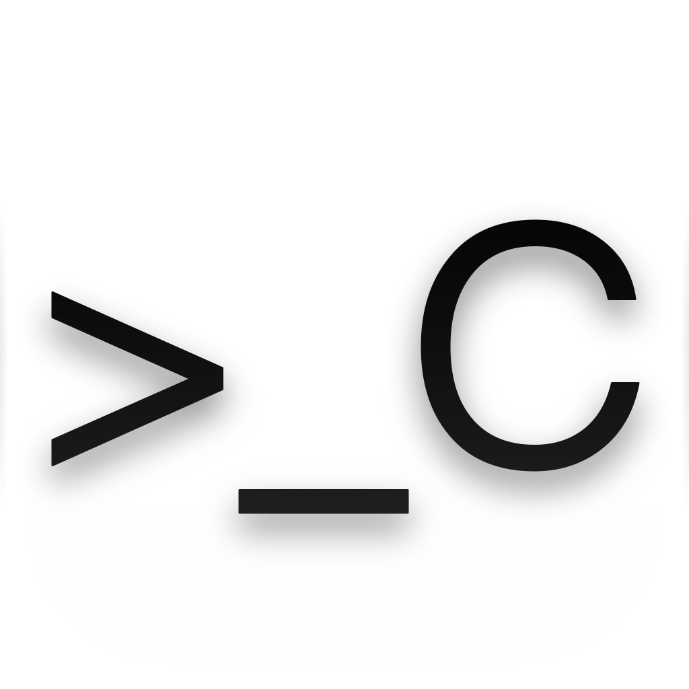

<div align="center">



# CodexBar

**Codex at a glance, right from your macOS menu bar**

[简体中文](README.md) | English

[](https://www.apple.com/macos/)
[](https://www.swift.org/)
[](https://github.com/bob-zebedy/CodexBar/releases)
[](https://github.com/bob-zebedy/CodexBar/releases)
[](LICENSE)

[Features](#features) | [Installation](#installation) | [Quick Start](#quick-start) | [Privacy](#privacy) | [Runtime Architecture](https://codexbar.zabrian.app/architecture) | [Performance Report](https://codexbar.zabrian.app/performance)


</div>

---

CodexBar is a menu bar app for macOS that displays your Codex account information, usage limits, token usage, and real-time task status in one place.

It can notify you when a task finishes, needs approval, or when your rate limits change. It can also keep your Mac awake while eligible Codex tasks are active.

## Features

### Account and rate limits at a glance

- View your current Codex account and plan
- See every rate-limit window, its remaining allowance, and reset time
- Check available credits and banked resets
- Automatically use banked resets from 15 minutes to 6 hours before they expire, with a default lead time of 30 minutes; CodexBar can wake your Mac at the scheduled time and revalidate availability before use
- Show the remaining percentage of a selected rate-limit window as a menu bar arc

### Understand your Codex usage

- Track total tokens, your highest daily usage, and usage streaks
- See your longest task duration
- Review recent daily token usage in a heatmap
- View daily session, turn, tool call, subagent, and other activity metrics

### Keep track of active tasks

- Menu bar person badges distinguish running tasks, tasks waiting for approval, recent completions, and recent terminations
- The main panel shows the current task, project, model, reasoning effort, and elapsed time
- Task Center brings concurrent, recently completed, and recently terminated tasks together
- Receive alerts for completed tasks, approval requests, and stalled tasks
- Optional task glow along the top of each display shows running, waiting, completed, and terminated states

### Let long-running tasks finish

- Prevent system sleep only while eligible Codex tasks are active
- Optionally stay awake while waiting for approval or keep the display awake as well
- Set a keep-awake time limit, low-battery protection, and stalled task protection
- Restore normal system sleep automatically when tasks finish or a protection rule is triggered

### Fit naturally into macOS

- Runs as a menu bar app without taking up space in the Dock
- Supports a global keyboard shortcut, launch at login, and automatic updates
- Provides Simplified Chinese and English interfaces
- Optionally merges daily activity metrics and token usage records across Macs through iCloud

## Installation

### Homebrew

```bash
brew install --cask bob-zebedy/tap/codexbar
```

### DMG

Download the latest version from [GitHub Releases](https://github.com/bob-zebedy/CodexBar/releases), then drag CodexBar into Applications.

## Requirements

- macOS 15.0 or later
- [Codex CLI](https://github.com/openai/codex) installed and signed in, or ChatGPT App or Codex App with bundled Codex installed
- Codex Daemon version `0.157.0` or later. CodexBar reuses an existing service on launch or starts it through an installed Codex that supports `codex app-server daemon start`. Codex Daemon remains running when CodexBar quits
- If the installed Codex does not support the start command, first start a Codex interactive session with the background service enabled
- Cross-device sync requires an available iCloud account on the Mac

## Quick Start

1. Launch CodexBar and find its icon in the menu bar
2. Left-click the icon to view your account, rate limits, and token usage
3. Right-click or Control-click the icon to open Settings, Logs, or the Quit menu
4. Activity capture and statistics start with the app; configure system notifications under `Settings > General`, and sleep prevention and sync under `Settings > Advanced`

The default global shortcut is `⌘⇧E`. You can record a different shortcut or disable it in Settings.

## Privacy

Raw activity events and live tasks are processed locally. Enabling cross-device sync uploads daily activity aggregates and per-turn token usage records to your private iCloud database. Account and usage data come through the local Codex app-server, which connects to the service; update checks use Sparkle.

## Local history and logs

Activity history is rebuilt from recorded events. Token history is recomputed from raw cumulative counter observations captured while collection was active. Both retain 210 days of data; rebuilding cannot recover unobserved usage or deleted source records. If cross-device token corrections lack a verifiable coverage relationship, no historical token aggregate is generated for the affected date.

Request logs retain at most 10,000 entries and 50 MiB of serialized records. Each request or response body is limited to 64 KiB and includes a truncation marker when shortened. The oldest entries are removed when limits are exceeded. The log window caches at most 1,000 entries; close and reopen the window to return from older history to the live list. Database indexes and WAL files add storage overhead.

## Feedback

Report bugs, request features, or ask questions through [GitHub Issues](https://github.com/bob-zebedy/CodexBar/issues).

## License

[GNU General Public License v3.0](LICENSE)
