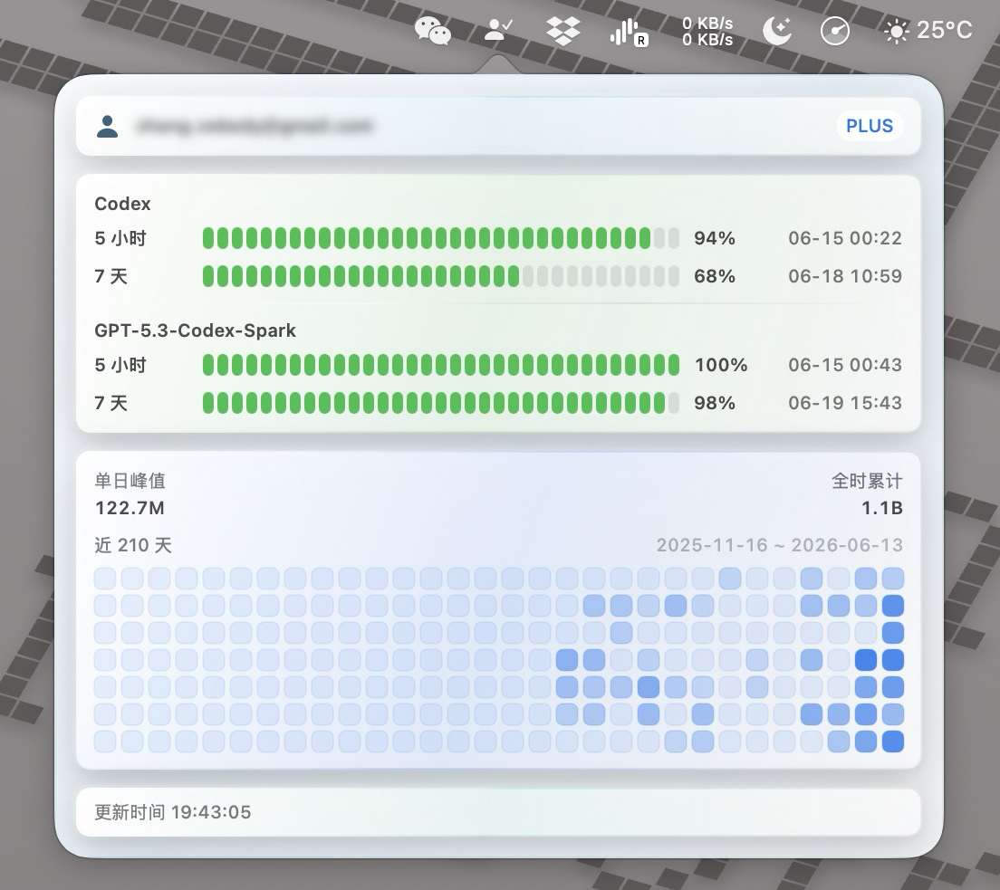

# CodexBar

> 在 macOS 菜单栏实时查看 Codex 账号额度和 token 用量。

CodexBar 是一个轻量级 macOS 菜单栏应用。它直接连接本机 Codex 的 app-server，定期读取额度信息，让你不用打开终端就能随时知道: 还剩多少额度、什么时候重置、最近用了多少 token。

<p align="center">
  
</p>

## 特性

- **额度一目了然**: 分段电量条展示各时间窗口 (如 5 小时、7 天) 的剩余额度，附剩余百分比和重置时间
- **token 贡献墙**: 30 周的每日 token 用量热力图，鼠标悬停查看单日明细，同时展示累计 token 和单日峰值
- **自动刷新**: 每分钟后台刷新一次，弹窗未打开也保持最新；双击账号图标可手动刷新
- **自动更新**: 内置 Sparkle 更新检查，新版本自动更新
- **本地优先**: 只与本机 Codex app-server 进程通信，不向任何第三方服务发送账号或额度数据

## 安装

### 下载 DMG

从 [Releases](https://github.com/bob-zebedy/CodexBar/releases) 下载。

之后的新版本会通过内置的 Sparkle 自动更新推送。

### 运行要求

- macOS 15.0 或更高版本
- 已安装 [Codex CLI](https://github.com/openai/codex) (全局 `codex` 命令或 `Codex.app`)
- 已在 Codex 中完成登录

> 提示: 如果把应用移动到 `/Applications` 后才开启开机自启，建议重新开关一次「开机启动」让 macOS 记录最终路径。

## 从源码构建

```bash
git clone git@github.com:bob-zebedy/CodexBar.git
cd CodexBar
xcodebuild -project CodexBar.xcodeproj -scheme CodexBar -destination 'generic/platform=macOS' build
```

也可以直接用 Xcode 打开 `CodexBar.xcodeproj` 运行。项目使用 SwiftUI + MVVM 依赖 Sparkle (SwiftPM)

## 隐私

CodexBar 只与本机 Codex app-server 进程通信。账号信息和额度数据不会被收集或发送给任何个人或服务。

只有检查和下载 App 更新时会产生额外网络请求，请求范围仅包含 [appcast](https://codexbar.zabrian.app/appcast.xml) 和 appcast 中对应的 DMG 下载地址。
