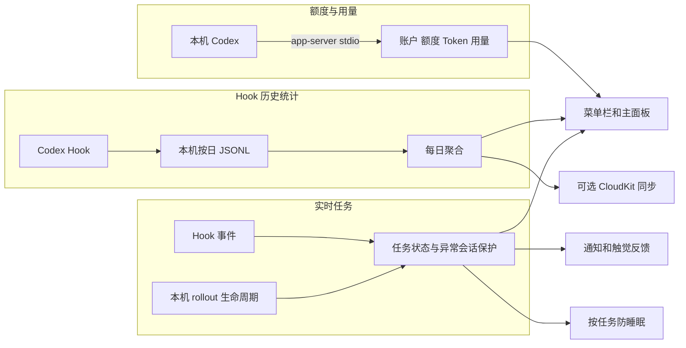

<div align="center">


# CodexBar

**在 macOS 菜单栏一眼看清 Codex 相关信息**

[](https://www.apple.com/macos/)
[](https://swift.org)
[](https://github.com/bob-zebedy/CodexBar/releases)
[](https://github.com/bob-zebedy/CodexBar/releases)
[](LICENSE)

[功能总览](#功能总览) | [安装](#安装) | [基本使用](#基本使用) | [设置说明](#设置说明) | [CodexBar Hook](#codexbar-hook) | [防止系统睡眠](#防止系统睡眠) | [隐私与数据](#隐私与数据)


</div>

---

CodexBar 是面向 macOS 15 及更高版本的菜单栏 App, 用于展示 Codex 账户 额度 Token 用量和实时任务状态, 并提供通知 跨设备 Hook 统计和按任务自动防睡眠等能力

CodexBar 会优先使用全局安装的 Codex CLI, 找不到时回退到 ChatGPT App 或 Codex App 内置的 Codex, 通过本机 `codex app-server` 获取账户 额度和 Token 用量

## 功能总览

CodexBar 的功能来自三条彼此独立的数据链路

| 功能 | 主要作用 | 数据来源 | 是否依赖 CodexBar Hook |
| --- | --- | --- | --- |
| 账户与额度 | 展示账户 套餐 额度窗口 重置时间 积分和手动重置次数 | 本机 `codex app-server` | 否 |
| Token 用量 | 展示全时累计 峰值 连胜 最长任务和近 30 周热力图 | 本机 `codex app-server` | 否 |
| 实时任务 | 判断运行中 等待批准 最近完成和最近终止任务 | Hook 事件与本机 rollout 生命周期 | 是 |
| Hook 历史统计 | 按天统计会话 轮次 工具调用 权限请求 上下文压缩和子 Agent | 本机 Hook 原始事件 | 是 |
| 系统通知 | 提醒额度变化 任务变化 重置临期和防睡眠保护事件 | 额度链路与实时任务链路 | 部分依赖 |
| 防止系统睡眠 | 只在符合条件的 Codex 任务存在时阻止系统睡眠 | 实时任务链路与 CodexBar Helper | 是 |
| 跨设备同步 | 通过 iCloud 合并多台 Mac 的每日 Hook 聚合 | CloudKit private database | 是 |

### 菜单栏图标

- 普通状态显示 Codex 图标, 账户或可信数据异常时切换为错误图标
- 运行中任务显示蓝色状态点, 等待批准显示橙色状态点, 刚完成任务显示绿色状态点
- 开启菜单栏额度指示后, 图标旁显示所选额度窗口的剩余比例
- 鼠标悬停可查看任务状态 项目名 运行或等待时长以及额度窗口剩余比例
- 额度数据来自缓存时会降低图标和进度条透明度, 避免把旧数据误认成最新状态

### 主面板

#### 账户信息

- 展示当前登录账户和套餐标识
- 套餐标识支持 Enterprise Team Business Pro Plus Edu 和 Free 等类型
- 双击邮箱可切换模糊显示
- 双击账户图标可立即刷新账户 额度和用量
- 未登录或 app-server 初始化失败时显示对应状态, 具体请求错误保留在日志窗口

#### 额度与重置次数

- 展示 Codex 返回的全部额度分组和额度窗口
- 每个窗口展示名称 剩余比例 分段进度条和重置时间
- 展示可用积分或无限积分状态
- 展示可用手动重置次数
- 点击手动重置次数可查看各批次的过期时间和数量
- 手动重置次数将在 7 天内过期时按剩余天数提供通知提醒

#### Token 用量与热力图

- 展示全时累计 Token
- 展示单日 Token 峰值
- 展示当前连续使用天数和最长连续使用天数
- 展示最长任务时长
- 使用 30 列乘 7 行热力图展示近 30 周每日 Token 用量
- 方块颜色强度相对于当前热力图中的峰值计算
- 鼠标移动到日期方块时展示日期 Token 数和用量强度
- Hook 开启时, 日期详情还会展示最常用模型 会话数 对话轮次 子 Agent 工具调用 权限请求和上下文压缩次数

#### 实时任务与任务中心

- 主面板活动卡片优先展示等待批准或运行中的任务, 没有活跃任务时展示最近完成或最近终止状态
- 活动卡片可展示模型 推理强度 项目名 工具名 运行时长 等待时长 活跃子 Agent 数和其他并发任务数
- 点击有内容的活动卡片可打开任务中心
- 任务中心分别列出等待确认 运行中 最近完成和最近终止任务
- 每条任务可展示项目 模型 推理强度 状态持续时间和完成或终止时间
- 防睡眠实际生效时, 活动卡片右侧显示咖啡杯标记

#### 底部状态

- 展示数据更新时间和距离下一次自动刷新的倒计时
- 账户 额度和 Token 用量每 60 秒自动刷新一次
- 展示 iCloud 同步关闭 同步中 已同步或同步失败状态
- 发现新版本时展示更新提示, 双击提示可开始更新

### 通知与提醒

CodexBar 通知总开关开启并获得 macOS 通知授权后, 支持以下通知

| 通知 | 触发条件 | 可配置项 | 额外依赖 |
| --- | --- | --- | --- |
| 任务完成 | 任务完成且运行时长达到阈值 | 开关 最短时长 音效 | CodexBar Hook |
| 任务等待 | 任务进入等待用户批准状态 | 开关 音效 | CodexBar Hook |
| 额度预警 | 剩余额度首次跌到阈值或以下 | 开关 阈值 音效 | 无 |
| 额度重置 | 已观察到消耗的额度窗口回到未消耗状态 | 开关 音效 | 无 |
| 重置临期 | 手动重置次数进入过期前 7 天窗口 | 开关 音效 | 无 |
| 低电量保护 | 低电量导致 CodexBar 成功恢复系统睡眠 | 开关 音效 | 防睡眠和低电量保护 |
| 防睡眠上限 | 达到时长上限并成功恢复系统睡眠 | 开关 音效 | 防睡眠和有限时长上限 |
| 异常会话保护 | 运行中任务超过静默阈值并仍然有效 | 固定使用系统默认声音 | CodexBar Hook 和防睡眠主开关 |

- 每类可配置通知都可选择默认 静音 系统声音或 App 内置声音
- 非默认且非静音的声音可在设置面板中试听
- 任务完成和任务等待可额外开启触摸板震动, 触觉反馈不依赖系统通知授权, 但服从 CodexBar 通知总开关
- 点击任意 CodexBar 通知会打开主面板
- App 位于前台时仍会显示通知横幅 列表项和声音
- 已经失效的等待批准或异常会话通知会从通知中心撤回
- Codex TUI 通知是 Codex 自己的设置, 与 CodexBar 本地通知相互独立

### 系统集成与辅助功能

- 作为 `LSUIElement` 菜单栏 App 运行, 不占用 Dock 图标
- 支持开机自动启动
- 支持可录制的全局快捷键
- 支持 Sparkle 自动检查 手动检查和应用内更新
- 支持简体中文和英文界面
- 日期 时间 时长 百分比 月历和星期顺序跟随当前地区设置
- 提供 Codex CLI 和 Codex App 内置 CLI 的版本 来源和路径检查
- 提供最多 500 条的内存 app-server 交互日志

## 安装

### 通过 Homebrew

```bash
brew install --cask bob-zebedy/tap/codexbar
```

### 通过 DMG

从 [Releases](https://github.com/bob-zebedy/CodexBar/releases) 下载并安装

### 运行要求

- macOS 15.0 或更高版本
- 已安装并登录 [Codex CLI](https://github.com/openai/codex), 或安装了内置 Codex 的 ChatGPT App 或 Codex App
- 使用 Hook 相关功能时, 当前连接的 Codex app-server 版本必须为 `0.145.0` 或更高版本
- 使用跨设备同步时, macOS 必须登录可用的 iCloud 账户

## 基本使用

| 操作 | 效果 |
| --- | --- |
| 左键点击菜单栏图标 | 打开或关闭主面板 |
| 右键或 Control 点击菜单栏图标 | 打开设置 日志和退出菜单 |
| `⌘⇧W` | 使用默认全局快捷键打开或关闭主面板 |
| `⌘,` | 打开设置窗口 |
| `⌘L` | 主面板打开时关闭面板并打开日志窗口 |
| 双击账户图标 | 立即刷新账户 额度和用量 |
| 双击账户邮箱 | 切换邮箱模糊显示 |
| 悬停热力图方块 | 查看当日 Token 和 Hook 统计详情 |
| 点击活动卡片 | 打开并发任务中心 |
| 点击手动重置次数 | 查看各批次过期时间 |

全局快捷键会优先在鼠标所在屏幕打开主面板, 菜单栏锚点不可用时使用独立浮动面板作为回退

## 设置说明

设置窗口包含通用 高级和关于三个页面

### 通用设置

| 设置 | 作用 | 当前默认或初始状态 |
| --- | --- | --- |
| 开机自动启动 | 通过 macOS 登录项启动 CodexBar | 跟随当前系统登录项状态 |
| 自动检查更新 | 由 Sparkle 定期检查 appcast | 跟随 Sparkle 当前设置 |
| 菜单栏额度指示 | 在菜单栏图标旁显示主额度或次额度剩余比例 | 主额度 |
| 全局快捷键 | 在任意 App 中打开或关闭 CodexBar 主面板 | `⌘⇧W` |

- 菜单栏额度指示会记住关闭前选择的窗口, 再次开启时恢复该选择
- 全局快捷键至少需要两个修饰键
- `Command-Space` 和 `Command-Tab` 等系统保留组合不可使用
- 快捷键可清除或恢复为默认值

### 高级设置

| 设置 | 作用 | 当前默认或初始状态 |
| --- | --- | --- |
| CodexBar Hook | 安装并校验 Codex 事件 handler | 未安装时关闭 |
| 主面板任务中心 | 控制活动卡片和任务中心是否显示 | 开启, Hook 关闭时不可用 |
| 系统通知 | 控制 CodexBar 本地通知和触觉反馈 | 关闭 |
| 防止系统睡眠 | 根据实时 Codex 任务自动切换系统睡眠 | 关闭 |
| 跨设备同步 | 通过 iCloud 同步每日 Hook 聚合 | 关闭 |
| 重建数据 | 从所选日期范围的本机 Hook 原始事件重新生成聚合 | 手动操作 |

#### 通知子选项

| 选项 | 可选值或默认值 |
| --- | --- |
| 任务完成通知 | 默认开启, 最短任务时长默认 1 分钟, 可选 30 秒 1 分钟 2 分钟或 5 分钟 |
| 任务等待通知 | 默认开启 |
| 额度预警通知 | 默认开启, 阈值默认 10%, 可选 5% 10% 或 25% |
| 额度重置通知 | 默认开启 |
| 重置临期通知 | 默认开启 |
| 低电量保护通知 | 默认开启, 仅在低电量保护实际可用时生效 |
| 防睡眠上限通知 | 默认开启, 仅在时长上限不是无限制时生效 |
| 任务触觉反馈 | 默认关闭 |
| Codex TUI 通知 | 读取并修改 Codex 用户配置中的 `tui.notifications` |

通知总开关首次开启时会请求 macOS 通知权限, 权限被拒绝时设置页会提供系统设置入口

#### 跨设备同步

- 只有 CodexBar Hook 已开启且 iCloud 可用时才能开启
- 开启后会回填保留期内的本机每日 Hook 聚合
- 设置页显示同步中状态和最近一次成功上传时间
- 主面板底部显示同步关闭 同步中 已同步或失败状态
- 每台设备的同日数据独立保存, 展示时会合并不同设备的贡献并避免重复叠加当前设备的本地副本
- CloudKit 使用 `iCloud.app.zabrian.codexbar` 容器的 private database

#### 重建数据

- 日期选择器只允许选择原始 Hook 数据保留期内的日期
- 有原始事件的日期会显示数据标记
- 执行前会确认所选日期范围
- 重建会重新计算本机每日聚合, 跳过无法解析的无效行并报告结果
- 开启跨设备同步后, 重建日期会在后续同步中替换当前设备对应日期的云端贡献
- 重建不修改账户 额度或 Token 用量数据

### 关于页面

- 分别检测全局 Codex CLI 和 Codex App 内置 CLI 的磁盘版本
- 标记当前 app-server 实际使用的 Codex 来源和运行版本
- 磁盘中的 Codex 已更新但当前 app-server 尚未重连时显示新安装版本
- 点击可执行文件路径可复制完整路径
- 展示 CodexBar 当前版本 更新检查状态和可用更新
- 提供 GitHub 项目入口 手动检查更新和退出 CodexBar 操作

## CodexBar Hook

### Hook 的作用

账户 额度和 Token 用量接口只能提供周期性快照, 不能完整表达一个 Codex 任务何时开始 何时等待批准 调用了多少工具或是否启动了子 Agent

CodexBar Hook 把 Codex 在关键节点产生的事件追加到本机日志, 让 CodexBar 能够获得以下能力

- 实时任务状态和并发任务中心
- 菜单栏任务状态点和任务 tooltip
- 任务完成 等待批准和异常会话保护通知
- 任务触觉反馈
- 按天统计会话 轮次 工具调用 权限请求 上下文压缩和子 Agent
- 基于任务状态自动防止系统睡眠
- 跨设备同步每日 Hook 聚合
- 从原始事件重建历史聚合

关闭 Hook 不影响账户 额度 Token 热力图 更新检查或日志窗口, 但以上依赖实时事件的功能会停止工作

### 启用条件

- CodexBar 必须能连接当前实际运行的 `codex app-server`
- app-server 握手版本必须为 `0.145.0` 或更高版本
- Codex 用户配置中的 `features.hooks` 不能被全局关闭
- Hook 配置文件必须是有效 JSON

版本检查使用当前连接的 app-server 运行版本, 不是磁盘上刚安装的版本

升级 Codex 后如果仍提示版本过低, 需要重启 CodexBar 以建立新连接

### 开启和关闭时修改的内容

CodexBar 使用 `$CODEX_HOME/hooks.json`, 未设置 `CODEX_HOME` 时使用 `~/.codex/hooks.json`

开启 Hook 时会完成以下操作

1. 读取并保留现有 `hooks.json` 内容
2. 为当前 CodexBar 可执行文件追加独立的 command handler
3. 通过 app-server 查询实际 Hook 列表
4. 只为命令 来源路径和事件都匹配当前 CodexBar 的 handler 更新信任状态
5. 再次查询并确认事件完整 启用 来源正确且已受信任

关闭 Hook 时只删除同时匹配当前 CodexBar 可执行路径和 `--hook-event` 参数的 handler, 并只清理对应信任项

用户自己配置的 handler 其他 App 的 handler 未识别的同级结构和无关信任项都会保留

### 监听的事件

| Hook 事件 | CodexBar 中的主要用途 |
| --- | --- |
| `SessionStart` `SessionEnd` | 会话生命周期 会话统计和任务收尾 |
| `UserPromptSubmit` `Stop` | 对话轮次 任务进展和完成候选 |
| `PreToolUse` `PostToolUse` | 工具调用统计和任务进展 |
| `PermissionRequest` | 用户审批状态 权限请求统计和等待通知 |
| `PreCompact` `PostCompact` | 上下文压缩统计和任务进展 |
| `SubagentStart` `SubagentStop` | 子 Agent 数量 状态和任务进展 |

`SessionEnd` 的 handler 超时为 3 秒, 其他事件为 5 秒

### 一次 Hook 事件如何处理

```text
Codex 触发事件
  -> 启动 CodexBar --hook-event 子进程
  -> 子进程只读取 stdin JSON
  -> 提取统计和任务状态需要的字段
  -> 在跨进程文件锁内追加到当日 JSONL
  -> 立即退出
  -> 主 App 增量读取并更新聚合和实时任务
```

- Hook 子进程不会初始化菜单栏 UI app-server CloudKit 通知或防睡眠服务
- 写入失败不会阻断 Codex, Hook 模式会忽略无效输入或本次记录失败并退出
- 主 App 同时读取 Hook 事件和本机 Codex rollout 生命周期, 用于区分准确的完成与终止状态并补充最近进展时间
- rollout 读取只提取生命周期 时间和推理强度等字段, 不展示或保存会话正文和工具内容

### Hook 本地数据

| 数据 | 路径 | 当前内容 | 保留规则 |
| --- | --- | --- | --- |
| 原始事件 | `~/Library/Application Support/CodexBar/HookEvents/events/YYYY-MM-DD.jsonl` | 时间 事件名 模型 推理强度 权限模式 reviewer session turn agent 工具和工作目录 | 210 天 |
| 每日聚合 | `~/Library/Application Support/CodexBar/HookEvents/daily.jsonl` | 每类事件计数 会话与轮次 项目名计数和模型计数 | 210 天 |
| 维护状态 | `~/Library/Application Support/CodexBar/HookEvents/maintenance.json` | 增量 offset 文件标识和待处理日期 | 跟随聚合维护 |

- 原始事件只保存选定的结构化字段, 不保存 prompt 文本 Codex 回复 工具参数或工具输出
- 原始事件中的 session turn 和 agent ID 会随对应 JSONL 一起保留 210 天
- 每日聚合只在最近 3 天保留 session 和 turn ID 列表, 之后转换为计数并删除列表
- 原始事件和每日聚合都只保存在本机
- CloudKit 不上传原始事件 session ID turn ID agent ID 完整工作目录 账户 额度或 Token 用量

### Hook 状态和排查

| 状态或提示 | 含义 | 处理方式 |
| --- | --- | --- |
| 需要更高 Codex 版本 | 当前运行的 app-server 版本不足 | 更新 Codex 后重启 CodexBar |
| Codex Hook 已全局关闭 | `features.hooks` 已禁用 | 在 Codex 配置中重新启用 Hooks |
| CodexBar Hook 已不完整 | 至少一个必要事件缺少当前 handler | 关闭后重新开启 CodexBar Hook |
| CodexBar Hook 未被信任 | app-server 仍将 handler 判定为未信任或已修改 | 重新开启 Hook 并检查 Codex 配置 |
| CodexBar Hook 意外来源 | app-server 返回的来源文件不是当前配置文件 | 检查 `CODEX_HOME` 和运行中的 Codex 来源 |
| hooks.json 文件格式错误 | 顶层或 `hooks` 结构不是有效 JSON 对象 | 修复 JSON 后重新操作 |
| 无法验证 Codex Hook | app-server 暂时不可用或校验请求失败 | 查看日志并在 Codex 可用后重新打开设置页 |

CodexBar 每次打开设置窗口或 App 重新激活时都会刷新配置并校验已安装 Hook

升级后出现 Hook 不完整提示时, 关闭后重新开启即可补齐当前代码要求的事件

## 防止系统睡眠

### 这个功能解决什么问题

macOS 进入系统睡眠后, 正在运行的本机 Codex 任务可能会被挂起

防睡眠功能根据 Codex 实时任务状态自动管理系统睡眠, 目标是让长任务在无人操作时继续运行, 同时在任务结束或保护条件触发后恢复系统原有睡眠行为

它不是一个永久保持唤醒的通用开关

打开设置只表示允许 CodexBar 自动管理睡眠, 没有符合条件的任务时不会修改系统睡眠

### 生效条件

以下条件同时满足时, CodexBar 才会实际阻止系统睡眠

1. CodexBar 正在运行且未进入退出流程
2. 防止系统睡眠主开关已打开
3. CodexBar Hook 已安装且最近一次明确校验有效
4. 至少有一个运行中任务, 或开启等待批准时保持后存在等待批准任务
5. CodexBarHelper 已注册并获得系统批准
6. Helper 当前不在更新过程中
7. 低电量保护当前没有生效
8. 本轮实际防睡眠时间尚未达到上限

任一条件不满足时只停止实际防睡眠

条件恢复后, 仍有符合条件任务时会自动重新生效

### 工作方式

```text
Hook 事件和 rollout 生命周期
  -> CodexActivityMonitor 判断运行中或等待批准任务
  -> KeepAliveController 检查 Hook Helper 电量和时长上限
  -> App 建立空闲睡眠断言
  -> CodexBarHelper 管理 pmset SleepDisabled
  -> 可选建立显示睡眠断言并持续声明用户活动
```

- App 侧建立 IOKit 空闲睡眠断言
- CodexBarHelper 只通过受签名约束的 XPC 接口接受租约 状态查询和更新恢复请求
- helper 使用 `pmset -g` 查询状态, 只使用 `pmset -a disablesleep 1` 或 `pmset -a disablesleep 0` 修改状态
- 任务结束 设置关闭 Hook 失效 低电量或时长到期时会释放租约并恢复睡眠
- 如果 CodexBar 自己恢复睡眠时设备已经合盖, 且系统配置要求合盖睡眠, App 会补发一次系统睡眠请求

### 防睡眠子选项

| 选项 | 作用 | 当前默认 | 可选值 |
| --- | --- | --- | --- |
| 等待批准时保持 | 将等待用户批准的任务也计入防睡眠 | 关闭 | 开启或关闭 |
| 保持屏幕常亮 | 实际防睡眠期间同时阻止显示器睡眠 屏保和闲置锁屏 | 关闭 | 开启或关闭 |
| 最长防睡眠时间 | 限制一轮实际阻止睡眠的累计时长 | 12 小时 | 1 2 4 8 12 24 小时或无限制 |
| 异常会话保护 | 运行中任务长时间无进展时隐藏任务并停止其防睡眠贡献 | 1 小时 | 30 分钟 1 2 4 小时 |
| 低电量保护 | 使用电池且电量过低时恢复系统睡眠 | 关闭 | 关闭或 5% 10% 15% 20% 25% |

没有内置电池的 Mac 不显示低电量保护选项

#### 等待批准时保持

- 关闭时, 任务从运行中进入等待批准后不再支撑防睡眠
- 开启时, 等待批准期间继续防止系统睡眠
- 等待批准没有自然超时, 因此无人值守时可能长时间保持唤醒
- 最长防睡眠时间仍会限制等待批准期间的实际防睡眠时长
- 异常会话保护不处理等待批准任务

#### 保持屏幕常亮

- 只在系统睡眠实际被阻止时生效
- 除了阻止显示器睡眠, 还每 30 秒声明一次用户活动以压住屏保和闲置锁屏
- 任务结束 低电量保护生效 达到时长上限或防睡眠失败时会同步释放
- 开启后可能让离开电脑时仍保持解锁界面, 因此默认关闭

#### 最长防睡眠时间

- 默认 12 小时
- 只累计真正阻止系统睡眠的时间
- 因低电量 Helper 不可用或其他条件暂停防睡眠的时间不计入上限
- 使用可暂停时钟, 系统睡眠期间和系统时间调整不会消耗上限
- 没有活跃任务时重置计时
- 新运行任务出现或等待任务恢复运行时重新开始一轮计时
- 达到上限后恢复系统睡眠, 直到新一轮任务重新开始

#### 异常会话保护

异常会话保护用于处理任务已经没有真实进展, 但缺少可靠终态而仍显示为运行中的情况

- 跟随防睡眠主开关, 没有独立开关
- 只判定运行中任务, 不判定等待批准任务
- 最近进展时间来自 Hook 顶层事件 子 Agent 事件和 rollout 生命周期
- 达到阈值后先保存保护记录并尝试发送系统通知
- 无论通知是否开启或提交成功, 候选仍然有效时都会隐藏任务
- 被隐藏任务不显示在活动卡片和任务中心, 也不参与防睡眠计算
- 后续出现新进展时自动恢复任务并撤回仍有效的保护通知
- 修改为更长阈值后, 尚未超过新阈值的隐藏任务会恢复
- Hook 历史回放 系统睡眠 唤醒对账和 Hook 数据源不可用期间暂停判定
- 保护记录最长保留到最后进展后的 24 小时
- 保护记录只包含哈希任务标识和时间戳, 不包含原始 session ID turn ID 项目名或任务内容

#### 低电量保护

- 只在 Mac 使用电池供电时生效
- 电量首次小于或等于所选阈值时恢复系统睡眠
- 电量必须回升到阈值加 5 个百分点才解除保护, 避免在临界值附近反复切换
- 接通电源会立即解除当前阻断, 仍有任务时自动恢复防睡眠
- 只有 CodexBar 确实停止了自己持有的防睡眠状态后才发送低电量通知

### Helper 授权与状态

防睡眠需要随 App 嵌入的 `CodexBarHelper` LaunchDaemon 修改系统级睡眠状态

- 首次开启时通过 macOS `SMAppService` 注册
- macOS 要求批准后台项目时, 设置页显示打开系统设置按钮
- Helper 文件缺失或注册失败时, 设置页显示错误且不执行防睡眠
- App 更新导致 Helper 内容变化时会刷新注册并校验睡眠状态
- App 退出前会先释放 Helper 租约并恢复由 CodexBar 修改的睡眠状态
- XPC 连接意外中断后, Helper 会在宽限期结束后释放失联客户端租约
- Helper 自身启动和终止时会根据持久化所有权记录恢复未完成的睡眠状态

### 与其他防睡眠来源共存

如果任务开始前 `SleepDisabled` 已经由其他 App 或用户设为 1, CodexBar 会把来源标记为外部

- CodexBar 不会把外部设置据为己有
- 任务结束时不会写回 `pmset` 或恢复外部来源的设置
- 外部设置恢复为 0 而任务仍在运行时, CodexBar 会重新检查并按需接管
- 主面板仍显示咖啡杯, tooltip 和设置页会说明系统睡眠由其他来源关闭

## 语言与地区

CodexBar 提供简体中文和英文界面, 默认跟随 macOS 的 App 语言偏好

需要单独切换时, 可在 macOS 系统设置的语言与地区中为 CodexBar 指定 App 语言

日期 时间 时长 百分比 月历和星期顺序继续按照当前地区格式显示

## 日志与排查

- 右键菜单栏图标选择日志, 或在主面板打开时按 `⌘L`
- 日志窗口保留当前 App 进程最近 500 条 app-server 请求
- 每条记录展示请求时间 方法 状态和响应时间
- 展开后可查看请求 响应或错误的单行预览
- 完整内容可在独立窗口中查看或复制
- JSON 内容会格式化并提供基础语法高亮
- 日志存储只在内存中, 可手动清空, 退出 App 后不会保留

## 隐私与数据

### 数据访问和网络行为

| 行为 | 目的 | 数据边界 |
| --- | --- | --- |
| 与本机 `codex app-server` 通过 stdio 通信 | 获取账户 额度 Token 用量 Hook 列表和 Codex 配置 | 本机进程通信 |
| 请求 OpenAI 重置次数接口 | 查询手动重置次数的过期时间 | 只在存在可用重置次数时执行 |
| Sparkle 更新检查 | 获取 appcast 和安装更新 | 使用配置的 HTTPS feed |
| CloudKit 同步 | 同步多设备每日 Hook 聚合 | 仅在用户开启跨设备同步后使用 private database |

### 本机保存的数据

| 数据 | 内容 | 位置或生命周期 |
| --- | --- | --- |
| Hook 原始事件 | 选定的结构化事件字段, 不含 prompt 回复 工具参数或工具输出 | `~/Library/Application Support/CodexBar/HookEvents/events`, 保留 210 天 |
| Hook 每日聚合 | 事件计数 会话与轮次计数 项目名计数和模型计数 | `~/Library/Application Support/CodexBar/HookEvents/daily.jsonl`, 保留 210 天 |
| 异常会话保护 | 哈希任务标识和时间戳 | `~/Library/Application Support/CodexBar/ActivityProtection/state.json`, 最长 24 小时 |
| App 偏好 | 开关 阈值 快捷键和通知去重状态 | macOS UserDefaults |
| app-server 日志 | 最近 500 条请求和响应 | 仅当前进程内存 |

### CloudKit 上传内容

CloudKit 每条记录包含设备伪标识 日期 来源 generation 各类 Hook 事件计数 会话与轮次计数 项目显示名计数 模型计数和更新时间

CloudKit 不上传以下内容

- 原始 Hook 事件文件
- session ID turn ID 和 agent ID
- 完整工作目录路径
- prompt Codex 回复 工具参数或工具输出
- Codex 账户 额度 Token 用量和 app-server 交互日志
- 异常会话保护记录

### 日志隐私

- 系统日志只记录操作结果 状态分类 计数和错误阶段
- 系统日志不记录账户额度数值 Token 用量 项目名 任务内容 session ID turn ID 或 OAuth token
- app-server 交互日志可能包含请求和响应内容, 但只存在当前 App 进程内存并由用户主动打开查看

## 实现

Swift 6 + SwiftUI + AppKit, 使用 MVVM, 外部依赖为 Sparkle

工程开启 `SWIFT_DEFAULT_ACTOR_ISOLATION = MainActor`, 共享状态收敛进 actor, 跨进程 Hook 文件写入由 `flock` 保护



<details>
<summary><b>关键实现约束</b></summary>

<br>

**Hook 子进程模式**

App 使用 `--hook-event` 参数启动时不初始化 UI, 只从 stdin 读取 Hook payload, 在文件锁内追加到当日 JSONL 后立即退出

**历史聚合**

原始 Hook 事件与每日聚合保留 210 天

每日聚合只为最近 3 天保留 session 和 turn ID 列表, 更早日期只保留计数

聚合算法版本变化或已压缩日期收到新事件时, 从仍在保留期内的原始 JSONL 完整重建

**实时任务**

`CodexActivityMonitor` 是菜单栏图标 活动卡片 通知和防睡眠的统一任务状态来源

`HookEventTailReader` 增量读取 Hook JSONL, `CodexSessionLifecycleReader` 只从 rollout 提取任务生命周期和最近进展字段

**异常会话保护**

异常会话保护以 Hook 事件和 rollout 最近进展时间为依据

达到静默阈值后先尝试提交本地通知, 随后隐藏任务并让它退出防睡眠计算

新进展到达后恢复任务

系统睡眠 Hook 历史回放和 Hook 数据源不可用期间暂停判定

唤醒后等待新一轮 Hook 增量读取与 rollout 对账完成再恢复

**CodexBar Helper 权限**

`CodexBarHelper` 是随 App 嵌入的 LaunchDaemon, 只暴露防睡眠租约 状态查询和更新恢复 XPC

Helper 对外只执行 `/usr/bin/pmset`, 使用 `-g` 查询状态, 使用 `-a disablesleep 0/1` 修改状态

Helper 只在 CodexBar 自己将 `SleepDisabled` 从 0 改为 1 时取得所有权

任务开始时已经为 1 则视为外部来源, 不修改该值

Helper 启动时读取自身签名并生成 XPC 客户端 requirement, 修改签名或 bundle ID 会导致连接被拒绝

</details>

## 从源码构建

```bash
git clone https://github.com/bob-zebedy/CodexBar.git
cd CodexBar
xcodebuild -project CodexBar.xcodeproj -scheme CodexBar -destination 'generic/platform=macOS' build
```

Debug 和 Release 使用不同的 App 与 Helper bundle ID

格式化和静态检查使用 `swiftformat` 和 `swiftlint`

## 反馈

Bug 功能建议或使用问题都欢迎通过 [Issues](https://github.com/bob-zebedy/CodexBar/issues) 反馈

## 许可证

[GNU General Public License v3.0](LICENSE)
