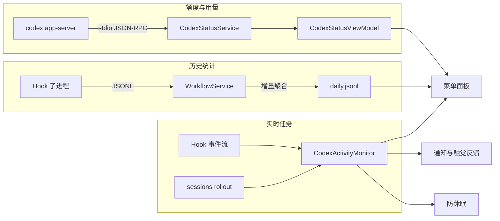

<div align="center">


# CodexBar

**在 macOS 菜单栏一眼看清 Codex 的账号; 额度; 用量与实时任务**

[](https://www.apple.com/macos/)
[](https://swift.org)
[](https://github.com/bob-zebedy/CodexBar/releases)
[](https://github.com/bob-zebedy/CodexBar/releases)
[](LICENSE)

[安装](#安装) | [使用](#使用) | [隐私](#隐私) | [实现](#实现)


</div>

---

CodexBar 把 Codex 的运行状态收进菜单栏: 剩余额度; 下次重置时间; 当日 Token 用量, 以及当前任务是在运行还是在等待批准

应用以 `LSUIElement` 方式运行, 没有 Dock 图标; 数据全部在本机采集与聚合, 对外通信仅有四项, 详见[隐私](#隐私)

## 特性

其中实时任务; 工作流统计与防休眠依赖 CodexBar Hook, 开启方式见[关于 Hook](#关于-hook)

### 额度与用量

- 分时间窗口展示剩余额度; 重置时间与可用的手动重置次数
- 菜单栏可常驻显示主要或次要窗口的额度百分比, 无需展开面板
- 30 周日历热力图呈现每日 Token 用量, 点击任意一格展开当天明细
- 账号有效时额度与用量允许单独失败, 失败项沿用同账号缓存并标记为陈旧

### 实时任务

- 开启 CodexBar Hook 后, 菜单栏图标随任务状态实时变化
- 任务中心区分运行中; 等待批准; 最近完成; 已终止四种状态
- 状态同时取自 Hook 事件流与 `~/.codex/sessions` 下的 rollout 记录, 前者覆盖工具调用与批准请求, 后者补齐对话轮次的起止

### 工作流统计

- 按天聚合会话; 对话轮次; 工具调用; 权限请求; 上下文压缩; 子 Agent 等指标
- 原始事件与每日聚合保留 210 天, 可按日期区间从原始事件重新统计
- 可选开启 iCloud 同步, 汇总多台 Mac 的数据

### 防休眠

- 仅在任务运行期间阻止空闲休眠与合盖休眠, 任务结束即恢复
- 最长时长可选 1; 2; 4; 8; 12; 24 小时或无限制, 默认 12 小时
- 等待批准; 任务结束与时长到期都会还原系统原有设置, 交由 macOS 重新判断

### 通知与提醒

- 五类本地通知: 额度告急; 额度重置; 任务等待批准; 长任务完成; 重置机会即将过期
- 告急百分比与长任务时长阈值可调, 每类通知的音效独立可选
- 阈值穿越带去重判定, 同一事件不会重复提醒; 任务状态变化另有触觉反馈
- 可直接读写 Codex CLI 自身的通知配置, 无需手动编辑 `config.toml`

### 系统集成

- 全局快捷键唤起 (默认 `⌘⇧W`, 可自定义); 开机自启; Sparkle 自动更新
- 内置日志窗口保留最近 500 条请求记录, 连接失败与解析异常均可追溯
- 界面风格贴近系统菜单栏工具, 不作额外装饰

## 安装

推荐通过 Homebrew 安装

```bash
brew install --cask bob-zebedy/tap/codexbar
```

也可以从 [Releases](https://github.com/bob-zebedy/CodexBar/releases) 下载 DMG, 将 `CodexBar.app` 拖入 `/Applications`

运行要求

- macOS 15.0 或更高版本
- 已安装并登录 [Codex CLI](https://github.com/openai/codex), 或安装了内置 Codex 的 ChatGPT App

> [!TIP]
> CodexBar 优先使用 PATH 中的 `codex`, 找不到时回退到 `ChatGPT.app` 或 `Codex.app` 的内置版本

## 使用

| 操作                | 效果                           |
| ------------------- | ------------------------------ |
| 左键点击菜单栏图标  | 打开主面板                     |
| 右键或 Control 点击 | 打开上下文菜单                 |
| `⌘⇧W`               | 全局唤起主面板, 可在设置中改键 |
| `⌘,`                | 打开设置窗口                   |
| `⌘L`                | 主面板打开时, 打开日志窗口     |

### 关于 Hook

实时任务; 工作流统计与防休眠都依赖 CodexBar Hook, 在设置中开启即可写入 `~/.codex/hooks.json`

> [!NOTE]
> 写入只追加 CodexBar 自身的 handler, 关闭时也只移除这一条; 已有的 Hook 与其他工具注册的 Hook 原样保留

### 关于防休眠

覆盖合盖休眠需要一个 root LaunchDaemon 执行 `pmset`, 因此首次开启时 macOS 会要求授权后台项目; 该功能同样依赖 Hook, 关闭 Hook 会将其一并关闭并置灰

> [!WARNING]
> 合盖状态下持续运行任务会明显增加耗电与发热, 请保证 Mac 通风良好, 不要在密闭背包内使用

## 隐私

CodexBar 的对外通信只有以下四项, 其中真正经过网络的是后三项

| 行为                           | 说明                                       |
| ------------------------------ | ------------------------------------------ |
| 与本机 `codex app-server` 通信 | 经由管道, 不经过网络                       |
| 查询额度重置机会的过期时间     | 只读请求, 全仓库唯一的 `URLSession` 调用点 |
| Sparkle 更新检查               | 拉取 appcast                               |
| CloudKit 同步                  | 仅在显式开启后进行                         |

账号; 额度; Token 用量与原始 Hook 事件都不会离开本机; 跨设备同步只上传去掉会话与轮次标识的每日聚合; Codex 的 OAuth token 与 `auth.json` 内容既不展示也不记录

## 实现

Swift 6 + SwiftUI + AppKit, MVVM, 唯一的外部依赖是 Sparkle

工程开启了 `SWIFT_DEFAULT_ACTOR_ISOLATION = MainActor`, 所有类型默认 MainActor 隔离; 共享状态收敛进 actor, 跨进程写统计文件由 `flock` 保护

三条数据链路各自独立



<details>
<summary><b>两处关键设计</b></summary>

<br>

**Hook 子进程模式**

App 二进制带 `--hook-event` 启动时不初始化任何 UI, 只从 stdin 读一行 JSON, 在文件锁内追加到当日 JSONL 后立即退出

写入失败一律静默返回, 任何情况下都不阻断也不拖慢 Codex

**root helper 的最小权限**

`CodexBarHelper` 是随 App 嵌入的 LaunchDaemon, 只暴露一个 XPC 方法, 只执行 `pmset -a disablesleep`; 没有网络访问, 没有命令执行, 也没有其他文件读写能力

调用方由代码签名强制校验: helper 启动时读取自身签名拼出 requirement 交给 XPC listener, 修改签名或 bundle ID 都会导致连接被拒

此外还有磁盘哨兵与 watchdog 兜底, 确保 App 异常退出后休眠设置仍能还原

</details>

## 从源码构建

```bash
git clone https://github.com/bob-zebedy/CodexBar.git
cd CodexBar
xcodebuild -project CodexBar.xcodeproj -scheme CodexBar -destination 'generic/platform=macOS' build
```

也可以直接 `open CodexBar.xcodeproj` 在 Xcode 中运行 Debug scheme; Debug 产物的 bundle ID 为 `app.zabrian.codexbar.debug`, 与 Release 安装版可以共存

格式化与静态检查使用 `swiftformat` 和 `swiftlint`, 配置位于仓库根目录

`Scripts/` 下是归档; 公证; DMG 打包与 appcast 签名等发布脚本, 它们需要 Developer ID 凭据, 不适合用于日常验证

## 反馈

Bug; 功能建议与使用问题都欢迎通过 [Issues](https://github.com/bob-zebedy/CodexBar/issues) 反馈, 仓库已备好对应模板

## 许可证

[GNU General Public License v3.0](LICENSE)
