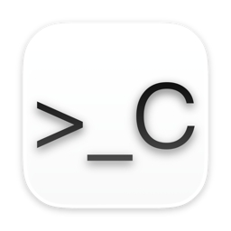
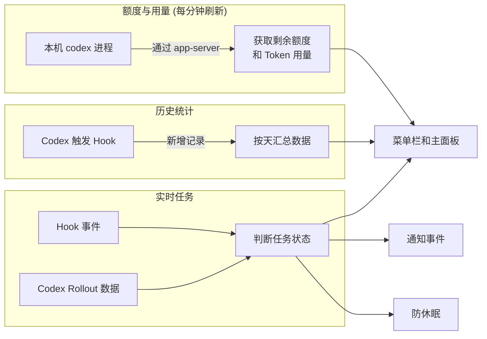

<div align="center">



# CodexBar

**在 macOS 菜单栏一眼看清 Codex 相关信息**

[](https://www.apple.com/macos/)
[](https://swift.org)
[](https://github.com/bob-zebedy/CodexBar/releases)
[](https://github.com/bob-zebedy/CodexBar/releases)
[](LICENSE)

[安装](#安装) | [使用](#使用) | [隐私](#隐私) | [实现](#实现)


</div>

---

CodexBar 把 Codex 的运行状态收进菜单栏: 账户信息, 剩余额度, 任务状态, 重置时间, Token 用量, 使用详细信息等

## 特性

其中实时任务, 热力图面板中的详细统计数据与防休眠功能依赖 CodexBar Hook, 开启方式见[关于 Hook](#关于-hook)

### 账户信息

- 展示当前登录的账号
- 右侧套餐徽章区分 Enterprise, Team, Pro, Plus, Edu, Free
- 双击邮箱可模糊遮挡
- 双击头像立即刷新

### 额度与用量

- 分时间窗口展示剩余额度, 重置时间与可用的手动重置次数
- 菜单栏可常驻显示主要或次要窗口的额度百分比, 无需展开面板
- 30 周日历热力图呈现每日 Token 用量, 点击任意一格展开当天明细

### 实时任务

- 开启 CodexBar Hook 后, 菜单栏图标随任务状态实时变化
- 任务中心区分运行中, 等待批准, 最近完成, 已终止四种状态

### 热力图统计

- GitHub 贡献墙样式展示每日 Token 用量
- 开启 CodexBar Hook 后的会话还可统计对话轮次, 工具调用, 权限请求, 上下文压缩, 子 Agent 等指标
- 可选开启 iCloud 同步, 在多台 Mac 之间同步数据

### 防止系统休眠

需要长时间运行 Codex 任务但是怕系统自动休眠?

- 仅在任务运行期间防止系统休眠, 任务结束恢复系统休眠设置
- 可设置最长防休眠时间 1, 2, 4, 8, 12, 24 小时或无限制
- 可开启低电量保护, 使用电池且电量跌破阈值时恢复系统休眠, 接通电源后自动恢复防休眠
- 防休眠状态可在主面板的任务卡片右侧显示一个咖啡杯标记

### 通知与提醒

- 本地通知: 额度预警, 额度重置, 任务等待批准, 任务完成, 手动重置即将过期, 低电量保护生效
- 通知音效独立设置
- 任务状态变化可设置触摸板震动反馈通知

### 系统集成

- 全局快捷键唤起
- 内置日志窗口保留最近 500 条 app-server 请求记录

## 安装

### 通过 Homebrew

```bash
brew install --cask bob-zebedy/tap/codexbar
```

### 通过 DMG

[Releases](https://github.com/bob-zebedy/CodexBar/releases)

运行要求

- macOS 15.0 或更高版本
- 已安装并登录 [Codex CLI](https://github.com/openai/codex), 或安装了内置 Codex 的 ChatGPT App

> [!TIP]
> CodexBar 会自动寻找可用的 codex 实例

## 使用

| 操作                | 效果                           |
| ------------------- | ------------------------------ |
| 左键点击菜单栏图标  | 打开主面板                     |
| 右键或 Control 点击 | 打开上下文菜单                 |
| `⌘⇧W`               | 全局唤起主面板, 可在设置中改键 |
| `⌘,`                | 打开设置窗口                   |
| `⌘L`                | 主面板打开时, 打开日志窗口     |

### 关于 Hook

实时任务展示, 热力图统计数据与防休眠都依赖 CodexBar Hook

> [!NOTE]
> 不会影响任何原本的 Codex Hook

### 关于防休眠

开启后需要一个 Helper 进行守护, 因此首次开启时 macOS 会要求授权后台项目; 该功能同样依赖 CodexBar Hook

> [!WARNING]
> 为了避免异常任务导致系统长时间处于禁止休眠状态, 建议设置最长防休眠时间

## 隐私

CodexBar 对外网络请求只有以下四项

| 行为                           | 说明                                           |
| ------------------------------ | ---------------------------------------------- |
| 与本机 `codex app-server` 通信 | 获取账户, 额度信息, 获取&修改本机 codex 配置等 |
| 查询额度重置次数和过期时间     | 请求 OpenAI 接口获取数据                       |
| Sparkle 更新检查               | 获取 appcast 检查新版本                        |
| CloudKit 同步                  | 私有数据: 同步用量数据                         |

## 实现

Swift 6 + SwiftUI + AppKit, MVVM, 外部依赖 Sparkle

工程开启了 `SWIFT_DEFAULT_ACTOR_ISOLATION = MainActor` 所有类型默认 MainActor 隔离; 共享状态收敛进 actor, 跨进程写统计文件由 `flock` 保护

三条数据链路各自独立



<details>
<summary><b>关键设计</b></summary>

<br>

**Hook 子进程模式**

App 使用 `--hook-event` 参数启动时不初始化任何 UI, 只从 stdin 读一行 JSON, 在文件锁内追加到当日 JSONL 后立即退出

**root helper 权限**

`CodexBarHelper` 是随 App 嵌入的 LaunchDaemon, 只暴露一个 XPC 方法, 只执行 `pmset -a disablesleep`

签名强制校验: helper 启动时读取自身签名拼出 requirement 交给 XPC listener, 修改签名或 bundle ID 都会导致连接被拒

</details>

## 从源码构建

```bash
git clone https://github.com/bob-zebedy/CodexBar.git
cd CodexBar
xcodebuild -project CodexBar.xcodeproj -scheme CodexBar -destination 'generic/platform=macOS' build
```

区分 Debug 和 Release 构建产物

格式化与静态检查使用 `swiftformat` 和 `swiftlint`

## 反馈

Bug, 功能建议或使用问题都欢迎通过 [Issues](https://github.com/bob-zebedy/CodexBar/issues) 反馈

## 许可证

[GNU General Public License v3.0](LICENSE)
